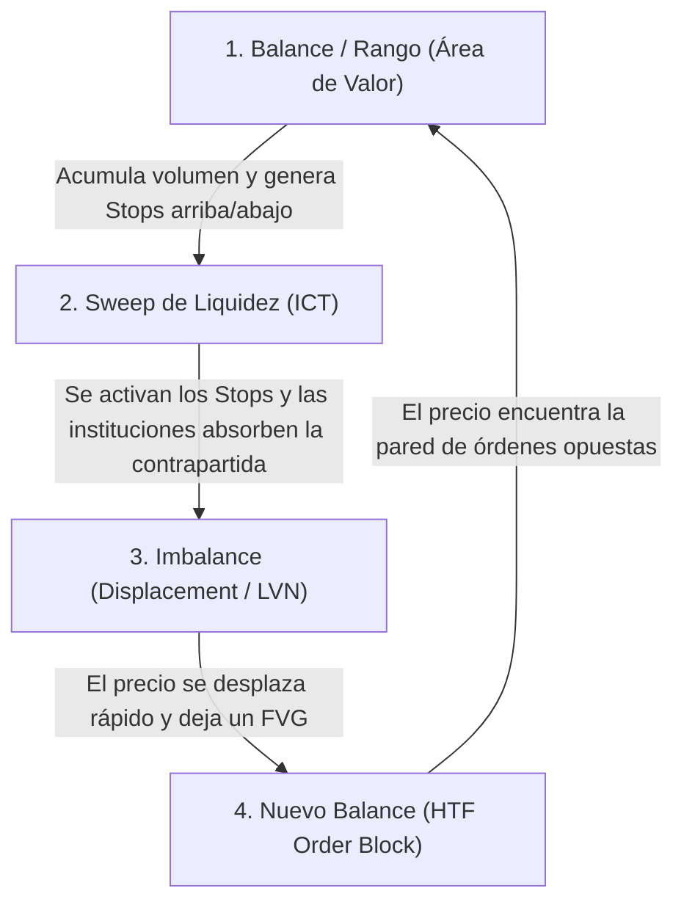

# Mecánica de Subasta y Liquidez: Compaginando Supreme Trading e ICT

Esta nota recopila y unifica dos de las teorías más populares y efectivas del trading moderno: el **Order Flow (Teoría de Subasta de Mercado)** y **ICT/SMC (Smart Money Concepts)**. En lugar de competir entre sí, ambas metodologías describen exactamente el mismo proceso mecánico del mercado, utilizando diferentes vocabularios y perspectivas.

---

## 🏛️ La Realidad Mecánica del Mercado (El Motor de Subasta Doble)

En la base de todo, los mercados financieros operan bajo un mecanismo físico inalterable:
1. **Órdenes Pasivas (Límite):** Órdenes registradas en el DOM (libro de órdenes) esperando a ser ejecutadas a un precio específico. Representan la **liquidez disponible**.
2. **Órdenes Agresivas (A Mercado):** Órdenes ejecutadas de inmediato por participantes que demandan entrar o salir *ya*.
3. **Desplazamiento del Precio:** El precio cambia **únicamente** cuando las órdenes agresivas consumen (barren) por completo toda la liquidez pasiva en el precio actual. Si se absorben todas las órdenes límite de venta en un nivel, el precio se desplaza hacia arriba al siguiente nivel de cotización.

---

## 📊 1. El Enfoque de Subasta (Supreme Trading / Volumen)

Este modelo analiza el mercado desde el prisma del **valor** y la **eficiencia**:
* **Zonas de Balance (Áreas de Valor / HVN - High Volume Nodes):** Rangos donde compradores y vendedores están conformes con el precio. El volumen de contratos intercambiados es elevado, el libro de órdenes está balanceado y el precio oscila lentamente (acumulación/distribución).
* **Zonas de Imbalance (LVN - Low Volume Nodes):** Cuando se inyectan órdenes agresivas masivas que el libro de órdenes pasivo no puede contrarrestar a corto plazo. El precio se desplaza a gran velocidad a través de niveles de precios considerados "injustos" hasta alcanzar una nueva zona de balance.

---

## 🎯 2. El Enfoque de Liquidez (ICT / SMC)

Este modelo analiza el mercado desde la perspectiva de la **búsqueda de contrapartida (stops)**:
* Los grandes algoritmos institucionales necesitan acumular y distribuir millones de contratos. Para entrar en el mercado con el mínimo deslizamiento (*slippage*), necesitan encontrar una enorme masa de órdenes opuestas.
* **Liquidity Pools (Piscinas de Liquidez):** Las órdenes stop-loss (**Buy Stops** por encima de máximos y **Sell Stops** por debajo de mínimos) de los traders minoristas y fondos. Al barrer estas zonas (Liquidity Sweep), se activan las órdenes stop y se transforman en órdenes agresivas a mercado. Esto proporciona a las instituciones la contrapartida exacta que necesitan para llenar sus órdenes límite pasivas.

---

## 🤝 El Diccionario de Traducción Inter-Teórica

| Concepto en ICT / SMC | Concepto en Order Flow (Subasta) | Realidad en el DOM (Libro de Órdenes) |
| :--- | :--- | :--- |
| **Order Block (OB)** | *High Volume Node (HVN)* o Zona de Balance | Un rango de precios donde hay acumulada una **gran cantidad de órdenes límite pasivas** institucionales. |
| **Fair Value Gap (FVG)** | *Low Volume Node (LVN)* o Imbalance de Volumen | Un vacío donde las órdenes agresivas barrieron las órdenes límite tan rápido que **casi no se cruzaron contratos** (baja densidad de negociación). |
| **Liquidity Sweep (Barrida)** | Neutralización de Liquidez / *Stop Run* | El precio cruza un extremo para activar las **órdenes de Stop**, convirtiéndolas en órdenes a mercado que absorben las órdenes institucionales límite pasivas. |
| **Mitigación** | Testeo de Valor / Retorno al Imbalance | El precio regresa a una zona de desequilibrio previa para negociar contratos residuales y rellenar el libro de órdenes. |

---

## 🔄 El Ciclo Técnico Completo

El puente que une ambas teorías es simple: **Los máximos y mínimos (ICT) representan los límites exteriores de las áreas de balance (Volumen).**

1. **Balance (Rango):** Se construye volumen. Los stops de protección se acumulan arriba y abajo del rango.
2. **Sweep (Cacería):** El mercado busca la liquidez exterior. Se ejecutan los stops masivos.
3. **Imbalance (Desplazamiento):** Tras la absorción institucional, se produce un desplazamiento veloz que deja un FVG en las velas y un LVN en el perfil de volumen.
4. **Nuevo Balance (OB):** El precio viaja hasta golpear un bloque de órdenes de temporalidad mayor (HTF) o área de alto volumen histórico, iniciando una nueva acumulación/distribución.

---

## 🧩 SMT en Tiempo Real: Ejecución Asimétrica de Liquidez (Caso de Estudio - 04 de Junio de 2026)

La Divergencia SMT es la prueba definitiva de la interacción inter-mercado de las órdenes:
* **MNQ (El Débil/Líder):** Mitigó su bloque de venta (FVG de 5m) a las 9:52 AM en `30316.50` y se quedó esperando. Como ya estaba cargado de ventas, empezó a decaer haciendo un máximo más bajo (*Lower High* en `30305.50`). **No necesitaba volver a subir a su máximo.**
* **MES (El Fuerte/Cazador):** Le faltaba barrer su liquidez de máximos. Siguió empujando hasta las 9:58 AM alcanzando `7564.50`.
* **El Desenlace:** En cuanto MES golpeó la gran pared de órdenes pasivas de venta a las 9:58 AM y se detuvo por absorción masiva (volumen inusual de `4,997` contratos en MES sin avanzar), el mercado general se quedó sin compradores agresivos. MNQ (que ya estaba debilitado y sin oferta arriba) se desplomó de manera inmediata 80 puntos a las 9:59 AM.

---

## 💡 Retroalimentación y Conclusiones Clave para el Futuro

1. **El Gráfico de Velas es el Mapa, el DOM/Volumen es el Microscopio:**
   Usa **ICT** para entender el contexto macro y la narrativa (¿adónde quiere ir el precio a cazar stops?). Usa el **Order Flow (DOM y Volumen Ejecutado)** para confirmar si en ese punto realmente se está procesando una absorción o si el precio va a romper la zona.
2. **La Paciencia ante la Asimetría:**
   Si estás operando el activo débil (como MNQ hoy) y ves que ya mitigó su zona premium mientras el fuerte (MES) sigue subiendo a buscar su propia liquidez, **no entres en pánico ni busques un re-testeo en el débil**. Espera a que el fuerte barre su máximo; ese es el gatillo real para el colapso del débil.
3. **Volumen de Absorción:**
   Cuando el precio entre en un Order Block o FVG, presta atención al volumen de las velas de 1m y al DOM. Un pico masivo de volumen *sin desplazamiento* (como los `4,997` contratos en MES a las 9:58 AM) es la confirmación matemática de que la pared pasiva está absorbiendo todo el flujo agresivo.

---

## 🧠 La Naturaleza del SMT: ¿Causa o Síntoma?

El SMT **no es la causa del movimiento, sino la plasmación visual (el síntoma)** de una asimetría real y física en el flujo de órdenes institucionales. 

Siempre que identificas un SMT en el gráfico, la mecánica interna es la siguiente:

1. **Desbalance de Fuerza Relativa (Asimetría):** Las instituciones no compran ni venden MNQ y MES en proporciones idénticas. Si hay un flujo institucional vendedor masivo concentrado en el sector tecnológico, MNQ estará inherentemente más pesado (débil) que MES.
2. **El Activo "Adelantado" (MNQ hoy):** El activo débil completa su mitigación del bloque de órdenes temprano (9:52 AM) y se detiene. Como las instituciones ya están distribuyendo contratos de venta allí, se forma un "techo" de órdenes límite pasivas. Aunque el mercado intente subir, el activo débil no puede hacer un nuevo máximo y se queda oscilando o bajando lentamente.
3. **El Activo "Atrasado" (MES hoy):** El activo fuerte todavía tiene liquidez pendiente por encima de sus máximos. Los algoritmos de alta frecuencia y los creadores de mercado continúan empujando el precio al alza para ejecutar esos stops y activar sus propios bloques de venta.
4. **La Sincronización del Reversible:** Debido a la correlación estrecha, el activo débil no puede iniciar su desplome real mientras el activo fuerte continúe presionando al alza. El débil "espera" pacientemente a que el fuerte ejecute su última barrida. En el milisegundo en que MES tocó su bloque y fue absorbido (9:58 AM), la presión alcista se evaporó por completo en ambos índices, permitiendo que cayeran juntos (con el débil liderando la velocidad de caída).

En resumen: **El SMT es la huella digital en el gráfico de un desequilibrio de órdenes en el DOM.** El activo débil nos muestra la dirección real del dinero inteligente de manera anticipada, mientras que el activo fuerte nos da el *timing* exacto del gatillo cuando termina de barrer su liquidez.

---

### Notas Relacionadas:
* [[SMT Divergence]]
* [[Fair Value Gap]]
* [[Order Block (Bearish)]]
* [[Mitigation]]

