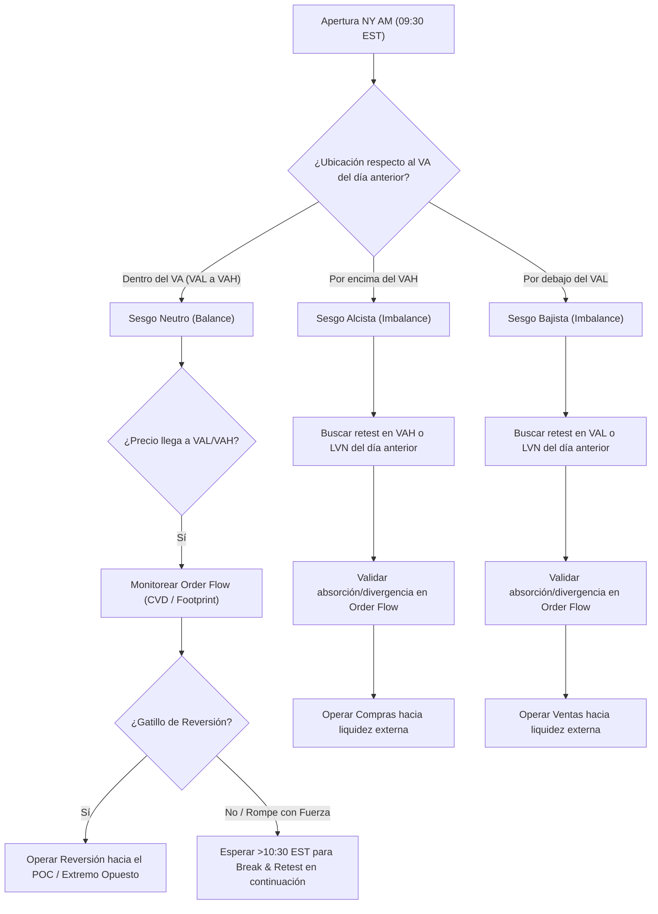

> [!NOTE]
> ### Resumen Causal
> - **La base del movimiento del mercado (AMT):** La Teoría de Subasta de Mercado (*Auction Market Theory*) explica cómo el mercado interactúa buscando liquidez entre compradores y vendedores, oscilando continuamente entre dos estados: balance (rango/condensación) e imbalance (descubrimiento de precio/expansión).
> - **El Value Area como referencia clave:** Utilizando el perfil de volumen de la sesión anterior (de apertura a cierre), se identifican el [[Mecánica de Subasta y Liquidez|Value Area High (VAH)]], el [[Mecánica de Subasta y Liquidez|Value Area Low (VAL)]] y el Point of Control (POC), definiendo las fronteras de valor aceptado y los niveles clave de soporte/resistencia dinámica.
> - **Estrategias basadas en la Apertura:** Se definen dos modelos operativos mecánicos (Día de Balance y Día de Imbalance) que determinan el sesgo (*bias*) inicial del día a partir de la ubicación del precio de apertura de Nueva York frente a las áreas de valor previas, complementados por filtros de Order Flow.

---

## Cronológico Breakdown

### `[00:01]` Introducción a la Teoría de Subasta de Mercado (AMT)
- AMT explica la justificación detrás de los movimientos del precio: el mercado es una subasta constante que busca compradores y vendedores facilitando transacciones a diferentes precios.
- El mercado opera en uno de dos estados principales:
  - **Balance (Rango / Condensación):** Se ha encontrado un valor justo aceptado por compradores y vendedores. El precio oscila de extremo a extremo de un rango, permitiendo a las instituciones acumular y distribuir posiciones pesadas continuamente sin mover bruscamente el mercado.
  - **Imbalance (Expansión / Descubrimiento de Precio):** El precio se encuentra en un valor considerado injusto. Ante la falta de límites de compra o venta en los extremos, el precio se expande rompiendo el rango previo en busca de un nuevo balance o visitando áreas de balance anteriores. Las instituciones suelen retirar sus órdenes límites durante noticias (ej. FOMC), provocando expansiones rápidas.

### `[03:11]` Identificación y Medición de las Áreas de Valor
- Para medir el balance, se utiliza el **Perfil de Volumen** configurado por sesión (desde la apertura hasta el cierre de Nueva York, 9:30 AM a 4:00 PM EST).
- **Zonas clave del Perfil de Volumen:**
  - **Value Area (VA):** Zona de balance donde se negoció el 70% del volumen de la sesión.
  - **Value Area High (VAH):** Límite superior del área de valor.
  - **Value Area Low (VAL):** Límite inferior del área de valor.
  - **Point of Control (POC):** El nivel de precios con mayor cantidad de contratos negociados (volumen máximo).
- El mercado repite un ciclo claro: Crea un balance, entra en imbalance (descubrimiento de precio), expande hacia un balance previo (que actúa como imán), encuentra aceptación y crea un nuevo balance.

### `[05:32]` Estrategia para Días de Balance (Rango)
- **Condición:** El precio abre *dentro* del Value Area (VA) del día anterior en la sesión de Nueva York AM.
- **Sesgo (Bias):** Neutro. Se pueden buscar tanto compras (en VAL) como ventas (en VAH).
- **Ejecución:**
  1. Monitorear reacciones de reversión en los extremos (VAH o VAL).
  2. Buscar un rompimiento y retesteo (*Break & Retest*) de los límites del rango, lo cual estadísticamente es más probable que ocurra tras concluir la primera hora de Nueva York (después de las 10:30 AM EST).
- **Gatillos de entrada:** Absorción en la ubicación, Divergencia Delta o Divergencia CVD (Cumulative Volume Delta) —que funciona óptimamente en días de rango—, exhaustión en el footprint o gatillos clásicos de SMC/ICT como un [[IFVG|iFVG]] o un Rejection Block.

### `[08:08]` Estrategia para Días de Imbalance (Tendencial)
- **Condición:** El precio abre *fuera* del Value Area (VA) del día anterior.
- **Sesgo (Bias):** Direccional definido. 
  - Si abre por arriba de VAH: Sesgo alcista (compras).
  - Si abre por abajo de VAL: Sesgo bajista (ventas).
- **Ejecución:** Buscar reacciones y retesteos del extremo que se rompió (VAL/VAH) o de Nodos de Bajo Volumen (LVN) del día anterior que actúan como soportes/resistencias clave. Raras veces ocurre una aceptación de vuelta dentro de la VA del día anterior (re-entry trade).
- **Gatillos de entrada:** Absorción o exhaustión en la ubicación de interés confirmada por herramientas de Order Flow (ej. QuanTower).

### `[09:42]` Ejemplos en Vivo y Backtesting
- Se muestra un ejemplo del lunes donde Nueva York abre dentro del VA del día viernes (sesgo neutro). Al caer al VAL, el footprint y la herramienta delta confirman absorción de ventas y agresividad de compras (divergencia Delta/CVD), propiciando una entrada alcista inicial.
- **Breakout de la primera hora:** Tras consolidar durante la primera hora de Nueva York, a las 10:30 AM EST se genera la ruptura del VAL. Se ejecuta un trade en continuación bajista (*break & retest*) que genera una expansión de 288 puntos hacia objetivos de liquidez del balance previo.
- Repaso semanal que demuestra la validez diaria del sistema basándose en la reacción matemática en VAL, VAH, POC y balances vírgenes/previos.

---

## Mechanical Rules (IF/THEN)

- **IF** la apertura de la sesión de Nueva York ocurre *dentro* del Value Area (VA) del día anterior, **THEN** el sesgo es neutro (Balance) y se operan rebotes en VAH/VAL, o un rompimiento y retesteo de dichos niveles después de las 10:30 AM EST.
- **IF** el precio abre *por encima* del Value Area High (VAH) del día anterior, **THEN** el sesgo es de compras (Imbalance alcista) y se buscan entradas en continuación tras el retesteo del VAH o de Nodos de Bajo Volumen (LVN) previos.
- **IF** el precio abre *por debajo* del Value Area Low (VAL) del día anterior, **THEN** el sesgo es de ventas (Imbalance bajista) y se buscan entradas en continuación tras el retesteo del VAL o de Nodos de Bajo Volumen (LVN) previos.
- **IF** se identifica una divergencia CVD o delta acumulada a favor del sesgo en VAH/VAL/POC **AND** se confirma absorción/exhaustión en el Footprint, **THEN** se valida la entrada con un stop loss ajustado al extremo de la estructura.

---

## Mermaid Flowchart

