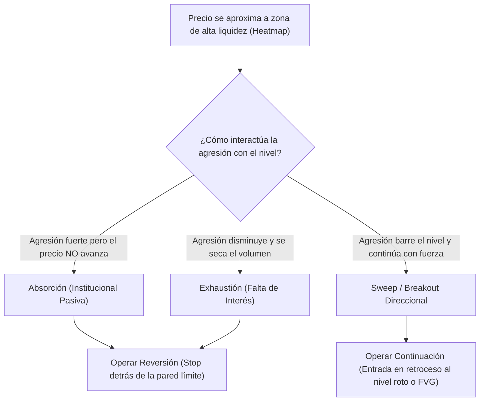

> [!NOTE]
> ### Resumen Causal
> - **La liquidez real vs. la liquidez minorista:** Mientras que los traders retail asocian la liquidez únicamente con *stop losses* en máximos y mínimos, en microestructura la liquidez real es la profundidad del libro de órdenes (DOM - *Depth of Market*), compuesta por órdenes limitadas pasivas esperando ejecución.
> - **Dinámica del movimiento del precio:** El precio se mueve mediante la interacción constante entre participantes pasivos (órdenes límite que proveen liquidez) y participantes agresivos (órdenes a mercado que consumen liquidez). El precio solo se desplaza cuando la agresión consume por completo la liquidez disponible en un nivel.
> - **Visualización mediante Heatmaps:** El uso de mapas de calor de liquidez (ej. Bookmap, DeepCharts) permite identificar bloques institucionales de alta densidad (órdenes límite masivas), detectando en tiempo real patrones de absorción (*icebergs/reloads*) y exhaustión para predecir giros del precio.

---

## Cronológico Breakdown

### `[00:00]` Introducción a la Liquidez y Microestructura
- Explicación de la diferencia entre los indicadores tradicionales minoristas (RSI, EMAs) y el análisis de flujo de órdenes real. La liquidez y el volumen son las únicas variables que realmente explican y provocan el movimiento del precio en los mercados centralizados de futuros.

### `[02:00]` ¿Qué es la Liquidez Real en los Mercados?
- La liquidez no es una simple línea o dibujo en el gráfico; es la densidad de órdenes límite pasivas dispuestas a comprar o vender a un precio determinado en el Depth of Market (DOM).
- Los mercados financieros funcionan bajo la [[Mecánica de Subasta y Liquidez|Teoría de Subasta (AMT)]]. El precio es atraído hacia zonas de alta densidad de liquidez (áreas de valor) para facilitar el intercambio de contratos entre compradores y vendedores.

### `[03:45]` Micromecánica del Mercado: Pasivos vs. Agresivos
- **Participantes Pasivos:** Colocan órdenes límite en el libro de órdenes. Proveen liquidez. Actúan como una "pared" o barrera física para el precio.
- **Participantes Agresivos:** Envían órdenes a mercado (*market orders*). Consumen liquidez. Son los que inician el movimiento del precio al "atacar" las órdenes límite del lado opuesto. El precio no se mueve a menos que un participante agresivo consuma toda la liquidez pasiva en el precio actual.
- **Absorción:** Fenómeno donde un flujo masivo de órdenes a mercado agresivas es absorbido por una gran orden límite pasiva. A pesar del alto volumen agresivo, el precio no logra avanzar. Esto suele ocurrir en soportes/resistencias importantes e indica una reversión inminente.
- **Exhaustión (Agotamiento):** Sucede cuando la agresión se detiene. Los compradores/vendedores agresivos ya no tienen interés en seguir consumiendo contratos a precios peores, provocando un giro del precio por falta de presión de compra/venta.

### `[07:40]` El Mapa de Calor de Liquidez (Liquidity Heatmap)
- El *heatmap* es una herramienta gráfica que registra históricamente la profundidad del libro de órdenes. Las zonas coloreadas con mayor brillo representan niveles con órdenes límite institucionales de gran tamaño.
- **La Ruta del Menor Esfuerzo:** El precio es atraído magnéticamente hacia estas zonas de gran liquidez porque los grandes participantes necesitan ese volumen para llenar sus posiciones sin sufrir deslizamiento (*slippage*).
- Al llegar el precio a una zona brillante del heatmap, se debe observar el flujo de órdenes en tiempo real: si el precio rompe con fuerza (breakout agresivo) o si es absorbido (reversión).

### `[11:30]` Patrones del Libro de Órdenes y DOM Profundo
- **Iceberg Orders (Órdenes Iceberg):** Algoritmos que dividen una orden masiva en pequeñas partes visibles en el DOM (ej. mostrar solo 50 de una orden de 1000 contratos). Se detectan cuando las órdenes agresivas atacan constantemente el nivel y la orden se rellena automáticamente sin que el precio se mueva.
- **Reloads (Recargas):** Adición constante de liquidez pasiva a un nivel de precios a medida que se va ejecutando el volumen.
- **Sweeps (Barrido de Libro):** Una orden de mercado extremadamente grande que consume de golpe toda la liquidez disponible en múltiples niveles de precios consecutivos, provocando un salto rápido en el precio (desplazamiento).

---

## Mechanical Rules (IF/THEN)

- **IF** el precio llega a una zona de alta densidad de liquidez visible en el Heatmap **AND** se observa una alta tasa de órdenes agresivas en el footprint pero el precio no logra romper el nivel (Absorción), **THEN** se busca una entrada en reversión (Short en techo, Long en suelo) con el stop loss justo detrás de la pared de liquidez pasiva.
- **IF** el precio se aproxima a una zona de liquidez importante en el Heatmap **AND** las órdenes agresivas disminuyen drásticamente a medida que el precio se acerca al nivel (Exhaustión), **THEN** se espera un giro del precio por falta de presión mercado.
- **IF** una orden agresiva barre múltiples niveles de precios del DOM (Sweep) creando un desplazamiento con volumen alto, **THEN** se busca operar a favor del barrido en el primer retroceso a una zona de valor o FVG.

---

## Mermaid Flowchart

