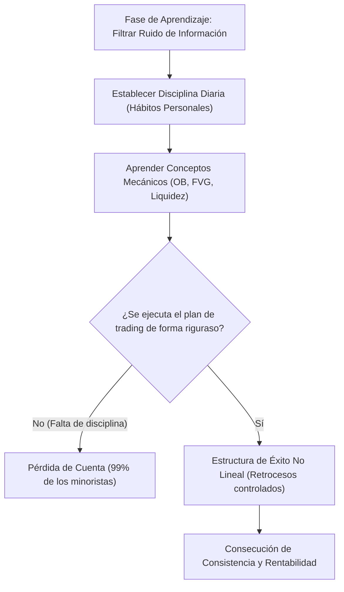

> [!NOTE]
> ### Resumen Causal
> - **El Proceso Simplificado:** La serie busca filtrar la inmensa cantidad de información disponible en línea sobre ICT, estructurándola de forma limpia para acelerar la rentabilidad sin omitir conceptos clave.
> - **Mentalidad y Crecimiento No Lineal:** El éxito en el trading se asemeja a una estructura alcista: está lleno de retrocesos (bajos), pero la clave consiste en asegurar que cada nuevo bajo sea más alto que el anterior ([[Market Structure|Higher Low]]).
> - **La Disciplina como Cimiento:** La disciplina en los gráficos es un reflejo de la disciplina en la vida diaria (hábitos, ejercicio, orden). Si no se controlan los pequeños hábitos, es imposible mantener la disciplina frente a las pantallas.

---

## Cronológico Breakdown

### `[00:00]` Introducción a la Serie y Filosofía de PB Trading
- Patrick y Blake presentan la serie "ICT for Dummies".
- El objetivo fundamental es eliminar el "ruido" y la sobrecarga de información que confunde a los principiantes en YouTube.
- Buscan presentar los conceptos de Smart Money de una manera lógica y altamente digerible.

### `[01:27]` Historia de Blake: El Camino del Aprendizaje y la Pérdida
- Blake comparte su trayectoria de 4 años en el trading, habiendo ganado sus primeros $100k a los 19 años.
- Sus inicios estuvieron marcados por la desinformación (estafas de cursos en línea, trading de opciones sin dirección clara) y la pérdida de sus ahorros iniciales.
- El punto de inflexión ocurrió tras descubrir los conceptos de ICT, que proporcionaron una narrativa lógica detrás del movimiento del precio, a diferencia de los soportes y resistencias tradicionales.

### `[04:42]` Mentoría y Acompañamiento
- Blake actuó como mentor de Patrick. Patrick resalta el valor de contar con un compañero de responsabilidad (accountability partner) para mantener la motivación y acelerar el aprendizaje.
- Se enfatiza que la mayoría de las personas no logran la rentabilidad porque no siguen las instrucciones ni realizan el trabajo de estudio constante.

### `[07:10]` La Filosofía del Fracaso y Psicología
- El fracaso es inevitable y forma parte del proceso de aprendizaje.
- Se compara el éxito con una estructura alcista de [[Market Structure|Market Structure]]: hay impulsos y retrocesos, pero la meta es asegurar que cada retroceso constituya un mínimo más alto ([[Market Structure|Higher Low]]).
- Se invita a los estudiantes a cuestionarse sus motivos reales para hacer trading y comprometerse a largo plazo en lugar de buscar dinero rápido.

### `[09:27]` Temario y Plan de Estudio del Curso
- Se detalla la estructura del curso "ICT for Dummies", que cubrirá:
  - Introducción a Futuros y conceptos básicos de velas ([[Market Structure|Candlesticks]]).
  - Conceptos de ICT: Fibonacci, [[Buy-Side Liquidity|Liquidity]], [[Fair Value Gap|Fair Value Gaps (FVG)]], [[Order Block (Bullish)|Order Blocks (OB)]], [[Breaker Block|Breaker Blocks]], CISD, [[SMT Divergence|SMT Divergence]], gestión de riesgo, perfiles de mercado y Judas Swings.
  - El modelo mecánico e institucional de Blake (con un winrate estadístico del 70%).
  - El modelo discrecional y el modelo PDI de Patrick.
  - Psicología aplicada, bitácora de operaciones y preparación para pasar cuentas de fondeo.

### `[11:00]` La Estadística del 99% y la Mentalidad Ganadora
- El 99% de los traders que fallan lo hacen debido a la falta de disciplina y ejecución de las reglas dadas.
- Importancia de reprogramar la mente de manera positiva y visualizar el éxito de forma proactiva cada día.

---

## Mechanical Rules (IF/THEN)

- **IF** deseas lograr la rentabilidad en el trading, **THEN** debes estructurar tu aprendizaje filtrando el exceso de información y limitándote a un plan mecánico y probado.
- **IF** experimentas una racha de pérdidas o retrocesos en tu proceso personal, **THEN** debes tratarlos como un [[Market Structure|Higher Low]], asegurando que tu nivel de conocimiento y control emocional actual sea mayor que en el retroceso anterior.
- **IF** no eres capaz de mantener la disciplina básica en tu vida cotidiana (ej. hacer la cama, ir al gimnasio, mantener el orden), **THEN** no tendrás la autodisciplina requerida para operar de forma mecánica en los gráficos de trading.

---

## Mermaid Flowchart

