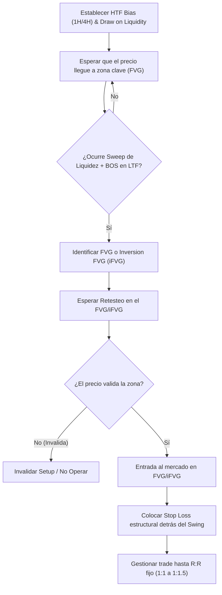

> [!NOTE]
> ### Resumen Causal
> - **La Importancia de la Simplicidad:** Reducir el sistema a reglas mecánicas específicas (como identificar HTF Bias y buscar confirmación en LTF) para evitar la parálisis por análisis y mantener la consistencia.
> - **El Rol de la Narrativa:** El trading exitoso no se basa en adivinar patrones aislados, sino en seguir la narrativa del precio, validando la dirección del mercado a través de la determinación del [[Draw on Liquidity|Draw on Liquidity]].
> - **La Disciplina en el Backtesting:** Utilizar sesiones rigurosas de backtesting histórico para ganar confianza estadística en la estrategia, aceptando que un 70% de winrate implica un 30% de pérdidas inevitables que forman parte del juego (conceptos psicológicos detallados en [[03-you-are-scared-to-change|you are scared to change]]).

---

## Cronológico Breakdown

### `[00:00]` Introducción a la Sesión de Backtesting y Filosofía de la Estrategia
- Presentación de la sesión de backtesting enfocada en el modelo mecánico de PB Trading (conocido como Mech Model).
- Explicación de por qué el backtesting es la única herramienta real para desarrollar confianza estadística antes de arriesgar capital en vivo.
- Enfoque en simplificar las variables: eliminar indicadores complejos y centrarse exclusivamente en la acción del precio y la liquidez.

### `[02:15]` Análisis del Sesgo de Temporalidad Mayor (HTF Bias)
- Cómo establecer la dirección del mercado en gráficos de 1 hora o 4 horas.
- Identificación del [[Draw on Liquidity|Draw on Liquidity (DOL)]], que representa el objetivo hacia donde el algoritmo interbancario es más probable que dirija el precio.
- Uso de zonas de descuento ([[Discount Zone]]) y premium ([[Premium Zone]]) para contextualizar las probabilidades del movimiento.

### `[05:30]` Identificación de zonas operativas (PD Arrays) y Brechas de Valor Justo
- Análisis detallado de los [[Fair Value Gap|Fair Value Gaps (FVG)]] como imanes y zonas de soporte/resistencia algorítmica.
- Introducción al concepto de [[IFVG|Inversion FVG (iFVG)]]: cuando una brecha contraria es invalidada por el precio y se convierte en soporte o resistencia para la continuación del movimiento.
- Cómo buscar confluencias estructurales entre las brechas y los niveles de soporte o resistencia previos.

### `[08:45]` El Modelo de Entrada Mecánico en Baja Temporalidad (LTF)
- Transición a gráficos de baja temporalidad (1m a 5m) para afinar la entrada.
- Esperar un barrido de liquidez ([[Liquidity Sweep]]) en máximos o mínimos previos para confirmar que los "manos fuertes" han tomado liquidez.
- Confirmar el cambio en la dirección mediante un desplazamiento fuerte que genere un [[Market Structure|Break of Structure (BOS)]] o un [[Market Structure|Change of Character (CHoCH)]].

### `[12:10]` Gestión de Riesgo y Ratios Fijos
- Definición de las reglas de salida: uso de un stop loss estructural colocado lógicamente detrás del swing que originó el desplazamiento.
- Aplicación de un ratio riesgo-beneficio fijo (generalmente entre 1:1 y 1:1.5) para maximizar la tasa de acierto y simplificar la gestión.
- Crítica al hábito común de mover prematuramente el stop loss a breakeven, argumentando que se debe dar espacio para que la narrativa se desarrolle por completo.

### `[16:40]` Ejecución del Backtesting en Datos Históricos
- Demostración práctica en TradingView utilizando la herramienta de reproducción de barras.
- Registro detallado de cada operación ganadora y perdedora, demostrando cómo se comporta la curva de capital de la estrategia en una muestra de trades.
- Análisis de la distribución de rachas de pérdidas y la importancia de la estabilidad psicológica durante esos periodos.

### `[21:20]` Conclusión y Mentalidad del Operador Mecánico
- El éxito de un sistema mecánico reside en la consistencia de la ejecución de sus reglas, no en predecir perfectamente cada vela.
- Consejos finales sobre la creación de una bitácora y la consistencia en el tamaño de las posiciones.

---

## Mechanical Rules (IF/THEN)

- **IF** el precio respeta una zona de temporalidad mayor (e.g., FVG de 1H) y barre liquidez externa mediante un [[Liquidity Sweep]], **THEN** establecemos una dirección y determinamos el [[Draw on Liquidity|Draw on Liquidity]] en los siguientes máximos ([[Buy-Side Liquidity]]) o mínimos ([[Sell-Side Liquidity]]).
- **IF** identificamos una entrada en LTF (1m-5m) basada en el retesteo de un [[Fair Value Gap|FVG]] o un [[IFVG|Inversion FVG (iFVG)]] tras un [[Market Structure|Break of Structure (BOS)]], **THEN** abrimos una posición en dirección del sesgo estructural.
- **IF** tomamos la operación, **THEN** colocamos el Stop Loss por debajo del mínimo ([[Swing Low]]) o máximo ([[Swing High]]) del desplazamiento y configuramos el Take Profit para un ratio fijo de 1:1 o 1:1.5, sin mover a breakeven prematuramente.
- **IF** el mercado no presenta desplazamiento o la acción del precio es errática en la zona clave, **THEN** invalidamos el setup y evitamos tomar operaciones.

---

## Mermaid Flowchart

