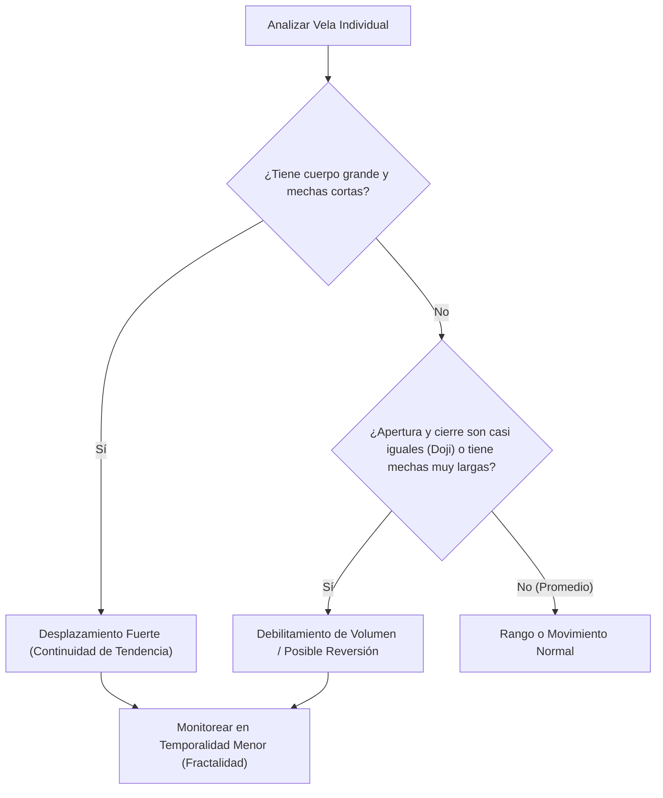

> [!NOTE]
> ### Resumen Causal
> - **Anatomía de las Velas:** Las velas japonesas expresan el movimiento del precio mediante cuerpos (apertura y cierre) y mechas (máximos y mínimos alcanzados), actuando como la base de la lectura de la acción del precio.
> - **Fractalidad del Tiempo:** Una sola vela de temporalidad alta (ej. 15 minutos) contiene el desglose detallado de múltiples velas de temporalidad baja (ej. 15 velas de 1 minuto), donde los extremos de las mechas de temporalidad alta representan los giros estructurales de temporalidad baja.
> - **Fuerza vs. Debilidad:** El volumen y la velocidad se identifican mediante la proporción del cuerpo frente a la mecha. Cuerpos grandes con mechas cortas implican [[Displacement Candle|desplazamiento (displacement)]], mientras que mechas largas indican rechazo o debilitamiento del movimiento.

---

## Cronológico Breakdown

### `[00:00]` Introducción a los Candlesticks (Velas Japonesas)
- Explicación de por qué se llaman velas: están compuestas por un cuerpo (body) y mechas (wicks).
- Las mechas indican los extremos a los que viajó el precio, mientras que el cuerpo define los puntos exactos de apertura y cierre.

### `[01:09]` Velas de Fuerza (Fuertes) vs. Velas de Rechazo (Débiles)
- **Vela Alcista Fuerte:** Muestra gran presión de compra con un cuerpo grande y cierre fuerte en el extremo superior, con poca o ninguna mecha arriba. Indica [[Displacement Candle|desplazamiento (displacement)]].
- **Vela Bajista Fuerte:** Muestra gran presión de venta con un cuerpo grande y cierre fuerte cerca del mínimo, sin mecha inferior significativa.
- **Vela Doji (Consolidación / Reversión):** Representa indecisión o acumulación. El precio abre y cierra casi en el mismo nivel. Suele aparecer en zonas donde el volumen o la presión compradora/vendedora se está agotando, sugiriendo un posible cambio de dirección.

### `[02:17]` Fractalidad y Temporalidades en los Gráficos
- Cada vela representa la acción del precio en una unidad de tiempo seleccionada (1 día, 1 hora, 15 minutos, 1 minuto, etc.).
- Ejemplo práctico con una vela de 15 minutos:
  - Al bajar al gráfico de 5 minutos, la misma vela se desglosa en 3 velas distintas.
  - Al bajar al gráfico de 1 minuto, se compone de 15 velas individuales.
  - Los extremos de la mecha superior e inferior de la vela de 15 minutos corresponden al máximo y mínimo absolutos alcanzados por las velas de 1 minuto durante ese intervalo de tiempo.

### `[05:07]` Rechazo y Debilidad en Velas Específicas
- **Vela Alcista Débil:** El precio subió con fuerza (dejando una mecha larga arriba) pero fue rechazado antes del cierre de la vela, cerrando cerca de la apertura.
- **Vela Bajista Débil:** El precio cayó fuertemente (dejando una mecha larga abajo) pero rechazó esa zona baja y cerró cerca del nivel de apertura.
- No se debe operar basándose únicamente en patrones de velas aislados; siempre se debe combinar el análisis con la narrativa macro y otras confluencias de [[Market Structure|Market Structure]].

### `[08:35]` Ciclos OHLC y OLHC (Anatomía Detallada)
- **Bearish Candle (OHLC - Open, High, Low, Close):**
  1. Abre (Open).
  2. Sube para formar el máximo (High - mecha superior).
  3. Cae con fuerza hasta el mínimo (Low - mecha inferior).
  4. Sube ligeramente para cerrar (Close) por debajo del precio de apertura.
- **Bullish Candle (OLHC - Open, Low, High, Close):**
  1. Abre (Open).
  2. Cae para formar el mínimo (Low - mecha inferior).
  3. Sube con fuerza hasta el máximo (High - mecha superior).
  4. Retrocede un poco para cerrar (Close) por encima del precio de apertura.

---

## Mechanical Rules (IF/THEN)

- **IF** una vela cierra con un cuerpo grande y mechas cortas en la dirección de la tendencia diaria, **THEN** se asume un alto volumen/[[Displacement Candle|desplazamiento]] y continuidad del movimiento.
- **IF** el precio muestra velas Doji o velas con mechas largas consecutivas en zonas clave de soporte/resistencia o PDI, **THEN** se interpreta como debilitamiento de la presión y posible reversión (acumulación).
- **IF** analizamos los extremos (máximos/mínimos) de una vela en temporalidad mayor, **THEN** entendemos que corresponden a la estructura interna o giros de tendencia visibles en temporalidades menores (fractalidad).

---

## Mermaid Flowchart

