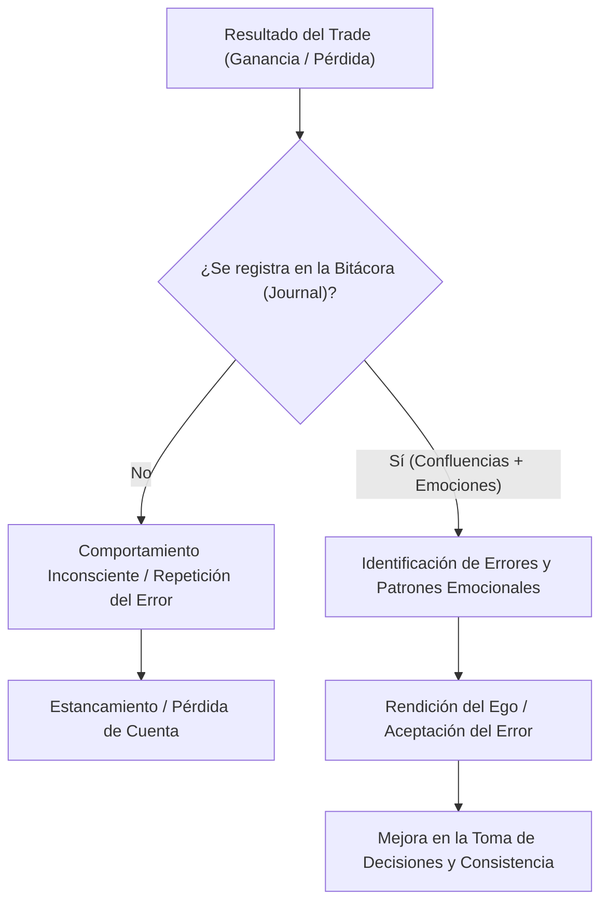

> [!NOTE]
> ### Resumen Causal
> - **Responsabilidad Absoluta:** En el trading no existe espacio para culpar al mercado, al broker o a factores externos. Al ser tú quien presiona el botón, debes asumir la total autoría de tus resultados y tus pérdidas.
> - **El Bitácora Emocional y Confluencias:** El progreso real se acelera documentando meticulosamente cada trade perdedor, registrando tanto las confluencias técnicas de la entrada como las emociones experimentadas antes, durante y después del trade.
> - **Rendición del Ego:** El mercado es indiferente a quién eres o a tus logros fuera de él. El éxito requiere vulnerabilidad para aceptar que te has equivocado y autodisciplina en los pequeños hábitos diarios (como hacer la cama o ir al gimnasio) para proyectarla en los gráficos.

---

## Cronológico Breakdown

### `[00:00]` La Importancia Crítica de la Psicología en el Trading
- Introducción al episodio enfocado completamente en la psicología y la mentalidad requerida para el trading.
- Patrick y Blake explican que, aunque los conceptos técnicos (como los estudiados en [[02-ict-for-dummies-candlesticks-ep-1|Candlesticks]]) son necesarios, el control emocional es el factor que define la rentabilidad a largo plazo.

### `[03:15]` Asumir Responsabilidad Absoluta
- La tendencia común del trader perdedor es culpar al mercado, a la manipulación institucional o a la mala suerte.
- Blake enfatiza que tú eres el único responsable de abrir y cerrar las posiciones. Culpar a otros factores te impide aprender de tus propios fallos.
- La repetición de los mismos errores es un síntoma directo de no admitir que estás equivocado (ego).

### `[06:30]` Journaling: El Método para Medir y Corregir Errores
- El journaling (bitácora de trading) no es opcional; es el motor principal para acelerar tu desarrollo.
- Cómo estructurar el diario de trading:
  - Anotar las confluencias técnicas (por qué entraste al trade).
  - Anotar el estado emocional antes de operar (ej. nivel de ansiedad, fatiga, euforia).
  - Anotar los sentimientos después del resultado del trade.
- Si no mides tus estadísticas emocionales y operativas en papel, es imposible que detectes tus patrones autodestructivos.

### `[09:45]` La Indiferencia del Mercado y la Humildad
- El mercado no sabe quién eres, ni le interesan tus logros académicos, físicos, deportivos o financieros.
- Para operar con éxito, debes "rendir tu ego" ante la acción del precio. Si intentas imponer tus deseos sobre el mercado, este te destruirá.
- La consistencia requiere aceptar que las pérdidas son normales y forman parte del negocio, siempre que sean gestionadas bajo reglas estrictas.

### `[12:15]` Complacencia: El Enemigo tras los Primeros Éxitos
- Uno de los mayores peligros para un trader principiante es experimentar éxito rápido (pasar su primer desafío de prop firm o hacer sus primeros $1,000).
- La ganancia fácil relaja la autodisciplina, lo que lleva a tomar trades fuera de plan, aumentar el apalancamiento y, finalmente, perder todo el capital acumulado.
- La autodisciplina debe duplicarse tras una victoria para mantener la mente fría y mecánica.

---

## Mechanical Rules (IF/THEN)

- **IF** tomas una pérdida o cometes un error operativo, **THEN** debes registrarlo inmediatamente en tu diario detallando las confluencias y tu estado mental, buscando desactivar el ego mediante la auto-observación.
- **IF** identificas que tus emociones (ira, revancha, avaricia) están afectando tu toma de decisiones antes de abrir un trade, **THEN** debes cerrar la plataforma de inmediato y dar por terminada tu sesión de trading.
- **IF** logras un objetivo financiero importante (ej. profit target o payout), **THEN** debes comprometerte a seguir operando con el mismo tamaño de lote y bajo las mismas reglas estrictas de gestión de riesgo para evitar caer en la complacencia.

---

## Mermaid Flowchart

