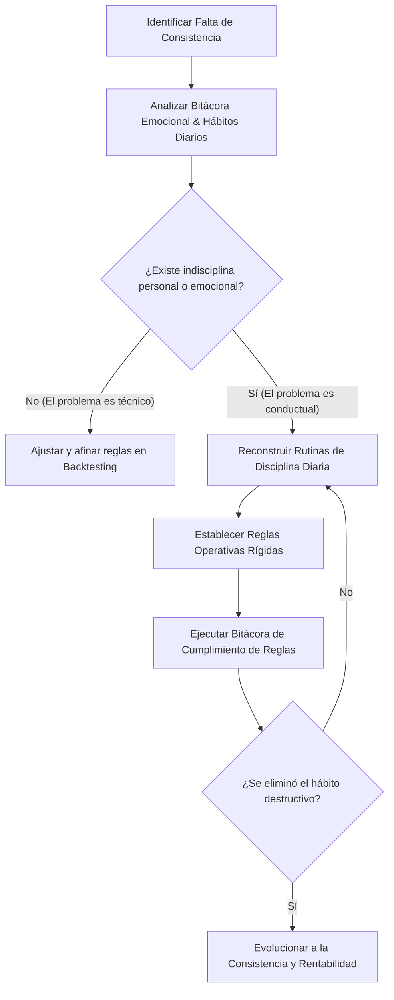

> [!NOTE]
> ### Resumen Causal
> - **La Disciplina como Requisito:** Aquellos que ya son disciplinados en sus hábitos cotidianos (salud, gimnasio, orden) están mejor equipados para seguir un sistema de trading mecánico y rentable.
> - **Superar el Miedo al Cambio:** La falta de rentabilidad no suele deberse a un mal sistema, sino a la resistencia psicológica del trader a cambiar sus malos hábitos operativos y a implementar reglas probadas en sesiones rigurosas de [[02-backtesting-my-70-percent-win-rate-strategy|Backtesting]].
> - **El Proceso de Transformación Personal:** El trading actúa como un espejo implacable que obliga al individuo a transformarse personalmente o a enfrentar el fracaso financiero inevitable.

---

## Cronológico Breakdown

### `[00:00]` Introducción: El Miedo al Cambio en el Trading
- Por qué la mayoría de los traders principiantes se resisten a cambiar sus hábitos a pesar de perder dinero constantemente.
- La psicología detrás de la zona de confort: es más fácil repetir conductas destructivas familiares que asumir el dolor temporal de la autodisciplina.
- Planteamiento de que el trading es un reto de desarrollo personal disfrazado de análisis técnico.

### `[02:30]` El Gráfico como Espejo de la Vida
- Cómo las decisiones de trading (FOMO, revancha, avaricia) reflejan directamente las carencias emocionales y la falta de control en la vida cotidiana.
- Si no puedes controlar tus emociones en tu día a día, el mercado magnificará esas debilidades cuando haya dinero real en juego.
- La necesidad de una autoauditoría honesta para identificar los fallos en tu estructura mental.

### `[05:00]` Construyendo la Disciplina Fuera de las Pantallas
- Explicación de que la disciplina no es un interruptor que se enciende solo al abrir TradingView.
- El rol de la actividad física (ir al gimnasio), el sueño regular, la alimentación y el orden en el hogar como entrenamiento para la mente.
- **IF** puedes dominar los pequeños hábitos diarios, **THEN** tendrás la fuerza de voluntad necesaria para seguir las reglas rígidas del [[02-backtesting-my-70-percent-win-rate-strategy|Mech Model]] o mantener la calma al [[04-how-to-trade-news-pb-theory|operar noticias]].

### `[08:15]` Descomposición del Comportamiento Destructivo
- Identificación de los errores conductuales más comunes: sobreoperar, mover el Stop Loss en contra, no esperar al setup y operar bajo el efecto de la revancha.
- Estrategias prácticas para interrumpir estos patrones, como apagar la computadora después de un límite de pérdidas establecido.
- Aceptar la incomodidad de no estar en el mercado y entender que la inacción activa es una habilidad de alto nivel.

### `[11:00]` El Proceso de Mejora Continua y Auditoría Emocional
- El valor de registrar no solo los números de tus trades, sino también tu estado mental antes, durante y después de la operación.
- El análisis post-operativo como herramienta de retroalimentación para medir la adherencia a las reglas y no solo el resultado monetario.
- Cómo el análisis objetivo desmitifica las malas rachas y ayuda a discernir entre pérdidas del sistema y pérdidas por indisciplina.

### `[13:45]` Conclusión y Llamado al Cambio
- Motivación para dar el paso hacia la transformación.
- El éxito requiere humildad para aceptar que tu forma actual de pensar te mantiene en la inconsistencia y que debes reconstruir tu mentalidad de trading.

---

## Mechanical Rules (IF/THEN)

- **IF** deseas lograr consistencia y rentabilidad como trader, **THEN** debes primero implementar una disciplina estricta en tus hábitos cotidianos (sueño, ejercicio, orden).
- **IF** detectas que estás operando por revancha o bajo la influencia del FOMO, **THEN** debes cerrar la plataforma de trading inmediatamente y alejarte de las pantallas por el resto de la sesión.
- **IF** no estás dispuesto a cambiar tus patrones de comportamiento y hábitos autodestructivos frente al gráfico, **THEN** debes aceptar que tus resultados financieros seguirán siendo inconsistentes.
- **IF** cometes una infracción a tu plan de trading, **THEN** debes registrarla detalladamente en tu bitácora emocional y analizar el desencadenante psicológico antes de volver a operar.

---

## Mermaid Flowchart

