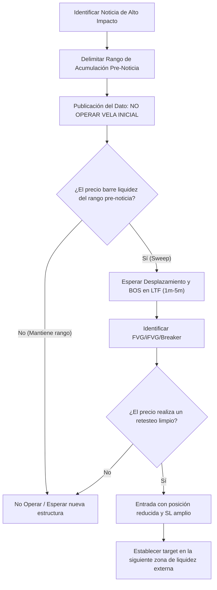

> [!NOTE]
> ### Resumen Causal
> - **No Operar la Vela de la Noticia:** La regla fundamental es nunca abrir posiciones durante el primer minuto de la publicación del dato macroeconómico para evitar la volatilidad extrema y el deslizamiento (slippage) del broker.
> - **Identificar el Rango Pre-Noticia:** Utilizar el período de acumulación anterior a la noticia para delimitar los niveles de soporte y resistencia clave que serán barridos por la reacción del mercado.
> - **Gestión de Riesgo Adaptativa:** El trading de noticias requiere reducir el tamaño de las posiciones y ampliar los stops para absorber la volatilidad residual del mercado post-noticia sin arriesgar capital excesivo (lo cual requiere la autodisciplina discutida en [[03-you-are-scared-to-change|you are scared to change]]).

---

## Cronológico Breakdown

### `[00:00]` Introducción a la Operativa de Noticias
- Presentación de los desafíos y oportunidades de operar en momentos de noticias macroeconómicas de alto impacto (IPC, FOMC, NFP).
- Explicación de la mentalidad de PB Trading respecto a las noticias: no intentamos predecir si el dato será positivo o negativo, sino reaccionar a la estructura técnica que se forma.

### `[02:15]` La Regla de Oro: Evitar la Vela de la Noticia
- Análisis de la anatomía de una vela de noticia: spreads abiertos, deslizamientos de órdenes (slippage) y movimientos espasmódicos.
- Por qué entrar al mercado en el segundo exacto de la noticia es un juego de azar, no de probabilidad técnica.
- Esperar que pase la tormenta inicial (típicamente los primeros 5-10 minutos) es crucial para la longevidad del trader.

### `[04:45]` Delimitación del Rango de Acumulación Pre-Noticia
- Cómo el precio se comprime en un rango estrecho antes de los eventos noticiosos principales (acumulación).
- Identificación de los máximos y mínimos de este rango como zonas cargadas de liquidez externa ([[Buy-Side Liquidity]] y [[Sell-Side Liquidity]]).
- Marcar estas zonas en gráficos de 5m o 15m para anticipar la manipulación del algoritmo.

### `[07:30]` La Fase de Manipulación y Barridos de Liquidez
- Explicación de cómo el mercado suele barrer los dos extremos del rango pre-noticia consecutivamente antes de tomar una dirección verdadera.
- Identificación de estos barridos ([[Liquidity Sweep]]) en baja temporalidad.
- El concepto de trampa para minoristas: inducción al error haciendo creer que el precio romperá en una dirección para luego revertirse con fuerza.

### `[10:15]` Retorno a la Estructura y Estabilización
- Cuándo buscar entradas: solo cuando el volumen y la volatilidad comiencen a estabilizarse y se observe un flujo de órdenes claro.
- Observar el desplazamiento posterior al barrido de liquidez para validar quién está en control del mercado (compradores o vendedores).

### `[13:00]` Confirmaciones en LTF tras la Noticia
- Drop a temporalidades de 1m a 5m para buscar la entrada.
- Esperar la creación de un [[Fair Value Gap|FVG]], un [[IFVG|Inversion FVG (iFVG)]] o un [[Breaker Block|Breaker Block]] que actúe como soporte/resistencia post-barrido.
- La confirmación definitiva requiere un [[Market Structure|Break of Structure (BOS)]] que respalde la nueva dirección del precio.

### `[16:15]` Reglas de Gestión de Riesgo para Noticias
- Reducción del tamaño de la posición (position sizing) al menos a la mitad debido al aumento de volatilidad y spreads, en comparación con el modelo normal de [[02-backtesting-my-70-percent-win-rate-strategy|Backtesting]].
- Ampliar el stop loss structural para evitar ser sacado del mercado por oscilaciones aleatorias y compensar esto reduciendo el apalancamiento.
- Ratios R:R realistas basados en la liquidez que queda por barrer en el gráfico.

### `[19:30]` Conclusión y Ejemplos en Gráficos Reales
- Análisis de ejemplos históricos reales de operaciones tomadas después de noticias de IPC e informes de empleo.
- Importancia de la paciencia y de aceptar que si la estructura no se estabiliza de forma clara, la mejor decisión es no operar ese día.

---

## Mechanical Rules (IF/THEN)

- **IF** se aproxima una noticia macroeconómica de alto impacto (e.g., IPC, FOMC, NFP), **THEN** suspendemos la operativa activa y no ingresamos al mercado durante la vela de publicación del dato.
- **IF** el precio realiza un [[Liquidity Sweep]] violento del rango pre-noticia y luego presenta un fuerte desplazamiento alcista o bajista que genera un [[Market Structure|Break of Structure (BOS)]], **THEN** buscamos un punto de entrada en LTF.
- **IF** decidimos tomar la operación post-noticia, **THEN** debemos reducir la exposición de contratos (menor apalancamiento) y configurar un Stop Loss más amplio detrás del swing de la noticia.
- **IF** no observamos un desplazamiento claro o el mercado se mantiene en rangos sucios post-noticia, **THEN** cancelamos los planes operativos y esperamos a la siguiente sesión.

---

## Mermaid Flowchart

