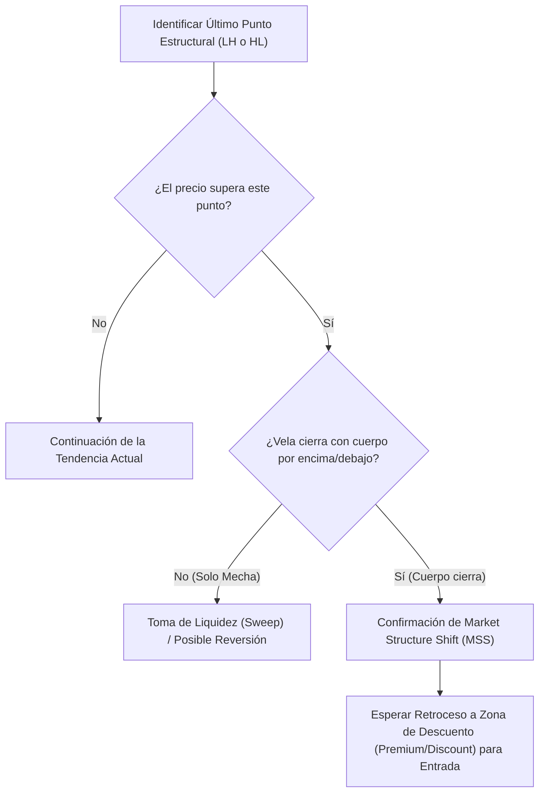

> [!NOTE]
> ### Resumen Causal
> - **Identificación de Tendencia:** La estructura del mercado se define por la secuencia de máximos y mínimos. Una estructura alcista consta de máximos más altos (HH) y mínimos más altos (HL), mientras que una bajista presenta máximos más bajos (LH) y mínimos más bajos (LL).
> - **Market Structure Shift (MSS) vs. Cierre de Cuerpo:** Un cambio de estructura (MSS) ocurre cuando el precio rompe y cierra con el cuerpo de la vela por encima del último LH (en tendencia bajista) o por debajo del último HL (en tendencia alcista). Las rupturas solo con mechas no son válidas y usualmente indican tomas de liquidez (sweeps) o trampas.
> - **Filtro de Temporalidades:** Entender la dirección de la temporalidad mayor (HTF) es esencial para evitar el "ruido" de las temporalidades menores (LTF) y operar a favor de la tendencia real del flujo de órdenes institucional.

---

## Cronológico Breakdown

### `[00:00]` Introducción a la Estructura de Mercado
- Patrick y Blake explican por qué la [[Market Structure]] es la base sobre la que se construye cualquier estrategia de trading exitosa en ICT.
- Sin entender en qué dirección se está moviendo la estructura, cualquier entrada basada en otros conceptos (como imbalances o bloques de órdenes) tiene alta probabilidad de fallar.

### `[02:30]` Definición Mecánica de Estructura Alcista y Bajista
- Explicación de cómo marcar correctamente los puntos estructurales en los gráficos:
  - **Estructura Alcista:** Sucesión de máximos más altos (Higher Highs - HH) y mínimos más altos (Higher Lows - HL).
  - **Estructura Bajista:** Sucesión de máximos más bajos (Lower Highs - LH) y mínimos más bajos (Lower Lows - LL).
- Se recalca que los gráficos no siempre son perfectos y que entrenar la vista para identificar la estructura real requiere mucho tiempo de pantalla.

### `[05:45]` El Criterio de Validación: Cierres de Cuerpo vs. Rupturas de Mechas
- Blake detalla la regla de oro: para que un máximo o mínimo sea roto formalmente y continúe la estructura, debe haber un cierre de vela con cuerpo (Body Close).
- Si el precio sobrepasa un máximo anterior pero cierra por debajo del mismo dejando una mecha, se interpreta como un [[Liquidity Sweep]] (barrido de liquidez) y no como una continuación o cambio de la estructura.

### `[08:15]` Market Structure Shift (MSS) y Transición de Tendencia
- El Market Structure Shift (MSS) representa el primer indicio de cambio de tendencia en el flujo de órdenes.
- Una transición bajista a alcista ocurre cuando el precio rompe con cuerpo el último LH.
- Una transición alcista a bajista ocurre cuando el precio rompe con cuerpo el último HL.
- Se diferencia el MSS del [[Change of Character]] (CHoCH), aunque en la práctica ambos representan el primer cambio estructural.

### `[11:00]` Sincronización de Temporalidades (HTF a LTF)
- Cómo utilizar la estructura en gráficos de temporalidades mayores (Higher Timeframe - HTF), como diario o 4 horas, para determinar el sesgo direccional del día ([[Higher Timeframe Bias]]).
- Una vez determinado el Bias alcista o bajista en HTF, el trader baja a temporalidades menores (Lower Timeframe - LTF), como 1 o 5 minutos, para buscar entradas alineadas con la estructura mayor.

### `[13:40]` Ejemplos en Gráfico Real (Nasdaq / ES)
- Demostración práctica en TradingView de cómo trazar e identificar la estructura en Nasdaq.
- Análisis de fallos comunes que cometen los traders novatos al marcar mínimos y máximos incorrectos que no tienen significancia real en el flujo institucional.

---

## Mechanical Rules (IF/THEN)

- **IF** el precio supera un máximo o mínimo estructural anterior pero solo lo hace con una mecha y la vela cierra por dentro del rango anterior, **THEN** se clasifica como una toma de liquidez ([[Liquidity Sweep]]) y se busca una reversión en lugar de una continuación.
- **IF** una vela cierra con cuerpo real por encima del último LH (en reversión alcista) o por debajo del último HL (en reversión bajista), **THEN** se confirma un Market Structure Shift (MSS) y se marca la zona para buscar un retroceso.
- **IF** la estructura de la temporalidad mayor (HTF) es alcista pero en temporalidad menor (LTF) se observa una estructura bajista temporal, **THEN** se busca la finalización de ese retroceso bajista en zonas clave para entrar en compras a favor del flujo mayor.

---

## Mermaid Flowchart

