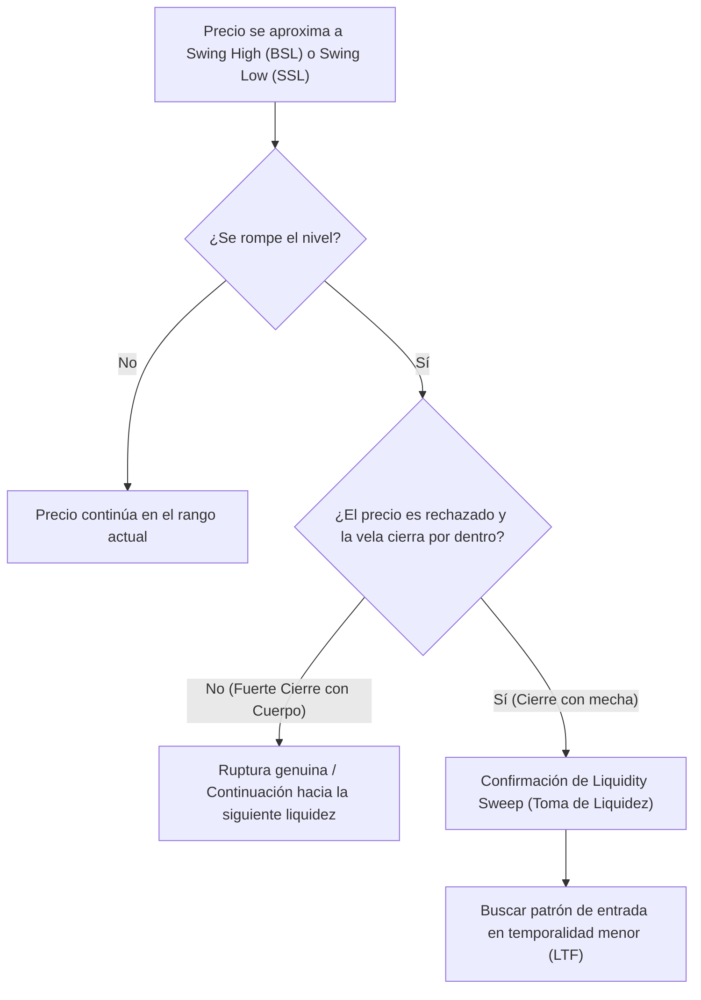

> [!NOTE]
> ### Resumen Causal
> - **Definición de Liquidez (Combustible):** La liquidez representa el "combustible" que el algoritmo interbancario utiliza para mover el precio de una zona a otra. Se define principalmente por las órdenes pendientes (stop losses y buy/sell stops) de los traders minoristas.
> - **Ubicación Clave de la Liquidez:** La liquidez se acumula principalmente por encima de los máximos de oscilación (Buy-Side Liquidity - BSL) y por debajo de los mínimos de oscilación (Sell-Side Liquidity - SSL).
> - **Patrón de Tres Velas:** Para identificar un swing high o swing low válido se requiere una formación de 3 velas: una vela central con un máximo/mínimo más alto/bajo que las dos velas laterales. El color de las velas no es relevante.

---

## Cronológico Breakdown

### `[00:00]` Introducción al Concepto de Liquidez
- Patrick y Blake explican qué es la liquidez y por qué es el pilar central sobre el que giran todos los conceptos de ICT.
- Se define la liquidez como la presencia de órdenes en el mercado (dinero real) que permite a los grandes participantes institucionales abrir o cerrar posiciones masivas sin causar deslizamientos masivos de precios.

### `[02:15]` Las Dos Fuerzas del Mercado
- Explicación de que el mercado financiero tiene un comportamiento algorítmico y se mueve principalmente por dos razones:
  1. **Buscar Liquidez:** Ir a buscar y limpiar máximos o mínimos anteriores donde se concentran las órdenes pendientes.
  2. **Rebalancear el Precio:** Volver a rangos de precios ineficientes donde hay un desequilibrio de órdenes (imbalance) para ofrecer una entrega de precios justa.

### `[04:40]` Buy-Side Liquidity (BSL) vs. Sell-Side Liquidity (SSL)
- Detalle de dónde descansan los stop-losses y buy/sell stops de los traders minoristas:
  - **Buy-Side Liquidity (BSL):** Liquidez acumulada en forma de órdenes de compra pendientes por encima de los máximos relativos. Principalmente colocada como stop-losses de vendedores en corto o buy stops de traders de ruptura.
  - **Sell-Side Liquidity (SSL):** Liquidez acumulada en forma de órdenes de venta pendientes por debajo de los mínimos relativos. Principalmente colocada como stop-losses de compradores en largo o sell stops de traders de ruptura bajista.

### `[07:30]` Identificación de Swing Highs y Swing Lows (El Patrón de 3 Velas)
- Blake explica de forma detallada cómo utilizar la regla de las 3 velas para marcar correctamente los máximos y mínimos que contienen liquidez:
  - **[[Swing High]]:** Formación de 3 velas consecutivas donde la vela central tiene el máximo más alto de las tres.
  - **[[Swing Low]]:** Formación de 3 velas consecutivas donde la vela central tiene el mínimo más bajo de las tres.
- El color o el tipo de vela no importa; la regla es puramente matemática basada en los máximos o mínimos de los rangos.

### `[10:15]` La Trampa del Trader Minorista (Stop Hunt)
- Explicación de cómo las instituciones y los creadores de mercado utilizan la liquidez minorista.
- Para que una institución pueda comprar millones de contratos, necesita que alguien venda. Por ende, empujan el precio por debajo de un mínimo clave para activar los stop-losses de compra (que son órdenes de venta en el mercado), absorbiendo esa oferta barata.
- Este proceso se denomina [[Stop Hunt]] o barrido de liquidez.

### `[13:00]` Ejemplos Prácticos en Gráfico
- Trazado en TradingView de BSL y SSL en gráficos reales de Nasdaq y Euro/Dólar.
- Se analizan sweeps (barridos) reales y cómo el precio tiende a revertirse inmediatamente después de que la liquidez ha sido purgada.

### `[15:10]` Tarea de Práctica (Homework)
- Blake y Patrick dejan como tarea a la comunidad ir al gráfico e identificar al menos 10 Swing Highs y 10 Swing Lows válidos en temporalidades de 15 minutos o una hora para acostumbrar el ojo a buscar el combustible del mercado.

---

## Mechanical Rules (IF/THEN)

- **IF** el precio rompe un Swing High limpio donde residen órdenes de compra pendientes ([[Buy-Side Liquidity]]), **THEN** se anticipa una posible reacción a la baja si el precio es rechazado rápidamente y la vela de ruptura cierra por debajo del máximo original.
- **IF** el precio rompe un Swing Low limpio donde residen órdenes de venta pendientes ([[Sell-Side Liquidity]]), **THEN** se anticipa una posible reacción al alza tras absorber las órdenes de venta si el precio es rechazado y la vela cierra por encima de ese nivel.
- **IF** identificas un Swing High/Low utilizando el patrón de 3 velas, **THEN** debes trazar una línea horizontal hacia el futuro marcando esa zona como un objetivo potencial donde el algoritmo institucional buscará llevar el precio (Draw on Liquidity).

---

## Mermaid Flowchart

