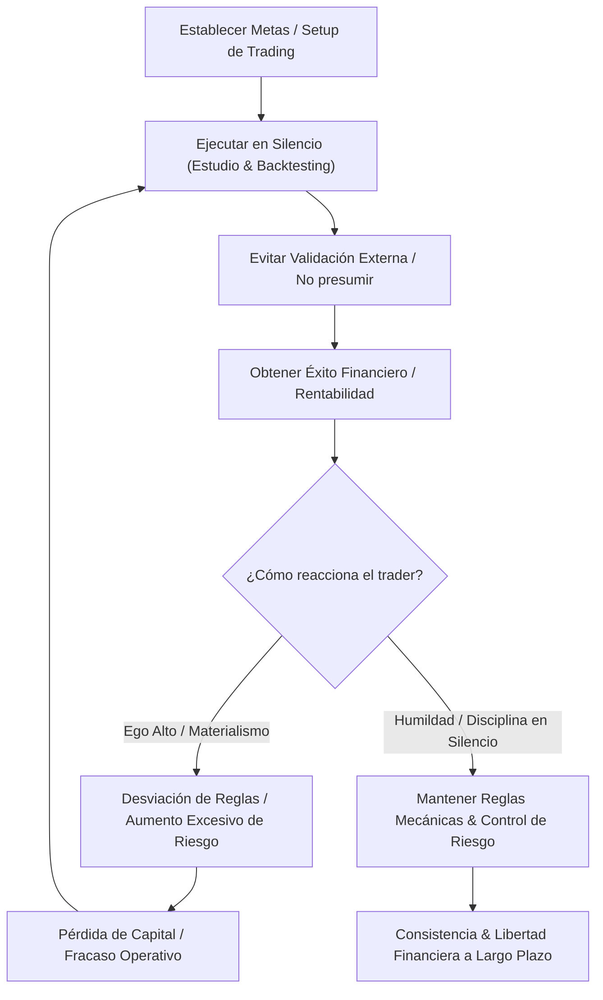

> [!NOTE]
> ### Resumen Causal
> - **El Silencio como Catalizador:** Compartir proyectos o metas antes de tiempo genera una satisfacción ficticia (gratificación inmediata) que debilita el impulso real necesario para ejecutar y ser disciplinado.
> - **Control de la Riqueza y el Ego:** El éxito monetario actúa como amplificador del carácter. Desarrollar humildad y autodisciplina es indispensable para evitar que las ganancias desestabilicen al operador y nublen su objetividad técnica en [[02-backtesting-my-70-percent-win-rate-strategy|Backtesting]].
> - **Ser Mayor que tus Posesiones:** Las posesiones materiales (como carros o lujos) no deben definir el valor o carácter de un trader. La verdadera maestría consiste en el crecimiento personal diario y la superación de las debilidades emocionales que conducen a la ruina en [[03-you-are-scared-to-change|you are scared to change]].

---

## Cronológico Breakdown

### `[00:00]` El Concepto de Trabajar en Silencio
- Introducción al concepto de "Work in Silence" en la operativa y la vida diaria.
- Por qué contar tus metas o "ideas de un millón de dólares" a amigos y familiares sabotea tu progreso mediante la gratificación psicológica falsa ("mental masturbation").
- Quienes construyen su habilidad y carácter en silencio muestran mayor consistencia y desarrollo a largo plazo.

### `[02:30]` La Trampa de la Aprobación Externa
- El peligro de buscar validación en redes sociales o en tu círculo social cercano antes de obtener resultados reales y consistentes.
- Cómo el algoritmo y el entorno social distraen al trader de lo verdaderamente importante: el estudio, el análisis de datos y la autoauditoría constante.
- Hacer lo que amas en silencio de forma genuina le añade valor real y lo hace especial.

### `[05:15]` El Dinero como Amplificador de Debilidades y Ego
- Reflexión sobre el proceso de ganar dinero en el trading y cómo esto puede alterar tu personalidad y ego.
- El dinero no te hace superior a nadie; cuando el capital aumenta, el ego intenta tomar el control de tus decisiones en la pantalla y en tu vida cotidiana.
- La humildad es un escudo protector fundamental frente al mercado. Un trader con ego sobredimensionado será castigado rápidamente por el mercado al irrespetar sus propias reglas operativas.

### `[07:45]` La Filosofía del Desapego Material
- Análisis de la relación entre el éxito financiero y los bienes materiales (carros, casas, lujos).
- La regla de ser "más grande que las cosas que posees": si tus pertenencias materiales son lo más interesante de ti, tu desarrollo personal es deficiente.
- Uso del trading como un vehículo de crecimiento interior y libertad en lugar de un canal de mera presunción y avaricia.

### `[10:30]` Trading: Una Batalla Personal ("You vs. You")
- El trading es una de las disciplinas más solitarias y transparentes que existen; el mercado es un espejo implacable de tu estado emocional.
- El enfoque debe estar en ser mejor que tu versión de ayer, no en compararse con otros operadores que publican ganancias extravagantes.
- Vincular la disciplina personal discutida en [[03-you-are-scared-to-change|you are scared to change]] con el éxito sostenido frente a los gráficos.

### `[13:00]` Conclusión: Propósito y Humildad
- Mensaje final sobre el impacto de la amabilidad, la empatía y la humildad en el camino hacia la rentabilidad.
- La rentabilidad sostenible se alcanza cuando el trader se enfoca en el proceso con paciencia y disciplina, eliminando el ruido del exterior y operando en silencio técnico.

---

## Mechanical Rules (IF/THEN)

- **IF** tienes una nueva meta o plan operativo (e.g., refinar un setup en [[02-backtesting-my-70-percent-win-rate-strategy|Backtesting]]), **THEN** lo ejecutas y guardas en silencio en lugar de compartirlo prematuramente para evitar la falsa sensación de logro.
- **IF** experimentas una racha de operaciones sumamente ganadoras, **THEN** debes redoblar tus hábitos de humildad y ceñirte estrictamente a tus reglas mecánicas para evitar que el ego domine tu gestión de riesgo.
- **IF** te encuentras comparando tus ganancias o tu proceso con los resultados de otros en redes sociales, **THEN** debes desconectarte de internet, cerrar tus redes and enfocarte en tu propia bitácora y datos históricos.
- **IF** dejas que tus posesiones materiales definan tu autovaloración o tu enfoque operativo, **THEN** perderás el desapego necesario para gestionar pérdidas de manera objetiva en tus operaciones diarias.

---

## Mermaid Flowchart

