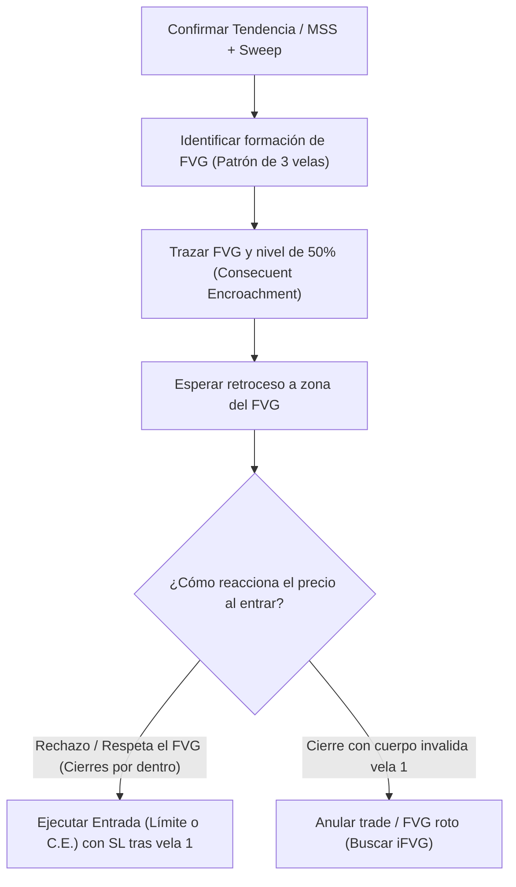

> [!NOTE]
> ### Resumen Causal
> - **Definición de Fair Value Gaps (FVG):** Un FVG es un desequilibrio o ineficiencia de precios que se forma cuando el mercado se mueve rápidamente en una dirección, dejando órdenes de compra o venta sin ejecutar. Se identifica mediante una secuencia de 3 velas consecutivas donde el mínimo de la primera vela y el máximo de la tercera vela no se superponen (dejando un "vacío" o "brecha" en la vela central).
> - **El FVG como Imán de Precios:** El algoritmo tiende a regresar al FVG para mitigar la ineficiencia (rebalancear el rango de precios) antes de reanudar el movimiento original. Este proceso de "regreso y reacción" sirve como punto clave para entradas de bajo riesgo.
> - **Contexto y Personalidad del FVG:** El tamaño físico de un FVG en el gráfico es menos importante que su contexto narrativo. Los FVGs que ocurren con fuerte desplazamiento (displacement) después de un Market Structure Shift (MSS) o de un Liquidity Sweep tienen la mayor tasa de efectividad.

---

## Cronológico Breakdown

### `[00:00]` Introducción a los Fair Value Gaps
- Patrick y Blake definen el concepto de FVG y su importancia fundamental para comprender la entrega de precios eficiente por parte del algoritmo.
- Se explica que el FVG no es solo un indicador, sino la huella física que deja la participación institucional pesada.

### `[02:00]` Anatomía de un Fair Value Gap (La Regla de las 3 Velas)
- Explicación de cómo trazar un FVG en el gráfico paso a paso mediante una secuencia de tres velas consecutivas:
  - **Bullish FVG:** Se forma en movimientos alcistas. Es la distancia entre el máximo (high) de la vela 1 y el mínimo (low) de la vela 3. La vela 2 es una gran vela alcista que genera el desplazamiento.
  - **Bearish FVG:** Se forma en movimientos bajistas. Es la distancia entre el mínimo (low) de la vela 1 y el máximo (high) de la vela 3. La vela 2 es una gran vela bajista de desplazamiento.

### `[05:15]` Comportamiento Algorítmico y Rebalanceo
- Por qué ocurren los FVGs: cuando hay prisa institucional por comprar o vender, el precio sube o baja de forma desequilibrada, ofreciendo el precio únicamente a un lado del mercado (compras o ventas).
- El algoritmo busca "rellenar" (fill) esta brecha para asegurar la eficiencia en la entrega del precio. Una vez rebalanceado, el precio suele continuar en su dirección original.

### `[07:45]` Consequent Encroachment (C.E.)
- Explicación del nivel de 50% de un FVG (Consecuent Encroachment - C.E.).
- El C.E. representa el punto de equilibrio de la ineficiencia. El precio a menudo retrocede exactamente al 50% del FVG antes de reaccionar. Si el precio cierra con cuerpo más allá del C.E., puede sugerir debilidad de la ineficiencia.

### `[10:30]` Cómo Combinar FVG con Sesgo (Bias) y Estructura
- Blake destaca que los FVGs no deben operarse de forma aislada (no se trata de entrar a todo FVG que se vea en el gráfico).
- Su verdadera fuerza radica en confluir con un Market Structure Shift (MSS) tras barrer liquidez en temporalidades mayores. El FVG se utiliza como el punto exacto de entrada una vez confirmada la dirección.

### `[13:20]` Ejemplos en Gráfico Real y Operativa Práctica
- Patrick enseña cómo trazar el FVG usando la herramienta "Canal Paralelo" o "Rectángulo" en TradingView.
- Se muestran ejemplos en Nasdaq (NQ) donde el precio toca el límite del FVG o su 50% (C.E.) y ofrece una reacción alcista/bajista instantánea.

---

## Mechanical Rules (IF/THEN)

- **IF** el precio retrocede hacia un Bullish FVG en una tendencia alcista confirmada por un MSS, **THEN** se busca una entrada en compra en el límite superior del FVG o en su nivel del 50% (C.E.), colocando el Stop Loss por debajo del mínimo de la vela 1.
- **IF** el precio retrocede hacia un Bearish FVG en una tendencia bajista confirmada por un MSS, **THEN** se busca una entrada en venta en el límite inferior del FVG o en su nivel del 50% (C.E.), colocando el Stop Loss por encima del máximo de la vela 1.
- **IF** el precio cierra con cuerpo de vela por encima/debajo de la vela 1 (invalidando el FVG), **THEN** se considera que el FVG ha fallado en actuar como soporte/resistencia, y se empieza a considerar como un posible Inverse Fair Value Gap ([[IFVG]]).

---

## Mermaid Flowchart

