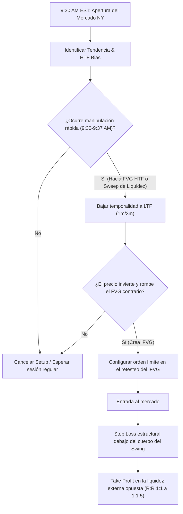

> [!NOTE]
> ### Resumen Causal
> - **La Ventana de Apertura de Nueva York:** El setup se activa específicamente en los primeros minutos de la apertura de mercado (9:30 AM - 9:37 AM EST), aprovechando la inyección de volumen y volatilidad inicial.
> - **Identificación de la Manipulación:** Buscar una manipulación rápida del precio que barra liquidez local o mitigue un [[Fair Value Gap|FVG]] de temporalidad mayor (HTF) inmediatamente después de la campana de apertura.
> - **Entrada por Inversión (iFVG):** El disparador de entrada es el cierre de una vela de baja temporalidad (LTF) invalidando el FVG inmediato de la pierna de manipulación, transformándolo en un [[IFVG|Inversion FVG (iFVG)]].

---

## Cronológico Breakdown

### `[00:00]` Introducción al Setup de Apertura Rápida
- Presentación de la estrategia más veloz del modelo PB Theory, diseñada para capitalizar los movimientos de los primeros minutos del mercado.
- La importancia de la preparación previa: marcar niveles de soporte, resistencia y zonas de liquidez HTF antes de las 9:30 AM EST.
- Por qué la campana de apertura de Nueva York ofrece las condiciones ideales de velocidad y volumen para este setup.

### `[02:45]` La Regla de la Ventana Temporal (9:30 AM - 9:37 AM)
- Delimitación estricta del tiempo: el setup ocurre casi exclusivamente entre las 9:30 AM y 9:37 AM EST.
- Si no hay manipulación o confirmación clara en estos primeros 7 minutos, el setup se cancela para evitar falsificaciones en rangos posteriores.
- Mantener la calma y esperar el desarrollo del movimiento sin caer en el FOMO (conectando con la mentalidad de [[05-work-in-silence-pb-theory|Work in Silence]]).

### `[05:15]` Identificación de la Pierna de Manipulación y HTF Pool
- El algoritmo tiende a expandir en una dirección falsa (manipulación) nada más abrir para capturar stops de los minoristas.
- Para un setup de compras (long), buscamos una caída rápida que barra mínimos ([[Liquidity Sweep]]) o tape un [[Fair Value Gap|FVG]] en 5m o 15m.
- La paciencia para dejar que esta manipulación se desarrolle y golpee un nivel institucional de alta probabilidad.

### `[08:00]` El Disparador de Entrada: iFVG en LTF
- Transición a gráficos de baja temporalidad (como 3m, 1m o incluso 30 segundos) para buscar el gatillo.
- Esperar a que el precio revierta la dirección de la manipulación y cierre por encima del último FVG bajista creado durante la caída (para un long).
- Este FVG bajista invalidado pasa a ser un [[IFVG|Inversion FVG (iFVG)]]. La entrada se ejecuta en el retesteo de este nivel.

### `[10:45]` Optimización del Stop Loss y Gestión de Riesgo
- Colocación del Stop Loss: lógicamente por debajo del cuerpo de la vela del swing en lugar de la punta del wick largo, lo cual mejora sustancialmente el ratio riesgo-beneficio.
- Objetivos de Take Profit: targeting a la liquidez externa opuesta ([[Buy-Side Liquidity]] o [[Sell-Side Liquidity]]) o un FVG HTF no llenado.
- Búsqueda de un R:R rápido de 1:1 o 1:1.5 para salir rápido del mercado antes de que cambie el flujo de órdenes de la mañana.

### `[13:30]` Ejemplos en Gráficos Reales (Nasdaq / S&P500)
- Demostración de setups en Nasdaq y ES utilizando el gráfico de TradingView.
- Análisis de operaciones exitosas y fallidas, mostrando cómo se lee la estructura de velas para validar el iFVG.
- Importancia de registrar estos trades en la bitácora siguiendo el proceso sistemático de [[02-backtesting-my-70-percent-win-rate-strategy|Backtesting]].

---

## Mechanical Rules (IF/THEN)

- **IF** el reloj marca las 9:30 AM EST y el precio realiza una manipulación rápida barriendo liquidez o mitigando un FVG de 5m/15m, **THEN** nos preparamos para buscar un contragolpe en LTF.
- **IF** el precio revierte y cierra una vela LTF (1m-3m) invalidando el FVG inmediato contrario (creando un [[IFVG|Inversion FVG (iFVG)]]), **THEN** ingresamos en una orden de límite al retesteo de dicho iFVG.
- **IF** ejecutamos la entrada, **THEN** colocamos el Stop Loss por debajo del cuerpo de la vela del swing (para un long) y apuntamos al siguiente máximo/mínimo relevante como objetivo de beneficio rápido.
- **IF** son las 9:37 AM EST y el setup no se ha presentado o no ha dado confirmación clara, **THEN** cancelamos las órdenes de la apertura y esperamos a la sesión regular o post-Silver Bullet.

---

## Mermaid Flowchart

