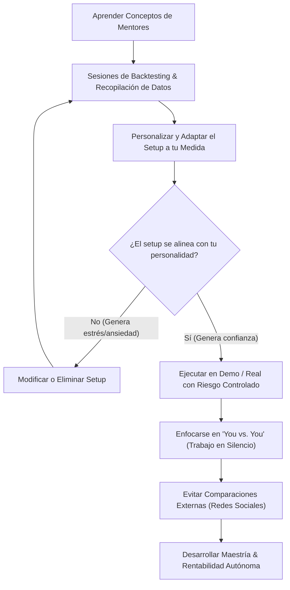

> [!NOTE]
> ### Resumen Causal
> - **El Veneno de la Comparación:** Comparar el ritmo de aprendizaje, los montos ganados o los setups individuales con los de otros traders en redes sociales paraliza el progreso y genera frustración emocional destructiva.
> - **Desarrollo de un Estilo Único:** El objetivo de estudiar a otros mentores es aprender la teoría fundamental para luego adaptarla e integrarla de forma intuitiva y personalizada a tu propia personalidad y tolerancia al riesgo.
> - **Autonomía y Toma de Decisiones:** La rentabilidad real e independiente requiere autoconfianza y la capacidad de tomar decisiones discrecionales bajo tus propias reglas operativas desarrolladas en [[02-backtesting-my-70-percent-win-rate-strategy|Backtesting]].

---

## Cronológico Breakdown

### `[00:00]` Introducción: La Individualidad en el Trading
- Por qué el trading es una disciplina puramente individual y no cooperativa.
- El peligro de intentar copiar exactamente a otros traders: cada persona ve e interpreta el flujo de órdenes de manera diferente.
- La psicología de "Be Yourself" como base para construir un sistema de trading duradero.

### `[02:30]` La Trampa de Compararse en Redes Sociales
- Cómo los grupos de chat y las redes sociales fomentan una competencia insana y una falsa expectativa de velocidad de progreso.
- El trading es una carrera de fondo: compararte con alguien que está en su año 5 cuando tú estás en tu mes 6 es injusto y sabotea tu disciplina.
- Abogar por el aislamiento productivo y el trabajo discreto, conectando directamente con el principio de [[05-work-in-silence-pb-theory|Work in Silence]].

### `[05:00]` Sintetizar y Personalizar tu Sistema
- Cómo tomar conceptos existentes (SMC, ICT, Price Action) y moldearlos a tu medida.
- Si un setup te causa excesivo estrés o ansiedad, significa que no se alinea con tu personalidad; debes tener la flexibilidad para desecharlo o adaptarlo.
- Doblar la apuesta en los patrones y franjas horarias que mejor comprendas y en los que tengas mejores estadísticas de [[02-backtesting-my-70-percent-win-rate-strategy|Backtesting]].

### `[07:45]` La Regla de "Tú contra Ti" (You vs. You)
- El mercado no sabe quién eres, ni le importa; el único obstáculo real entre tú y la rentabilidad son tus propios sesgos y faltas de control emocional.
- El desarrollo de la autodisciplina en el gráfico está ligado a cómo manejas tus hábitos fuera de las pantallas, tal como se analiza en [[03-you-are-scared-to-change|you are scared to change]].
- Tomar la responsabilidad completa de cada ganancia y pérdida.

### `[10:15]` El Carácter del Trader Profesional
- Para ser un operador consistente, primero debes desarrollar cualidades humanas clave: paciencia, humildad, gratitud y ecuanimidad ante la pérdida.
- La importancia de la autoaceptación: entender que las pérdidas son un costo del negocio y no un reflejo de tu valor personal.
- La confianza en uno mismo se construye trade a trade siguiendo reglas mecánicas sencillas.

### `[13:00]` Conclusión y Llamado a la Autoauditoría
- Cierre del video exhortando a los espectadores a realizar una revisión honesta de su mentalidad y objetivos.
- Enfócate en tu propio gráfico, sigue tus reglas operativas (como las de [[06-the-fastest-setup-pb-theory|The FASTEST Setup]]) y confía en el proceso.

---

## Mechanical Rules (IF/THEN)

- **IF** sientes el impulso de comparar tus resultados o setups en redes sociales, **THEN** te desconectas inmediatamente y recuerdas que tu único competidor real es tu versión de ayer.
- **IF** estudias una nueva estrategia de un mentor, **THEN** debes realizarle al menos 100 pruebas en [[02-backtesting-my-70-percent-win-rate-strategy|Backtesting]] para personalizarla y adaptarla a tu propio estilo cognitivo antes de operar en vivo.
- **IF** un setup técnico te genera parálisis o sobrecarga emocional constante al ejecutarlo, **THEN** lo eliminas de tu arsenal operativo para mantener la claridad y coherencia mental.
- **IF** asumes el control total de tu proceso de trading, **THEN** eliminas las excusas externas y te enfocas en optimizar tu disciplina diaria descripta en [[03-you-are-scared-to-change|you are scared to change]].

---

## Mermaid Flowchart

