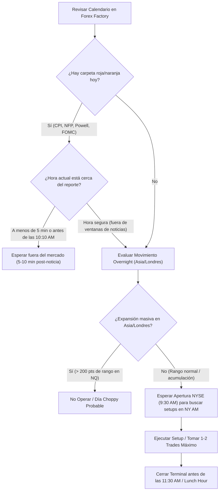

> [!NOTE]
> ### Resumen Causal
> - **El Tiempo sobre el Precio:** El tiempo es el elemento más crucial en la entrega del precio por parte del algoritmo. Operar únicamente dentro de las horas de mayor volumen y volatilidad institucional (conocidas como [[Kill Zones]]) maximiza la probabilidad y reduce el riesgo de quedar atrapado en rangos de acumulación.
> - **Especialización y Disciplina:** No es necesario operar todas las sesiones del día. Enfocarse en dominar una única sesión, específicamente la sesión am de Nueva York (New York AM Session), permite construir consistencia y evita caer en el sobre-operar (overtrading).
> - **Filtro de Noticias de Alto Impacto:** Las noticias de color rojo u naranja en Forex Factory (como CPI, PPI, FOMC y NFP) actúan como catalizadores de volatilidad. Un trader disciplinado debe evitar abrir posiciones minutos antes de la noticia y esperar de 5 a 10 minutos a que el precio estabilice su dirección tras el lanzamiento.

---

## Cronológico Breakdown

### `[00:00]` Introducción a la Importancia del Tiempo
- Patrick y Blake introducen el concept de "Time" en la metodología ICT, señalando que el tiempo es más importante que el precio mismo.
- Explican que el algoritmo interbancario entrega el precio de forma eficiente en momentos muy específicos del día.

### `[00:46]` Anatomía de las Sesiones y Kill Zones (EST)
- Definición de los horarios clave para operar Nasdaq (NQ) y S&P 500 (ES) en hora del Este (EST):
  - **[[Asian Session Range|Asia Session]] (8:00 PM - 12:00 AM):** Choppy y de baja volatilidad. Los traders de Nueva York están inactivos.
  - **[[London Open|London Session]] (2:00 AM - 5:00 AM):** Mayor volatilidad, movimientos prolongados, pero de desarrollo más lento.
  - **New York AM Session (8:30 AM - 11:00 AM / 12:00 PM):** El horario de oro. Cuenta con el mayor volumen y los movimientos más limpios. A las 8:30 AM se liberan noticias y a las 9:30 AM abre la Bolsa de Nueva York (NYSE), inyectando enorme volatilidad.
  - **New York Lunch Hour (12:00 PM - 1:00 PM):** Sesión lenta, sin volumen institucional y propensa a falsos movimientos.
  - **New York PM Session (1:00 PM - 4:00 PM):** Movimientos secundarios interesantes, aunque usualmente con menor volatilidad que la sesión de la mañana.

### `[02:23]` Dominio de una Sola Sesión
- Advertencia sobre el error común de los principiantes de intentar operar todo el día.
- Blake enfatiza que "más tiempo en pantalla no equivale a más dinero". Operar varias sesiones disminuye la disciplina y genera pérdidas por desgaste psicológico y de capital.
- Se recomienda enfocarse plenamente en dominar la New York AM Session.

### `[05:05]` El Impacto del Movimiento Overnight (Asia y Londres)
- Cómo las sesiones previas afectan a la sesión americana:
  - Si Asia o Londres realizan un movimiento expansivo inusualmente grande (de cientos de puntos), es muy probable que la sesión de Nueva York sea lenta y en rango (choppy).
  - En esos escenarios, la regla mecánica principal es evitar operar o reducir radicalmente el riesgo.
  - De igual forma, si la New York AM Session tiene una gran expansión que barre la liquidez de la sesión previa, la hora del almuerzo (Lunch Hour) será muy inactiva y de baja probabilidad.

### `[07:59]` Configuración de Indicadores y Filtros en TradingView
- Blake muestra cómo configurar el indicador "ICT Kill Zones and Pivots" (de *trade for op*) para automatizar el sombreado de las sesiones en TradingView.
- Se explican las ventajas de comenzar a marcar la sesión americana a partir de la apertura oficial de la NYSE (9:30 AM) para filtrar el ruido pre-market.

### `[08:56]` Filtro de Noticias y Uso de Forex Factory
- Introducción a la plataforma Forex Factory para monitorear eventos económicos del USD.
- Filtrado y enfoque exclusivo en noticias de carpeta roja (alto impacto) y carpeta naranja (impacto medio).
- Eventos clave a tener en cuenta: CPI (Inflación), PPI, FOMC (Tasas de interés) y NFP (Non-Farm Payrolls - primer viernes de cada mes).
- En días de FOMC (donde Powell habla a las 2:30 PM), la sesión de la mañana suele ser sumamente errática, por lo que es prudente evitar operar en la mañana por completo. En días de NFP, el jueves previo suele carecer de volatilidad.

---

## Mechanical Rules (IF/THEN)

- **IF** el movimiento de las sesiones de Asia/Londres (overnight) es inusualmente grande y volátil (expansión masiva sin dirección clara), **THEN** se evita operar la New York AM Session debido al alto riesgo de consolidación y distribución lenta.
- **IF** se planea tomar un trade cerca de una noticia de carpeta roja/naranja (ej. CPI a las 8:30 AM o Powell a las 10:00 AM), **THEN** no se debe estar dentro del mercado 5 minutos antes de la noticia y se debe esperar entre 5 y 10 minutos después del impacto para buscar una entrada confirmada.
- **IF** es un día de FOMC (conferencia de prensa a las 2:00 PM / 2:30 PM EST), **THEN** se evita operar la sesión de la mañana (New York AM Session) y se busca operar únicamente la sesión de la tarde (PM Session) una vez que el mercado haya digerido la noticia.
- **IF** la sesión de la mañana (AM Session) ha completado una gran expansión y ha tomado la liquidez principal del día, **THEN** se asume que la sesión del almuerzo (Lunch Hour) será de rango y se cierran las plataformas de trading de inmediato.

---

## Mermaid Flowchart

