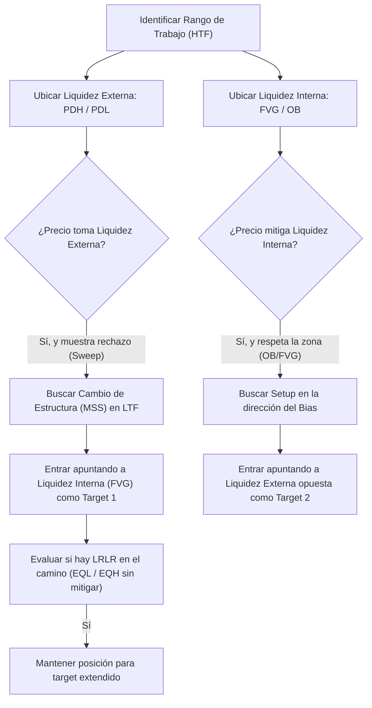

> [!NOTE]
> ### Resumen Causal
> - **Liquidez de Línea de Tendencia (Trend Line Liquidity):** Las líneas de tendencia dibujadas por el retail (comunes en análisis clásico) representan una acumulación masiva de stop losses. El algoritmo institucional utiliza estas líneas como "autopistas" de liquidez, barriéndolas velozmente antes de revertir el precio.
> - **Liquidez Interna vs. Externa:** La liquidez externa reside en los extremos de un rango (ej. Previous Day High/Low - PDH/PDL), mientras que la liquidez interna se encuentra dentro del rango en forma de ineficiencias ([[Fair Value Gap|Fair Value Gaps]] u Order Blocks). El precio se mueve cíclicamente de liquidez externa a interna, y viceversa.
> - **Baja vs. Alta Resistencia (LRLR vs. HRLR):** Un Low Resistance Liquidity Run (LRLR) ocurre cuando el precio se expande con rapidez hacia un objetivo debido a que los swing highs/lows previos están limpios y sin mitigar. Un High Resistance Liquidity Run (HRLR) es lento y ruidoso porque el precio enfrenta zonas mitigadas y estructuras densas.

---

## Cronológico Breakdown

### `[00:00]` Introducción a Liquidez Avanzada
- Patrick y Blake retoman el tema de la liquidez como el motor del mercado.
- En este episodio, el enfoque pasa de los máximos/mínimos simples a la liquidez estructurada y las dinámicas internas/externas del precio.

### `[02:10]` Liquidez de Línea de Tendencia (Trend Line Liquidity - TLL)
- Explicación de cómo los traders retail compran o venden apoyándose en líneas de tendencia diagonales.
- Cada toque en la línea de tendencia acumula stop losses justo debajo (en una tendencia alcista) o justo arriba (en una tendencia bajista).
- El mercado busca purgar esta liquidez con una vela de fuerte desplazamiento para activar esas órdenes pendientes (sell stops o buy stops).

### `[05:30]` Previous Day High (PDH) y Previous Day Low (PDL)
- Patrick destaca que el máximo y mínimo del día anterior son las piscinas de [[External Liquidity|liquidez externa]] más vigiladas en temporalidades diarias.
- El algoritmo busca abrir el rango diario expandiéndose hacia el PDH o PDL para neutralizar las órdenes de stop de los traders intradía.

### `[07:45]` Círculo de Entrega de Precio: Liquidez Externa a Interna
- El precio oscila continuamente bajo una regla:
  - Una vez tomada la liquidez externa (PDH, PDL o Session Highs/Lows), el precio busca rebalancear la [[Internal Liquidity|liquidez interna]] (llenar un [[Fair Value Gap]] o mitigar un Order Block).
  - Tras rebalancear la liquidez interna, el mercado se impulsa nuevamente hacia la liquidez externa opuesta.

### `[10:15]` Low Resistance Liquidity Run (LRLR)
- Blake define el LRLR como la situación ideal para entrar al mercado.
- Ocurre cuando el precio tiene un camino despejado con máximos o mínimos relativos iguales o limpios (EQL/EQH) sin mitigar.
- El movimiento es sumamente rápido y vertical debido a que el algoritmo corre a ejecutar los stops acumulados sin resistencia estructural.

### `[12:50]` High Resistance Liquidity Run (HRLR)
- Contraste con el LRLR. Se da cuando los swing points anteriores ya han sido mitigados o barridos parcialmente.
- El mercado se mueve de forma errática, lenta y con muchas mechas, lo que incrementa el riesgo de ser sacado en stop loss si el sesgo no es sumamente claro.

---

## Mechanical Rules (IF/THEN)

- **IF** el precio acumula una línea de tendencia alcista muy obvia con múltiples toques minoristas, **THEN** se proyecta un barrido de esa línea hacia el soporte real o [[Sell-Side Liquidity]] antes de buscar compras institucionales.
- **IF** el precio barre la liquidez externa diaria ([[Buy-Side Liquidity]] en el PDH o [[Sell-Side Liquidity]] en el PDL) y muestra rechazo con cuerpo de vela en temporalidad de 15 minutos, **THEN** se busca una entrada hacia la [[Internal Liquidity]] opuesta (rebalancear el FVG más cercano).
- **IF** la estructura de mercado muestra máximos/mínimos limpios y acumulados sin mitigar en la dirección del sesgo diario (LRLR), **THEN** se puede entrar con mayor confianza al setup en FVG, proyectando una toma de ganancias acelerada en esos extremos.

---

## Mermaid Flowchart

