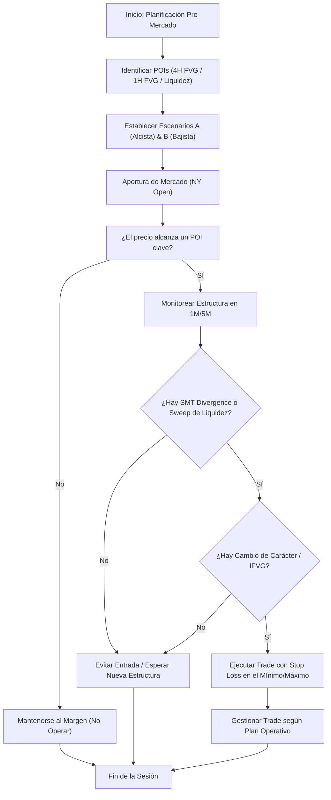

> [!NOTE]
> ### Resumen Causal
> - **Reacción sobre Predicción:** Operar con éxito no consiste en adivinar la dirección del precio antes de la apertura, sino en trazar escenarios objetivos (A y B) y reaccionar únicamente cuando el precio los valida.
> - **Planificación Pre-Mercado:** El análisis preliminar requiere identificar zonas clave en temporalidades mayores ([[Higher Timeframe Bias]]) como [[Fair Value Gap|Fair Value Gaps (FVG)]] e imbalances de 1H y 4H.
> - **Confirmación y Divergencias:** Se utiliza la [[SMT Divergence|divergencia SMT]] entre ES (S&P 500) y NQ (Nasdaq) para confirmar tomas de liquidez y fuerza relativa en los puntos de interés operados.

---

## Cronológico Breakdown

### `[00:00]` Filosofía de Reacción: El Error del "Predictor"
- La diferencia fundamental entre un operador que intenta adivinar el futuro del gráfico y uno profesional que reacciona a los hechos de la acción del precio.
- Predecir ciega la mente del trader, haciendo que mantenga un sesgo equivocado incluso cuando el mercado rompe contra sus reglas.
- Cómo el control del ego se conecta con la psicología descrita en [[03-ict-for-dummies-surrender-your-ego-ep-2|Surrender Your Ego]].

### `[02:15]` Planificación y Escenarios Pre-Mercado (A vs. B)
- Blake muestra cómo de manera práctica estructurar la sesión antes de la apertura de Nueva York.
- Definición de dos caminos claros:
  - **Escenario A (Bullish):** Si el precio retrocede a una zona de descuento ([[Discount Zone]]) o barre mínimos y confirma estructura alcista, buscaremos compras.
  - **Escenario B (Bearish):** Si el precio rechaza con fuerza una zona premium ([[Premium Zone]]) y rompe estructura hacia abajo, buscaremos ventas.
- Si ninguno de los dos escenarios ofrece una confirmación clara, la sesión se considera nula y no se arriesga capital.

### `[05:30]` Identificación de Puntos de Interés (POIs) y SMT
- Selección de imbalances institucionales: análisis de [[Fair Value Gap|Fair Value Gaps]] de 4 horas y 1 hora.
- Evaluación de la correlación de índices: cómo la [[SMT Divergence]] (donde un índice hace un mínimo más bajo pero el otro no) indica una absorción institucional de liquidez ([[Liquidity Sweep]]).
- Determinación de cuál de los dos índices es el más fuerte o el más débil para seleccionar el activo a operar.

### `[08:45]` Acción del Precio en el POI: Temporalidad Menor
- Monitoreo del precio una vez ingresa a la zona de interés preestablecida.
- Detección del desplazamiento de las velas ([[Displacement Candle]]) que demuestra la participación de dinero inteligente.
- Espera de la formación de una estructura de reversión clara mediante el cambio de carácter ([[Change of Character]]) y la creación de gaps de escape.

### `[11:00]` Setups de Continuación: Retrocesos y Gaps Inversos
- Cómo operar continuaciones en tendencias muy marcadas.
- Uso del retroceso de 5 o 15 minutos en busca de ineficiencias de corto plazo.
- Explicación de la operativa con gaps inversos ([[IFVG|Inverse FVG]]): cuando una brecha bajista es superada con cuerpo y se convierte en soporte para el movimiento alcista.
- Las bases teóricas de estas brechas se asientan sobre [[06-ict-for-dummies-fair-value-gaps-ep-5|Fair Value Gaps Ep. 5]].

### `[13:30]` Conclusión y Filosofía del Operador Consistente
- Resumen de la sesión. Blake recalca que la paciencia es la herramienta que más dinero genera.
- Aceptar que el mercado puede moverse con fuerza sin darnos una entrada válida; evitar perseguir el precio es la clave para no sufrir de [[03-ict-for-dummies-surrender-your-ego-ep-2|sobreoperativa]].
- Vincular la disciplina de la sesión con los principios de [[05-work-in-silence-pb-theory|Work in Silence]].

---

## Mechanical Rules (IF/THEN)

- **IF** el precio alcanza un POI de alta temporalidad durante la sesión, **THEN** bajamos a temporalidad de 1M/5M y buscamos confirmaciones de [[Change of Character|CHoCH]] y desplazamiento.
- **IF** observamos una [[SMT Divergence]] en los mínimos de la sesión dentro de un FVG de 4H alcista, **THEN** favorecemos compras en el índice que muestra mayor fuerza relativa.
- **IF** el precio invalida y cierra con cuerpo de vela por encima de un FVG bajista de 5M (convirtiéndose en [[IFVG]]), **THEN** podemos buscar una entrada en largo en el retest de dicho gap inverso.
- **IF** el mercado avanza verticalmente sin ofrecer retrocesos claros a nuestros POIs o sin activar nuestras confirmaciones mecánicas, **THEN** no entramos al mercado y cerramos la plataforma por el día.

---

## Mermaid Flowchart

