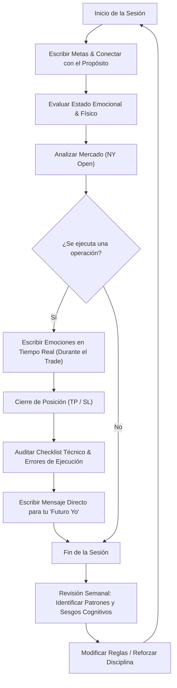

> [!NOTE]
> ### Resumen Causal
> - **Conversación con tu Futuro Yo:** El diario de trading no es una simple hoja de cálculo de resultados numéricos, sino una bitácora introspectiva para auditar tus hábitos y mentalidad en el tiempo.
> - **Estructura en Tres Áreas:** Para que sea efectivo, debe documentar la rutina previa a la sesión (claridad física y mental), las emociones sentidas en tiempo real mientras el trade está activo, y la auditoría pos-trade.
> - **Alineación de Propósito:** Conectarte diariamente con tus metas de vida profundas (libertad, familia) te ancla a la disciplina operativa y previene que caigas en la codicia cortoplacista.

---

## Cronológico Breakdown

### `[00:00]` Introducción: El Espejo Psicológico del Diario
- Por qué la mayoría de los traders acumulan pérdidas a pesar de conocer la teoría técnica: falta de autoconocimiento.
- El diario no se trata de presumir ganancias, sino de registrar con honestidad las debilidades humanas.
- El concepto de "conversación con tu futuro yo": escribir hoy lo que necesitas recordar mañana para no repetir errores estúpidos.

### `[03:00]` Anclaje y Alineación de Propósito (Metas)
- La importancia de comenzar el día de trading escribiendo tus metas a largo plazo (por qué operas, a quién quieres ayudar, qué estilo de vida buscas).
- Escribir tus metas alinea tu energía y evita que te pierdas en el ruido de los gráficos de velas de 1 minuto.
- La psicología de mantener el foco lejos de la desesperación por dinero rápido, vinculada con la mentalidad de [[03-you-are-scared-to-change|You are Scared to Change]].

### `[06:30]` Estructura Práctica de una Bitácora PB Theory
- **Rutina Matutina:** Registrar horas de sueño, nivel de energía, si hiciste ejercicio y si estás en un estado mental enfocado o disperso.
- **Bitácora Durante el Trade:** Escribir textualmente cómo te sientes mientras la posición está corriendo (ansiedad, ganas de cerrar antes del Target, euforia). Esto desmitifica la idea del trader "robot".
- **Auditoría Pos-Trade:** Determinar objetivamente si cumpliste el checklist de tu sistema o si tomaste un trade discrecional por impulso.

### `[09:45]` Detección de Patrones de Comportamiento
- Cómo revisar tu diario al final de cada semana para identificar tus mayores saboteadores (por ejemplo: perder consistentemente los viernes por cansancio, o sobreoperar después de un stop loss).
- El diario sirve como base de datos de tu propio comportamiento para refinar las reglas operativas que probaste en [[02-backtesting-my-70-percent-win-rate-strategy|Backtesting]].
- La transición de un operador reactivo e indisciplinado a uno profesional y sistemático.

### `[12:15]` El Mensaje para tu "Futuro Yo"
- Escribir un párrafo directo y honesto al finalizar el día de trading dirigido a ti mismo para la siguiente sesión.
- Consejos prácticos escritos en primera persona: "Mañana no operes si no hay divergencia SMT" o "Hoy lo hiciste excelente esperando pacientemente el setup de [[08-react-dont-predict-market-pb-theory|REACT, Don't PREDICT]]".
- Cómo construir autoconfianza a través del respeto mutuo entre tu versión presente y futura.

### `[14:30]` Conclusión: La Disciplina de Escribir Diariamente
- La bitácora solo funciona si se realiza con constancia absoluta.
- El acto físico de escribir hace que las lecciones queden impresas en tu subconsciente.
- Cierre conectando el diario con el principio del progreso en solitario de [[05-work-in-silence-pb-theory|Work in Silence]].

---

## Mechanical Rules (IF/THEN)

- **IF** te dispones a analizar los gráficos de la sesión, **THEN** primero abres tu bitácora y completas los datos de tu rutina matutina y estado emocional inicial.
- **IF** entras a una operación activa, **THEN** escribes tu nivel de convicción (del 1 al 10) y tus sensaciones emocionales en tiempo real en lugar de intervenir el gráfico sin justificación técnica.
- **IF** el trade toca Stop Loss o Take Profit, **THEN** registras la conformidad técnica del trade con respecto a tu checklist y escribes un mensaje de retroalimentación para tu siguiente sesión.
- **IF** notas que tu estado emocional registrado al inicio de la sesión es de cansancio, enojo o frustración, **THEN** prohíbes operar en real por ese día y limitas tu actividad a la observación o al [[02-backtesting-my-70-percent-win-rate-strategy|Backtesting]].

---

## Mermaid Flowchart

