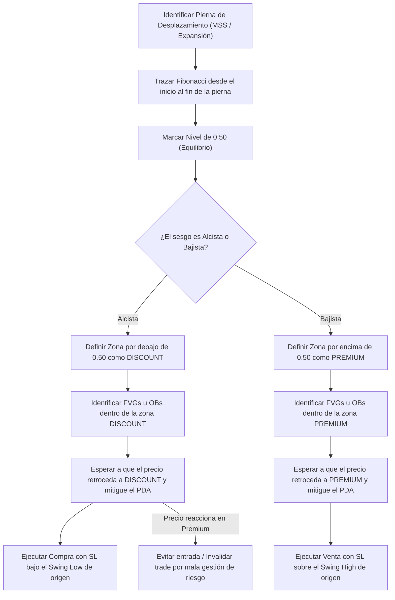

> [!NOTE]
> ### Resumen Causal
> - **El Concepto de Equilibrio (50%):** Al trazar un rango de trading desde el mínimo de oscilación (swing low) hasta el máximo de oscilación (swing high), el nivel del 50% define el equilibrio de precios. No se deben abrir compras por encima de este nivel ni ventas por debajo.
> - **Comprar Barato y Vender Caro:** Los traders minoristas a menudo compran cuando el precio sube rápido, entrando en la [[Premium Zone|zona premium]] (cara). Las instituciones compran en la [[Discount Zone|zona discount]] (barata) y venden en premium. Operar con las instituciones exige esperar pacientemente el retroceso a descuento.
> - **Confluencia Estructural:** El filtro de Premium/Discount no se opera solo. Funciona al superponer el rango con ineficiencias de precio como [[Fair Value Gap|Fair Value Gaps]] u Order Blocks. Un setup alcista solo es de alta probabilidad si el FVG u OB a mitigar se ubica por debajo del equilibrio (50%).

---

## Cronológico Breakdown

### `[00:00]` Introducción a Premium vs. Discount
- Patrick y Blake explican la lógica empresarial básica detrás del trading: comprar barato (a descuento) y vender caro (con prima o premium).
- Señalan que operar fuera de estas zonas es la razón número uno de pérdidas en traders principiantes, incluso si logran predecir correctamente la dirección del mercado (bias).

### `[02:30]` Configuración de la Herramienta Fibonacci
- Explicación de cómo simplificar la herramienta de retroceso de Fibonacci en TradingView:
  - Eliminar todos los niveles estándar (como 0.382, 0.618, etc.) excepto el `0` (extremo inicial), `1` (extremo final) y `0.5` (Equilibrio).
  - Opcionalmente, mantener los niveles de descuento profundo como el `0.62`, `0.705` y `0.79` (conocidos como OTE - Optimal Trade Entry).

### `[04:45]` Definiendo el Rango de Trabajo (Dealing Range)
- Cómo marcar correctamente los puntos de anclaje de la herramienta Fibonacci:
  - **Rango Alcista (Bullish Range):** Se traza desde el cuerpo o mecha del [[Swing Low]] más bajo que generó el desplazamiento alcista, hasta el [[Swing High]] más alto donde el precio comenzó a retroceder.
  - **Rango Bajista (Bearish Range):** Se traza desde el [[Swing High]] más alto que generó el desplazamiento bajista, hasta el [[Swing Low]] más bajo donde comenzó el retroceso.

### `[08:15]` Las Reglas de Oro Operativas
- **En tendencias alcistas (compras):** Buscar posiciones largas únicamente en la [[Discount Zone]] (por debajo del nivel 0.50).
- **En tendencias bajistas (ventas):** Buscar posiciones cortas únicamente en la [[Premium Zone]] (por encima del nivel 0.50).
- Comprar en Premium o vender en Discount reduce drásticamente el ratio Riesgo:Beneficio (R:R) y expone al trader a stop outs por retrocesos naturales de precio.

### `[11:00]` Confluencia con Ineficiencias de Precio (PD Arrays)
- Los creadores explican cómo combinar Premium/Discount con PD Arrays (Price Delivery Arrays):
  - En un rango alcista, marcar todos los [[Fair Value Gap|Fair Value Gaps]] u Order Blocks. Aquellos que se encuentren en la mitad superior (Premium) se ignoran para compras o se asumen como zonas que fallarán.
  - El foco se dirige exclusivamente a los FVGs u OBs ubicados en Discount.

---

## Mechanical Rules (IF/THEN)

- **IF** el sesgo diario (bias) es alcista y el precio realiza un Market Structure Shift (MSS) con fuerte desplazamiento, **THEN** se traza el Fibonacci del mínimo al máximo de la pierna de desplazamiento y se espera a que el precio retroceda por debajo del nivel 0.50 ([[Discount Zone]]) antes de buscar compras.
- **IF** el precio retrocede a un Bullish FVG que está ubicado en la [[Premium Zone]], **THEN** se evita tomar el trade debido a que el precio no ha abaratado lo suficiente y el algoritmo institucional probablemente buscará mitigar zonas más profundas en Discount.
- **IF** el sesgo diario es bajista y el precio realiza un MSS bajista, **THEN** se busca entrar en venta únicamente cuando el precio retroceda por encima del nivel 0.50 ([[Premium Zone]]), confluenciando con un Bearish FVG o Bearish Order Block.

---

## Mermaid Flowchart

