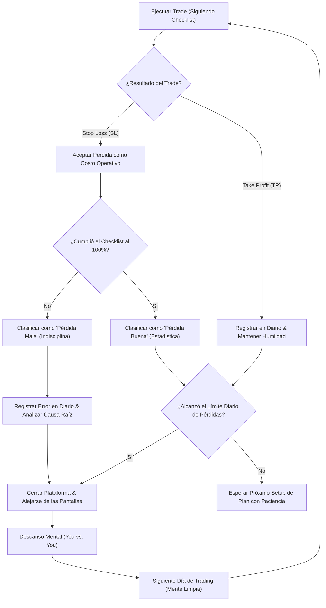

> [!NOTE]
> ### Resumen Causal
> - **Aceptación del Costo:** Las pérdidas no representan un fracaso personal, sino el costo operativo inevitable en el negocio del trading; la consistencia reside en saber transitar los "días rojos".
> - **Eliminación de la Revancha:** El impulso de revenge trading (buscar recuperar lo perdido aumentando el lote o forzando entradas) es el mayor destructor de cuentas y disciplina.
> - **Mentalidad Probabilística:** El trading es un juego de distribución estadística; los resultados individuales no importan tanto como el rendimiento acumulado de una serie de 100 trades ejecutados bajo el mismo sistema.

---

## Cronológico Breakdown

### `[00:00]` El Gran Tabú: Aceptar la Pérdida
- Por qué la mente humana está biológicamente programada para odiar perder y cómo esto sabotea las decisiones financieras.
- Los traders novatos buscan un win rate del 100% e ignoran que incluso los fondos de cobertura institucionales tienen pérdidas constantes.
- Aceptar el stop loss como una protección necesaria para preservar la salud de tu cuenta.

### `[03:15]` El Ciclo Destructivo del "Revenge Trading"
- Desglose del espiral descendente: sufrir una pérdida, sentir humillación o enojo, duplicar el riesgo, tomar una entrada apresurada sin confirmación y terminar quemando la cuenta.
- Cómo detener este patrón destructivo reconociendo los disparadores emocionales en el momento en que ocurren.
- La desconexión total como única herramienta de control efectiva en momentos de ira operativa.

### `[06:45]` La Perspectiva del Casino: Pensar en Probabilidades
- Explicación de cómo funciona la esperanza matemática en el trading.
- Los casinos pierden manos de blackjack y tiradas de ruleta individuales, pero ganan a largo plazo porque conocen su ventaja estadística (edge).
- Si tu sistema tiene un 70% de win rate demostrado en [[02-backtesting-my-70-percent-win-rate-strategy|Backtesting]], debes esperar series aleatorias de 3 o 4 pérdidas consecutivas sin dudar de la estrategia.

### `[09:30]` Pérdidas Buenas vs. Pérdidas Malas
- **Pérdida Buena:** El setup cumplió todas las condiciones de tu checklist técnico, la gestión de riesgo fue correcta y el mercado simplemente se movió en contra. Es una pérdida estadística normal.
- **Pérdida Mala:** Se originó por FOMO, se operó durante noticias sin aplicar el protocolo de [[04-how-to-trade-news-pb-theory|How to Trade News]], se movió el Stop Loss o se arriesgó de más. Esta pérdida es un error de disciplina y debe ser penalizada.
- Clasificar tus pérdidas de forma honesta en tu bitácora de trading.

### `[12:30]` El Checklist Mecánico como Escudo
- El uso de un checklist inalterable (por ejemplo, identificación de POIs, presencia de [[SMT Divergence]] y confirmación en microestructura mediante [[IFVG]]) para filtrar entradas impulsivas.
- Si el trade no cumple con todos los puntos del checklist, se considera un trade fuera de plan y ejecutarlo es una falta grave a las reglas del sistema.
- Cómo la estructura rígida de ejecución apoya la toma de decisiones descrita en [[08-react-dont-predict-market-pb-theory|REACT, Don't PREDICT]].

### `[15:00]` Rutina Post-Pérdida y Gestión Emocional
- Qué hacer inmediatamente después de tocar tu límite de pérdida diaria.
- Uso del diario para externalizar la frustración y documentar los hechos antes de que tu mente intente racionalizar el error, siguiendo el método de [[09-how-to-journal-pb-theory|How To Journal]].
- El autocontrol como el verdadero diferenciador de un trader profesional que protege su capital ante todo.

---

## Mechanical Rules (IF/THEN)

- **IF** tocas tu límite máximo de pérdidas por sesión (1 o 2 Stop Losses según tu plan), **THEN** cierras la plataforma de trading y apagas el monitor inmediatamente por el resto del día.
- **IF** tienes una operación perdedora, **THEN** revisas tu checklist técnico para verificar si fue una "pérdida buena" (estadística) o una "pérdida mala" (disciplinaria).
- **IF** detectas que estás operando con impulsividad o deseos de revancha tras una pérdida, **THEN** aplicas un protocolo de desconexión física de las pantallas por al menos 30 minutos.
- **IF** has realizado un riguroso [[02-backtesting-my-70-percent-win-rate-strategy|Backtesting]] de tu sistema, **THEN** confías en la esperanza matemática y mantienes el tamaño del riesgo constante sin alterarlo por miedo a perder de nuevo.

---

## Mermaid Flowchart

