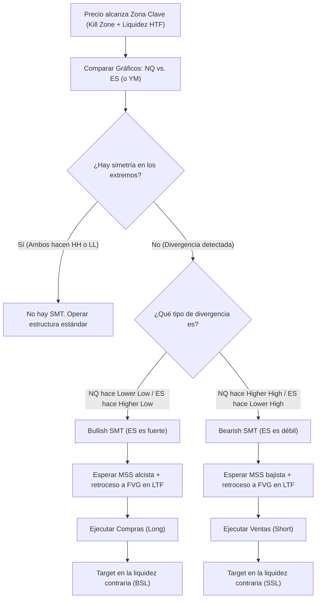

> [!NOTE]
> ### Resumen Causal
> - **Firma del Smart Money:** La Divergencia SMT (Smart Money Technique) revela la acumulación o distribución institucional oculta. Se produce cuando dos activos altamente correlacionados (como Nasdaq NQ y S&P 500 ES) muestran una falta de simetría en sus máximos o mínimos clave.
> - **Confirmación, no Entrada:** La divergencia SMT nunca debe ser operada como un indicador de entrada independiente. Su verdadera función es servir como un factor confirmatorio de alta probabilidad cuando el precio alcanza una piscina de liquidez o un PD Array importante.
> - **Mecánica Bullish/Bearish:** Un SMT alcista ocurre cuando un activo rompe a un mínimo más bajo mientras que el otro mantiene un mínimo más alto. Un SMT bajista se genera cuando un activo rompe a un máximo más alto pero el otro falla y deja un máximo más bajo. El activo "más fuerte/debil" que no rompe suele dar el movimiento más limpio.

---

## Cronológico Breakdown

### `[00:00]` Introducción al SMT Divergence
- Patrick y Blake definen el SMT (Smart Money Technique) como una de las herramientas de confirmación más poderosas del arsenal de ICT.
- Explican que dado que los índices bursátiles (NQ, ES, YM) representan la salud general de la economía estadounidense, deben moverse de la mano. Cuando no lo hacen, significa que el dinero inteligente está interviniendo de manera asimétrica.

### `[02:45]` Mecánica de la Divergencia Alcista (Bullish SMT)
- Blake ilustra cómo buscar una divergencia alcista en mínimos clave (ej. Session Lows o PDL):
  - **Activo A (ej. NQ):** Rompe hacia abajo barriendo el mínimo anterior y creando un Lower Low (mínimo más bajo).
  - **Activo B (ej. ES):** No logra romper su mínimo anterior, haciendo un Higher Low (mínimo más alto).
  - **Explicación:** ES muestra fuerza institucional (está siendo acumulado agresivamente), lo que impide que rompa su nivel. La entrada óptima se busca en el activo fuerte (ES) tras confirmar el SMT.

### `[06:15]` Mecánica de la Divergencia Bajista (Bearish SMT)
- Explicación de la divergencia bajista en máximos clave (ej. Session Highs o PDH):
  - **Activo A (ej. NQ):** Rompe hacia arriba haciendo un Higher High (máximo más alto).
  - **Activo B (ej. ES):** No logra romper su máximo anterior, dejando un Lower High (máximo más bajo).
  - **Explicación:** ES muestra debilidad estructural (se están vendiendo posiciones de forma masiva), fallando en confirmar la subida de NQ. Se busca operar en venta el activo débil.

### `[09:30]` Combinación con Liquidez y Estructura
- Patrick enfatiza que el SMT solo tiene valor analítico en "Zonas de Reacción Clave":
  - Buscar SMT durante las [[Kill Zones]] (especialmente en la apertura de Nueva York a las 9:30 AM).
  - Debe ocurrir exactamente cuando uno de los activos barre una piscina de [[Buy-Side Liquidity]] o [[Sell-Side Liquidity]] importante.
  - El setup se confirma en temporalidad menor (1m o 5m) a través de un Market Structure Shift (MSS) y un [[Fair Value Gap]] (o Inverse FVG).

### `[12:10]` Ejemplos en Gráfico Real NQ vs. ES
- Blake muestra cómo configurar dos pantallas o usar el indicador "Comparison" en TradingView para comparar NQ y ES en tiempo real.
- Analizan un trade real en la sesión de la mañana donde NQ barrió los mínimos del pre-market pero ES no, disparándose al alza con una confluencia de FVG perfecta.

---

## Mechanical Rules (IF/THEN)

- **IF** el precio de Nasdaq (NQ) rompe un mínimo de sesión clave haciendo un Lower Low, y S&P 500 (ES) respeta su mínimo anterior haciendo un Higher Low, **THEN** se confirma un Bullish [[SMT Divergence]] (fuerza en ES).
- **IF** se confirma un Bullish SMT durante la Kill Zone de Nueva York, **THEN** se prioriza buscar posiciones largas (compras) en el activo que mostró fuerza (ES) o en el que barrió liquidez (NQ), tras un MSS en temporalidades menores (1m/5m).
- **IF** el precio de NQ hace un Higher High en un máximo diario anterior, mientras ES falla y hace un Lower High, **THEN** se confirma un Bearish SMT (debilidad en ES) y se priorizan las ventas tras la formación de un MSS bajista.
- **IF** se observa una divergencia en medio del rango (sin toques a piscinas de liquidez HTF o PD Arrays), **THEN** se ignora por completo, ya que carece de contexto y suele ser ruido algorítmico.

---

## Mermaid Flowchart

