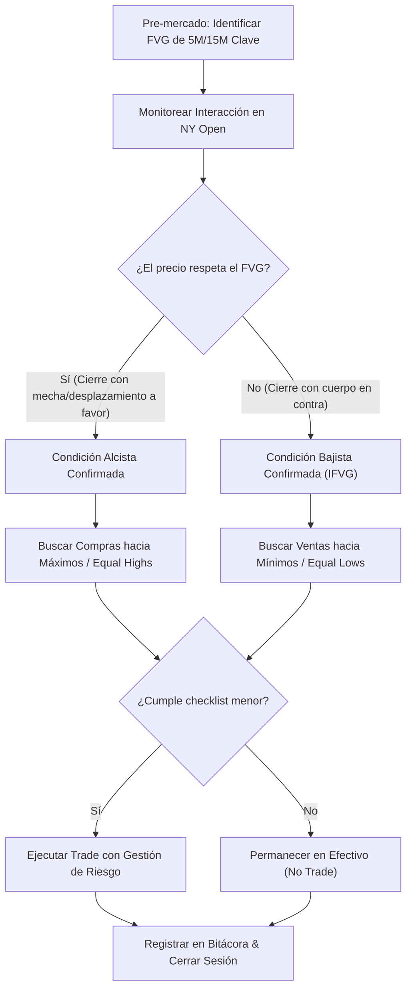

> [!NOTE]
> ### Resumen Causal
> - **Eliminación de la Adivinanza:** En lugar de adivinar si el precio subirá o bajará al tocar un POI, la metodología de PB Theory establece "condiciones" mecánicas claras del tipo "SI ocurre X, ENTONCES ejecuto".
> - **El FVG de 5M/15M como Pivote:** Las condiciones se centran en el comportamiento del precio dentro de Fair Value Gaps de temporalidad menor (5m o 15m). El respeto o invalidación de estas zonas dicta el sesgo definitivo de la sesión.
> - **Enfoque en Objetivos Claros:** Una vez que se confirma que una condición es respetada o disrespetada (inversada), el operador simplifica su foco mental dirigiéndose únicamente hacia la liquidez restante en esa dirección, ignorando el ruido opuesto.

---

## Cronológico Breakdown

### `[00:00]` Introducción: La Definición de una Condición
- Explicación de qué es una condición en trading: una regla inalterable que previene que operemos de forma impulsiva o predictiva.
- Por qué la mayoría de los traders pierden dinero al intentar anticipar la reversión exacta en un nivel sin esperar que el precio "le ponga condiciones" al mercado.
- La transición de un trading de predicción a uno puramente reactivo, en línea con la filosofía de [[08-react-dont-predict-market-pb-theory|REACT, Don't PREDICT]].

### `[03:15]` Cómo Seleccionar el Rango y el FVG Clave
- Identificación de ineficiencias en temporalidades mayores como punto de partida.
- El uso del [[Fair Value Gap]] (FVG) de 5 minutos o 15 minutos en el extremo del movimiento actual.
- Cómo este FVG actúa como la línea en la arena: si el mercado respeta este gap, la tendencia previa sigue activa; si lo rompe, el sesgo cambia de inmediato.

### `[06:30]` Respeto vs. Disrespeto (Inversión)
- **Escenario 1: Zona Respetada.** Si el precio toca el FVG de 5M y muestra un desplazamiento rápido en la dirección original, se confirma la continuación y se busca la entrada en temporalidades menores.
- **Escenario 2: Zona Invalidada.** Si el precio cierra con cuerpo de vela a través del FVG, este se convierte en un [[IFVG|Inverse FVG (iFVG)]]. Esto invalida el sesgo previo y nos da una condición de dirección opuesta de alta probabilidad.
- El concepto de "Double Condition": cuando la inversión del FVG es a su vez la confirmación de la entrada, similar a lo expuesto en [[06-the-fastest-setup-pb-theory|The Fastest Setup]].

### `[09:45]` Simplificación del Foco de Liquidez
- Una vez validada la condición del día (por ejemplo, alcista tras el respeto de un FVG de 5M), el operador debe enfocar su atención únicamente en los objetivos de compra por encima (como [[Equal Highs]] o máximos de sesión).
- Cómo esto elimina la fatiga mental y el sesgo de confirmación al evitar buscar ventas en retrocesos insignificantes.
- Vinculación de la paciencia operativa con las reglas de [[09-how-to-journal-pb-theory|How To Journal]] para registrar solo setups de plan.

### `[12:50]` Conclusión y Reglas de Oro
- Resumen del proceso de toma de decisiones basado en condiciones.
- Aceptar que habrá sesiones donde el mercado no defina ninguna condición clara, lo cual nos obliga a permanecer en efectivo.
- La importancia de la consistencia mental explicada en [[05-work-in-silence-pb-theory|Work in Silence]].

---

## Mechanical Rules (IF/THEN)

- **IF** el precio se aproxima a un POI de alta temporalidad, **THEN** definimos un FVG de 5M/15M clave como nuestra "condición" del día.
- **IF** el precio respeta el FVG de 5M/15M y muestra desplazamiento en el NY Open, **THEN** buscamos compras hacia la liquidez externa alcista.
- **IF** el precio cierra con cuerpo por debajo del FVG de 5M/15M alcista, **THEN** consideramos que la condición ha sido invalidada (convertida en [[IFVG|iFVG]]) y buscamos escenarios de venta hacia los mínimos de sesión.
- **IF** el mercado no interactúa con nuestro FVG condicional o lo hace con velas de poco volumen sin dirección clara, **THEN** nos abstenemos de operar y protegemos el capital.

---

## Mermaid Flowchart

