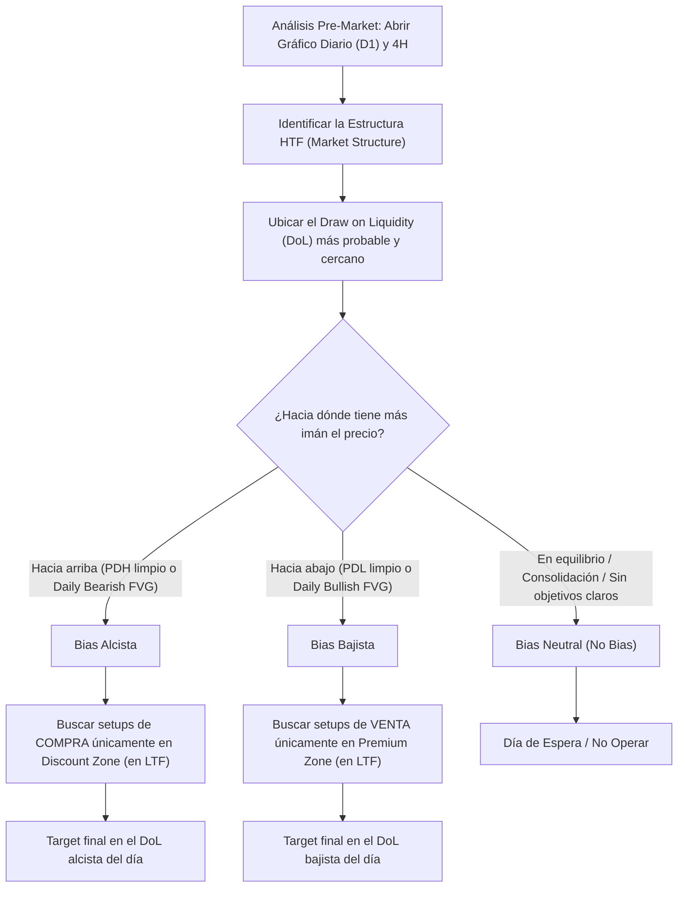

> [!NOTE]
> ### Resumen Causal
> - **El Draw on Liquidity (Objetivo Diario):** El sesgo diario o daily bias consiste en predecir hacia qué piscina de liquidez externa principal (PDH, PDL) o ineficiencia interna (Daily FVG) se expandirá la vela del día de hoy. El precio se mueve buscando su "Draw on Liquidity".
> - **Respetar vs. Irrespetar PD Arrays:** Un daily bias alcista se confirma cuando el mercado respeta de forma sistemática los PD Arrays alcistas (como Daily/4H [[Order Block (Bullish)|Bullish Order Blocks]] y [[Fair Value Gap|Bullish FVGs]]) e irrespeta (rompe) los PD Arrays bajistas, convirtiéndolos en zonas de soporte (Inversión).
> - **Evitar Forzar Dirección (No Bias = No Trade):** Si el gráfico diario o de 4 horas muestra consolidación, velas con cuerpos pequeños y muchas mechas, o si el precio está en un rango de equilibrio exacto sin dirección, se asume un sesgo neutral. En estos días, la mejor regla mecánica es no operar.

---

## Cronológico Breakdown

### `[00:00]` Introducción a la Dirección del Día (Daily Bias)
- Patrick y Blake explican qué es el sesgo diario y por qué es fundamental para tener confianza al ejecutar operaciones intradía.
- Se desmitifica el sesgo: "No se trata de saber exactamente qué hará cada vela, sino de saber hacia dónde corre el precio en las temporalidades mayores (Daily, 4H)".

### `[02:15]` El Concepto de "Draw on Liquidity" (DoL)
- El daily bias se reduce a contestar la pregunta: *¿Dónde está el dinero más cercano en el gráfico diario?*
- El algoritmo busca expandirse hacia:
  - **[[External Liquidity]]:** Previous Day High (PDH), Previous Day Low (PDL), Session Highs/Lows.
  - **[[Internal Liquidity]]:** Ineficiencias de precio como Daily Fair Value Gaps (FVG) o Volume Imbalances.

### `[05:40]` Lectura de la Estructura en Temporalidades Mayores (HTF)
- Pasos para determinar el sesgo diario en el gráfico:
  - **Alcista (Bullish Bias):** Si la estructura en diario y 4 horas está haciendo máximos y mínimos más altos, y el DoL alcista (ej. un PDH relativamente limpio) aún no ha sido alcanzado.
  - **Bajista (Bearish Bias):** Si la estructura HTF es bajista, y el DoL bajista (ej. un PDL o un FVG de descuento) sigue abierto abajo.

### `[08:50]` El Filtro de Respeto / Disrespeto de PD Arrays
- Reglas avanzadas para monitorear la salud de la tendencia:
  - Si el precio retrocede a un Bullish FVG diario y reacciona de forma alcista, la tendencia está saludable y el bias alcista se mantiene fuerte.
  - Si el precio atraviesa con fuerza un Bearish FVG (lo irrespeta) y cierra con cuerpo por encima, ese FVG se convierte en un Inverse FVG ([[IFVG]]) que actuará como soporte. Esto confirma que el bias es fuertemente alcista.
  - En una tendencia bajista, se deben respetar los Bearish FVGs e irrespetar los alcistas.

### `[12:15]` El Escenario de Rango o Sin Sesgo (Consolidación)
- Qué hacer cuando el mercado no muestra dirección:
  - Velas diarias que se superponen entre sí (cuerpo a la mitad de la vela anterior).
  - El precio se encuentra exactamente en la zona de equilibrio (0.5) de un rango mayor sin barridos de liquidez recientes.
  - La regla mecánica en estos escenarios es mantenerse al margen (neutral) para evitar ser destruido en la picadora de carne de las consolidaciones intradía.

---

## Mechanical Rules (IF/THEN)

- **IF** el precio en temporalidad diaria (D1) y de 4 horas (H4) muestra una estructura alcista y el precio retrocede hacia un [[Discount Zone|descuento]] (un Bullish FVG diario no mitigado), **THEN** el sesgo diario (daily bias) es alcista y solo se buscan setups de compra durante las [[Kill Zones]] de la sesión americana.
- **IF** el precio rompe con cuerpo de vela un Bearish FVG en H4/D1, **THEN** se asume que esa zona actuará ahora como soporte ([[IFVG]]) y se valida un sesgo alcista para la sesión.
- **IF** el precio de ayer barrió el PDH o PDL principal y la vela cerró con una mecha de rechazo muy grande (indicando un sweep), **THEN** se anticipa una reversión del bias para el día de hoy, apuntando al extremo opuesto del rango.
- **IF** el gráfico HTF muestra velas superpuestas de cuerpos pequeños (acumulación) o el DoL más cercano ya fue alcanzado y mitigado en el pre-market, **THEN** se declara "No Bias" y se evita abrir operaciones ese día.

---

## Mermaid Flowchart

