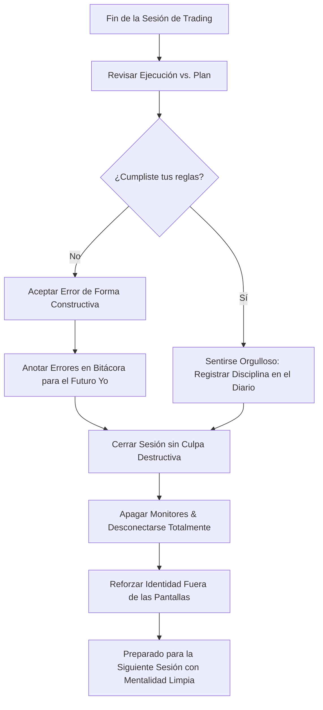

> [!NOTE]
> ### Resumen Causal
> - **El Valor del Progreso Psicológico:** Encontrar consistencia en el trading requiere valorar el desarrollo de la disciplina personal por encima del resultado monetario inmediato.
> - **Celebrar la Inacción:** No operar en días con mercados erráticos o de bajo volumen es un éxito operativo que debe festejarse tanto como un día ganador (Take Profit).
> - **Autoestima vs. Rendimiento:** Separar tu autovaloración como persona del saldo diario de tu cuenta de trading previene la autodestrucción emocional y el autosabotaje.

---

## Cronológico Breakdown

### `[00:00]` Introducción: La Soledad del Trader en Desarrollo
- Blake describe la cruda realidad del proceso de aprendizaje en solitario: horas frente a la pantalla sin reconocimiento inmediato.
- Por qué la sociedad y los círculos sociales suelen malinterpretar el trading, lo que añade presión externa al operador novato.
- La conexión entre este aislamiento necesario y la mentalidad descrita en [[05-work-in-silence-pb-theory|Work in Silence]].

### `[03:40]` Re-definiendo el Significado de una "Victoria"
- Por qué los principiantes solo consideran un "día exitoso" si su cuenta de trading subió en balance.
- El concepto de victorias invisibles: seguir el límite de pérdida diaria, apagar la pantalla tras un Stop Loss, o apegarse al checklist.
- Cómo estas decisiones construyen el músculo de la disciplina para lograr la consistencia matemática demostrada en [[02-backtesting-my-70-percent-win-rate-strategy|Backtesting]].

### `[07:15]` La Práctica del Auto-Respeto Diario
- Consejos psicológicos sobre cómo hablarte a ti mismo después de cometer un error o de tener una racha perdedora.
- El impacto del autoreproche destructivo en el rendimiento futuro (revenge trading) y cómo mitigar sus efectos mediante la introspección honesta del diario en [[09-how-to-journal-pb-theory|How To Journal]].
- Por qué sentir orgullo por tu esfuerzo y constancia es la mejor defensa frente a la desesperación financiera de [[03-you-are-scared-to-change|You are Scared to Change]].

### `[10:50]` El Diario de Agradecimiento y Logros
- La recomendación de incluir en tu bitácora diaria no solo datos técnicos de acción del precio, sino también comentarios positivos sobre tu ejecución.
- "Hoy no cometí FOMO" o "Hoy esperé el POI pacientemente" como apuntes indispensables para retroalimentar positivamente a tu cerebro.
- La psicología de la autoconfianza: tú eres tu propio jefe y mentor en esta carrera.

### `[13:30]` Conclusión: Orgullo en el Proceso
- Resumen final. La consistencia no es un destino repentino, sino una acumulación de decisiones diarias bien tomadas.
- Sentirse orgulloso del esfuerzo realizado cada día, sabiendo que cada sesión te acerca a la maestría operativa.

---

## Mechanical Rules (IF/THEN)

- **IF** finalizas una sesión de trading habiendo respetado tu plan de trading al 100% (operes o no), **THEN** te felicitas a ti mismo y consideras la sesión como un éxito absoluto.
- **IF** tocas un Stop Loss but te mantienes fiel a tus parámetros de riesgo y apagas la plataforma, **THEN** registras tu comportamiento positivo en el diario y te desconectas orgulloso de tu autocontrol.
- **IF** detectas pensamientos de autosabotaje o comparación destructiva con otros traders en redes sociales, **THEN** recuerdas tu propio progreso y te enfocas exclusivamente en tu camino personal.
- **IF** el mercado no presenta setups y decides quedarte al margen de las pantallas, **THEN** valoras esa decisión como una demostración de madurez profesional y paciencia.

---

## Mermaid Flowchart

