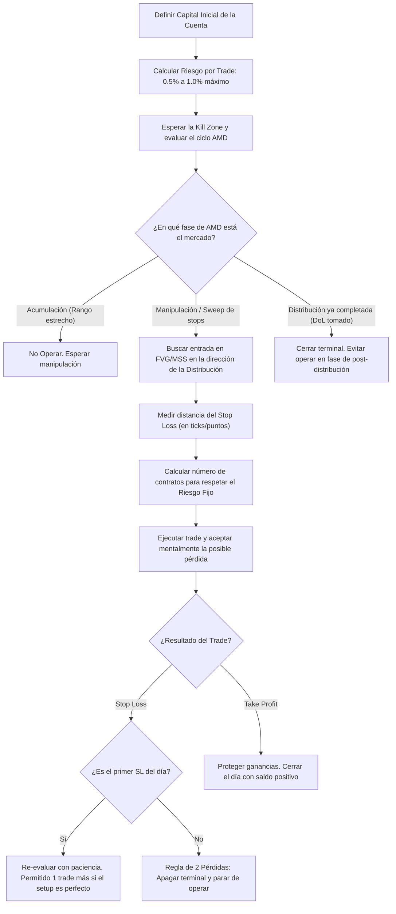

> [!NOTE]
> ### Resumen Causal
> - **Aceptación Psicológica del Riesgo:** El trading exitoso no se trata de tener una estrategia infalible, sino de gestionar el riesgo con disciplina de hierro. Aceptar la posibilidad matemática de la pérdida *antes* de ejecutar una posición elimina las decisiones emocionales y previene el pánico en stop outs.
> - **El Filtro de AMD (Acumulación, Manipulación, Distribución):** Limitar las operaciones a momentos específicos del ciclo de mercado. La mayor rentabilidad y la mejor relación riesgo:beneficio (R:R) se obtienen operando únicamente durante la fase de *Distribución* de la plantilla [[Power of Three|AMD]]. Una vez completada la distribución, el mercado vuelve a acumular, fase en la que no se debe operar.
> - **Gestión Estricta del Capital (Prop Firms):** Especialmente durante las fases de evaluación de cuentas fondeadas (prop firms), arriesgar entre un 0.5% y un 1% por operación asegura la supervivencia ante rachas negativas de pérdidas consecutivas y protege la cuenta del drawdown diario.

---

## Cronológico Breakdown

### `[00:00]` Introducción a la Gestión del Riesgo
- Patrick y Blake comienzan explicando que la gestión de riesgo es la columna vertebral de cualquier trader profesional.
- Indican que puedes tener la mejor estrategia del mundo, pero sin una correcta gestión de riesgo, terminarás quemando tu cuenta de trading tarde o temprano.

### `[02:30]` Psicología de la Pérdida en el Trading
- Discusión sobre cómo los traders principiantes ven las pérdidas como fracasos personales en lugar de costos operativos del negocio.
- Blake explica que aceptar la pérdida en el momento en que se coloca la orden es clave. Si tu mente ya asimiló que vas a arriesgar una cantidad de dinero específica, no tendrás la tentación de mover el Stop Loss o cerrar la posición antes de tiempo por miedo.

### `[05:15]` El Modelo de Riesgo Fijo por Trade (0.5% - 1%)
- Reglas prácticas para dimensionar posiciones:
  - Para cuentas normales o de empresas de fondeo (prop firms), se aconseja arriesgar un 1% como límite absoluto, y de preferencia un 0.5% en la fase de evaluación.
  - Esto da al trader una capacidad de supervivencia de al menos 10 a 20 operaciones seguidas con pérdidas antes de comprometer la cuenta de manera crítica.

### `[07:45]` Frecuencia de Operaciones y la Picadora de Carne (Overtrading)
- Blake comparte su regla personal de tomar un máximo de 1 o 2 trades de alta calidad al día.
- Explica que después de una operación ganadora, el ego del trader aumenta, lo que nubla el juicio técnico y lleva a tomar trades de baja calidad, devolviendo las ganancias al mercado.

### `[10:30]` Entendiendo las Fases del Mercado (AMD y el Filtro de AMD)
- Conexión entre la gestión de riesgo y las fases de entrega de precio ([[Power of Three|Accumulation, Manipulation, Distribution]]):
  - **Accumulation (Acumulación):** Rangos estrechos de consolidación. Se generan piscinas de liquidez en ambos lados. (Evitar operar).
  - **Manipulation (Manipulación):** Falso movimiento en contra del bias diario para barrer los stops de retail. (Buscar setups de entrada).
  - **Distribution (Distribución):** Expansión rápida hacia el verdadero objetivo de liquidez del día. (Fase ideal para capturar beneficios rápidamente con el mínimo de riesgo).
  - Una vez que la fase de distribución ha culminado y se toma el DoL diario, el mercado suele volver a consolidar (Acumulación). Operar después de que la distribución se completó es una receta para el desastre.

---

## Mechanical Rules (IF/THEN)

- **IF** vas a abrir una posición en Nasdaq o S&P 500 futures, **THEN** debes calcular matemáticamente el tamaño del lote (lot size) para que la distancia al Stop Loss represente exactamente entre el 0.5% y el 1% del balance total de tu cuenta de trading.
- **IF** el mercado ya completó la fase de Distribución del día (limpió el PDH/PDL principal con un fuerte movimiento expansivo), **THEN** se prohíbe abrir nuevos trades debido a la altísima probabilidad de que el mercado entre en rango (fase de Acumulación) y licue las ganancias obtenidas.
- **IF** tomas un trade y este resulta en stop loss, **THEN** puedes tomar un segundo trade solo si hay un setup extremadamente claro que cumpla con todos tus parámetros mecánicos; si ese segundo trade también falla, se apaga la computadora de inmediato por el resto del día.
- **IF** estás en fase de evaluación de cuenta de fondeo (prop firm), **THEN** reduces tu riesgo por trade al 0.5% para mitigar el impacto del drawdown diario y proteger la cuenta de las fases de volatilidad desordenada de las noticias.

---

## Mermaid Flowchart

