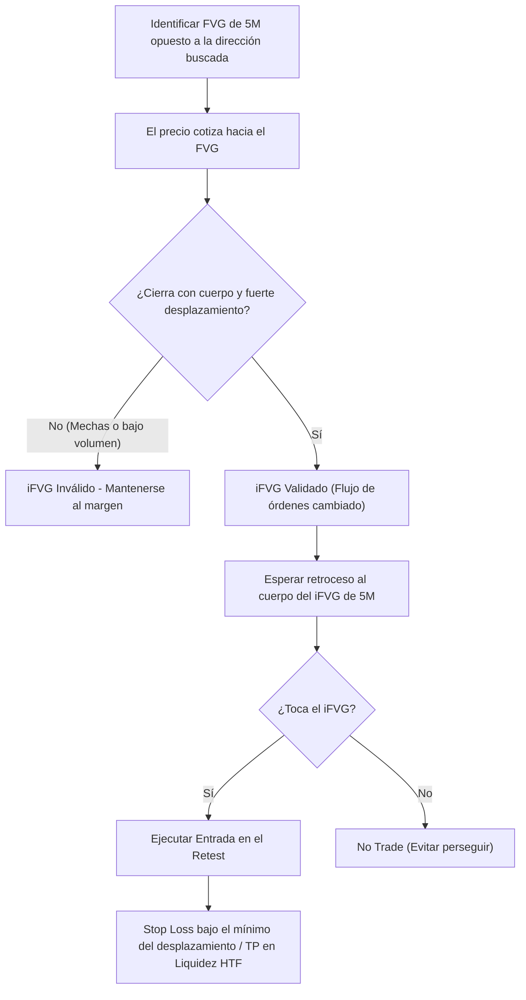

> [!NOTE]
> ### Resumen Causal
> - **El FVG Inverso (iFVG) como Soporte/Resistencia:** Un Fair Value Gap es inversado cuando el precio cierra con cuerpo de vela por encima o por debajo de él (según sea bajista o alcista), transformando una zona de ineficiencia en un nivel de soporte o resistencia dinámico.
> - **Priorización de la Temporalidad de 5M:** Para la operativa intradiaria con iFVGs, la temporalidad de 5 minutos ofrece el equilibrio perfecto entre velocidad de confirmación y confiabilidad técnica. Las zonas de 15 minutos tardan demasiado en formarse y restan agilidad operativa.
> - **Calidad de Desplazamiento Obligatoria:** Un iFVG válido requiere un cruce con fuerza y volumen. Si la invalidación ocurre lentamente, con velas pequeñas o mechas largas, el nivel es propenso a fallar y a inducir tomas de stop loss.

---

## Cronológico Breakdown

### `[00:00]` Introducción a los iFVGs en PB Theory
- Explicación teórica de un [[IFVG|Inverse Fair Value Gap (iFVG)]].
- Cómo las instituciones financieras utilizan estas zonas para acumular o distribuir órdenes cuando la ineficiencia anterior ha sido superada.
- Diferencia técnica entre un [[Fair Value Gap]] tradicional y uno inversado.

### `[03:15]` El Factor Temporal: Por Qué 5M es el Rey
- Blake analiza las distintas temporalidades en las que se forman los iFVGs.
- Demostración de por qué los iFVGs de 15M suelen retrasar la entrada y comerse gran parte del movimiento.
- La regla de la temporalidad de 5 minutos: proporciona la señal óptima de cambio en el flujo de órdenes intradiario sin comprometer la relación riesgo-beneficio.

### `[07:00]` Selección del iFVG de Mayor Probabilidad
- La regla del "highest timeframe iFVG" en el impulso actual: identificar el primer iFVG significativo en la estructura para entrar lo más cerca posible del punto de giro.
- Cómo filtrar falsos iFVGs que se forman sin barrido previo de liquidez.
- El papel de la [[SMT Divergence]] en los mínimos/máximos del movimiento para certificar que el iFVG resultante es de alta probabilidad.

### `[10:30]` Filtro de Calidad: Desplazamiento y Liquidez de Resistencia
- **Desplazamiento fuerte:** El precio debe superar el FVG con una vela de rango amplio ([[Displacement Candle]]) y un cierre limpio de cuerpo.
- **Evitar la mecha lenta:** Si el precio pasa la zona con debilidad, es una señal de que el mercado está acumulando liquidez de baja resistencia cerca de tu stop loss, lo que hace al setup altamente propenso a fallar.
- Cómo la disciplina para filtrar estos iFVGs de baja calidad se alinea con la mentalidad de [[10-how-to-handle-losses-pb-theory|How to Handle Losses]].

### `[14:15]` Conclusión y Aplicación Práctica
- Resumen de la estrategia de iFVG.
- La importancia de practicar este setup en [[02-backtesting-my-70-percent-win-rate-strategy|Backtesting]] antes de operarlo en vivo.
- Recordatorio de mantener la concentración y no forzar trades en ausencia de desplazamiento real.

---

## Mechanical Rules (IF/THEN)

- **IF** un FVG bajista de 5M es superado alcistamente con un cierre de cuerpo completo de vela, **THEN** lo catalogamos como [[IFVG|Inverse FVG (iFVG)]] alcista y preparamos una entrada en largo.
- **IF** el cruce de la zona del FVG se realiza con velas pequeñas de bajo volumen o sin un desplazamiento claro, **THEN** cancelamos el setup y evitamos tomar la entrada.
- **IF** entramos en el retest del iFVG de 5M, **THEN** colocamos el Stop Loss por debajo del mínimo de la vela que causó el desplazamiento (invalidación).
- **IF** el precio no ofrece un retest al iFVG de 5M y continúa de forma vertical, **THEN** no perseguimos el trade y esperamos el siguiente ciclo de mercado.

---

## Mermaid Flowchart

