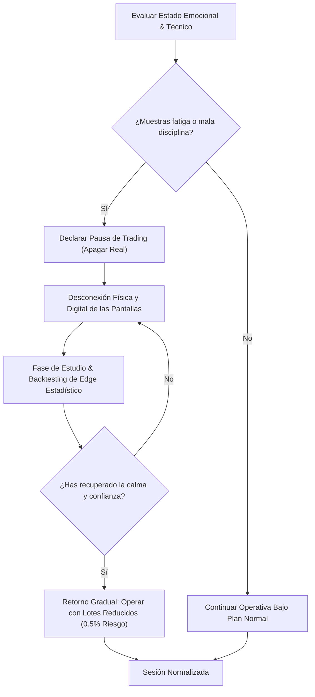

> [!NOTE]
> ### Resumen Causal
> - **El Burnout como Enemigo Silencioso:** La fatiga cognitiva y el estrés prolongado nublan la capacidad de juicio del trader, forzándolo a cometer errores básicos que destruyen el capital.
> - **La Pausa como Acción Defensiva:** Tomar un descanso programado tras una racha de pérdidas consecutivas o un drawdown severo es un acto de gestión de riesgo supremo, no una señal de derrota.
> - **Re-calibración en Demo/Backtesting:** El tiempo fuera de los mercados reales debe ser aprovechado para estudiar teoría y realizar simulaciones estadísticas sin la presión emocional del dinero real.

---

## Cronológico Breakdown

### `[00:00]` El Cansancio Mental y el Declive en la Ejecución
- Explicación de cómo el cerebro humano pierde enfoque tras sesiones prolongadas de sobreanálisis técnico.
- La trampa del trader que cree que pasar más horas frente al gráfico se traduce directamente en más ganancias.
- Conexión con los saboteadores emocionales descritos en [[09-how-to-journal-pb-theory|How To Journal]] y la sobreoperativa.

### `[03:30]` Señales Clave de que Necesitas un Descanso
- Identificación de los síntomas de saturación: ignorar el checklist, mover el Stop Loss en contra, o sentir enojo/frustración antes de abrir la plataforma.
- Cómo las pérdidas impulsivas se asocian con una mala gestión de las emociones analizada en [[10-how-to-handle-losses-pb-theory|How to Handle Losses]].
- El concepto de "drawdown mental": cuando tu disciplina está más baja que el saldo de tu cuenta.

### `[07:00]` Estructura Práctica de una Pausa de Trading
- **Pausa Diaria:** Apagar monitores tras alcanzar el límite diario de pérdidas.
- **Pausa Semanal/Mensual:** Alejarse de los gráficos durante varios días tras tocar el límite de drawdown mensual de la cuenta de fondeo.
- La desconexión digital completa: prohibición de revisar canales de alertas en Discord o gráficos en TradingView desde el teléfono celular.

### `[10:45]` Qué Hacer Durante el Descanso
- Actividades para limpiar el sesgo cognitivo: ejercicio físico, lectura y reconexión con tus metas personales y propósito de vida.
- La transición al [[02-backtesting-my-70-percent-win-rate-strategy|Backtesting]] en frío: simular 100 trades con datos históricos para restaurar la confianza estadística en tu edge y sistema de trading sin comprometer fondos reales.
- El valor de la preparación mental silenciosa explicada en [[05-work-in-silence-pb-theory|Work in Silence]].

### `[13:50]` El Retorno al Gráfico: Mente Limpia (Clean Slate)
- Cómo de manera práctica estructurar el primer día de regreso tras un descanso: comenzar con lotes pequeños o cuentas de simulación para recuperar el ritmo y la fluidez del mercado.
- La importancia del autorespeto y de estar orgulloso de haber tomado la decisión madura de pausar, siguiendo los consejos de [[12-be-proud-of-yourself-pb-theory|Be Proud of Yourself]].
- Conclusión: El trading es una maratón, no una carrera de velocidad; los descansos salvan carreras.

---

## Mechanical Rules (IF/THEN)

- **IF** experimentas una racha de tres días consecutivos de Stop Losses o tocas tu límite de pérdida mensual, **THEN** declaras una pausa obligatoria de trading real de mínimo 3 días.
- **IF** te sientes frustrado, cansado o con la necesidad de "recuperar dinero" antes de que inicie la sesión, **THEN** no abres la plataforma y te dedicas a hacer backtesting o actividades fuera de las pantallas.
- **IF** estás en un período de descanso de trading, **THEN** desinstalas las aplicaciones de trading de tu móvil y evitas participar en salas de chat de la comunidad.
- **IF** decides regresar tras una pausa, **THEN** reduces tu riesgo por trade a la mitad (por ejemplo, del 1% al 0.5%) durante la primera semana para afianzar tu ejecución mecánica.

---

## Mermaid Flowchart

