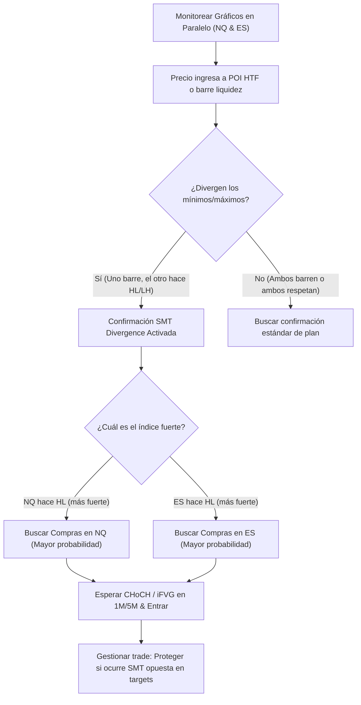

> [!NOTE]
> ### Resumen Causal
> - **Divergencia SMT como Confirmación:** SMT (Smart Money Technique) es una divergencia en la acción del precio entre activos altamente correlacionados (como NQ y ES). Ocurre cuando un índice barre un máximo o mínimo clave mientras el otro no lo hace, revelando una acumulación o distribución institucional silenciosa.
> - **El Concepto del \"Shadow Clone\":** Si ES barre un nivel de liquidez, NQ queda validado por correlación (Internal SMT), lo que significa que no necesitamos esperar un barrido idéntico en NQ para buscar setups de entrada.
> - **Gestión Dinámica de Posiciones:** SMT no solo sirve para entrar, sino también para gestionar. Si un índice alcanza su objetivo (TP) y muestra rechazo mientras el otro está rezagado, el operador debe ajustar su stop loss a break-even o tomar ganancias parciales de inmediato.

---

## Cronológico Breakdown

### `[00:00]` Introducción al Smart Money Technique (SMT)
- Definición básica de la [[SMT Divergence|divergencia SMT]].
- La correlación estrecha entre los futuros del Nasdaq (NQ) y el S&P 500 (ES) como base operativa.
- Por qué la divergencia SMT es el indicador institucional más confiable para identificar cuándo el "dinero inteligente" está absorbiendo órdenes.

### `[03:15]` SMT Externo vs. SMT Interno (Shadow Clone Jutsu)
- **SMT Externo:** Ocurre en máximos o mínimos de la sesión (macroestructura) y confirma reversiones importantes.
- **SMT Interno:** Ocurre durante la estructura menor de la sesión en niveles de retroceso.
- Explicación de la analogía del "Shadow Clone Jutsu" (Jutsu clones de sombra): si ES barre la liquidez de un mínimo intradiario, NQ ya ha hecho su trabajo a nivel macro. Puedes ejecutar un setup alcista en NQ con base en la fuerza demostrada por ES.

### `[06:45]` Confluencia en Zonas HTF
- Cómo combinar SMT con otros PDRAs (PD Arrays) de alta temporalidad.
- El requisito indispensable de buscar SMT únicamente dentro de [[Fair Value Gap|Fair Value Gaps (FVG)]] de 1H/4H o áreas de [[Liquidity Sweep|barrido de liquidez]] principales.
- Filtrar y descartar divergencias SMT huérfanas que se producen en medio de la nada en gráficos de 1 minuto.

### `[10:30]` Gestión y Toma de Decisiones Basadas en SMT
- Cómo utilizar SMT para la gestión activa del trade.
- **Escenario:** Si estás largo en NQ y uno de los dos índices toca su objetivo y empieza a mostrar divergencia bajista en máximos, es momento de proteger la operación moviendo el Stop Loss a Break-Even o cerrando parcialmente.
- Vincular estas decisiones dinámicas a las pautas operativas del checklist de [[08-react-dont-predict-market-pb-theory|REACT, Don't PREDICT]].

### `[13:15]` Conclusión y Práctica Mecánica
- Resumen técnico. Blake recuerda que SMT no es una regla obligatoria para tomar un trade, sino una confirmación premium que eleva drásticamente la tasa de acierto (win rate).
- Consejos para entrenar el ojo en la detección de divergencias en paralelo utilizando gráficos divididos.

---

## Mechanical Rules (IF/THEN)

- **IF** el S&P 500 (ES) barre un mínimo de la sesión pero el Nasdaq (NQ) hace un mínimo más alto en el mismo instante, **THEN** registramos una [[SMT Divergence]] alcista en NQ (fuerza relativa).
- **IF** identificamos una divergencia SMT alcista dentro de un POI de HTF (como un FVG de 4H), **THEN** buscamos un [[Change of Character|CHoCH]] en 1M/5M para ingresar al mercado.
- **IF** estamos en una operación activa y observamos que el índice correlacionado llega a un objetivo clave y muestra rechazo con SMT opuesto, **THEN** protegemos la posición moviendo el SL a Break-Even.
- **IF** el mercado rompe niveles de forma correlacionada sin mostrar ninguna divergencia en máximos/mínimos, **THEN** ejecutamos setups estándar de continuación respetando la tendencia sin forzar la hipótesis de reversión.

---

## Mermaid Flowchart

