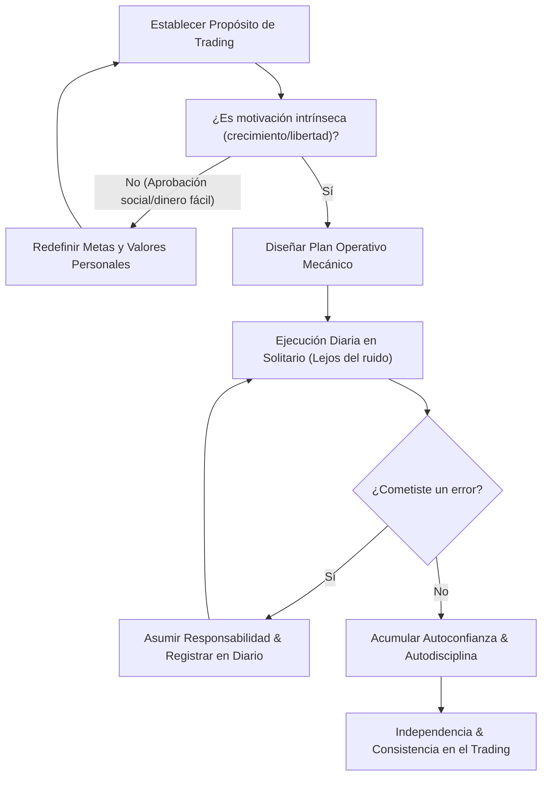

> [!NOTE]
> ### Resumen Causal
> - **Motivación Intrínseca vs. Extrínseca:** El éxito sostenible en el trading se alimenta de metas personales internas (libertad, crecimiento, autosuficiencia) y se destruye si buscas aprobación de terceros o presumir lujos vacíos.
> - **Tomar Acción Inmediata:** La distancia entre tus metas y tu realidad actual se reduce únicamente mediante el estudio enfocado diario y la toma de decisiones disciplinadas frente a las pantallas.
> - **El Negocio Invisible:** El trading profesional se desarrolla lejos del ruido de las redes sociales; es un proceso solitario donde tu único oponente y aliado eres tú mismo.

---

## Cronológico Breakdown

### `[00:00]` Introducción: La Trampa de Operar para el Ojo Ajeno
- Explicación de cómo las redes sociales han distorsionado la imagen del trading, promoviendo una riqueza rápida e irreal.
- Por qué operar con la presión de demostrar tu éxito a familiares o amigos genera un estrés insoportable que conduce a la [[10-how-to-handle-losses-pb-theory|sobreexposición de riesgo]].
- La importancia de silenciar el ruido exterior, conectándose con los principios de [[05-work-in-silence-pb-theory|Work in Silence]].

### `[04:15]` Definición de tu Verdadero "Por Qué"
- Blake guía al espectador a escribir con honestidad su propósito real para hacer trading (por qué estás aquí).
- Si tu motivación es solo ganar dinero rápido para complacer a alguien más, te rendirás al primer drawdown severo.
- Cómo alinear tus objetivos personales te ayuda a superar las rachas perdedoras y a tener la paciencia de esperar setups de alta probabilidad de [[08-react-dont-predict-market-pb-theory|REACT, Don't PREDICT]].

### `[08:00]` La Disciplina de la Ejecución Solitaria
- El trading como un espejo psicológico: nadie te está vigilando cuando decides saltarte las reglas de tu checklist técnico.
- La transición de un operador dependiente (que busca señales de trading ajenas) a uno soberano que confía en sus propios análisis de [[02-backtesting-my-70-percent-win-rate-strategy|Backtesting]].
- Sentir orgullo de tu camino, enlazado con la mentalidad de [[12-be-proud-of-yourself-pb-theory|Be Proud of Yourself]].

### `[11:30]` Superación del Miedo y Acción Presente
- Por qué postergar el estudio técnico o evitar el backtesting por miedo a fallar es la mayor forma de autosabotaje.
- Cómo tomar el control total de tus decisiones diarias y aceptar que el dolor temporal del esfuerzo hoy es el precio de la libertad del mañana.
- El cambio de perspectiva mental necesario para no caer en el estancamiento analizado en [[03-you-are-scared-to-change|You are Scared to Change]].

### `[14:45]` Conclusión: Tu Carrera, Tus Reglas
- Resumen final. La consistencia es el subproducto de hacer las cosas bien para ti, por ti y bajo tus propios términos.
- Cierre motivacional instando al trader a tomar acción disciplinada a partir de hoy.

---

## Mechanical Rules (IF/THEN)

- **IF** te dispones a iniciar tu jornada pre-mercado, **THEN** recuerdas tu motivación intrínseca personal y eliminas cualquier presión externa por "hacer dinero" rápido.
- **IF** sientes el impulso de compartir tus resultados diarios en redes sociales para buscar validación, **THEN** abstente de hacerlo y mantén tu proceso en privado para proteger tu enfoque mental.
- **IF** cometes un error operativo por indisciplina, **THEN** asumes la responsabilidad absoluta en tu bitácora de [[09-how-to-journal-pb-theory|diario de trading]] y aplicas los correctivos de inmediato.
- **IF** tu entorno social cuestiona tu camino, **THEN** mantienes la calma, no entras en discusiones y dejas que tus resultados futuros en solitario hablen por sí mismos.

---

## Mermaid Flowchart

