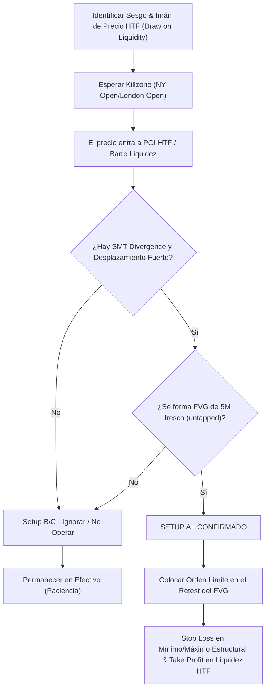

> [!NOTE]
> ### Resumen Causal
> - **La Definición de un Setup A+:** Un setup de máxima probabilidad (A+) no surge del análisis improvisado, sino de la coincidencia exacta de factores de alta temporalidad con confirmaciones mecánicas de baja temporalidad.
> - **Inversión y Gaps Intactos (Fresh FVGs):** Los setups A+ requieren que el precio interactúe con Fair Value Gaps frescos y sin tocar (untapped FVGs), seguidos de un desplazamiento fuerte que invalide o respete dichos niveles.
> - **Confluencia Indispensable:** Para calificar un setup como A+, debe existir barrido de liquidez macro, divergencia SMT en el punto de giro, y un punto de interés claro de HTF como imán de precio (Draw on Liquidity).

---

## Cronológico Breakdown

### `[00:00]` Introducción: La Obsesión por Operar vs. la Calidad de los Setups
- Blake expone el problema del trader novato: intentar forzar operaciones mediocres (setups clase C o B) por ansiedad de mercado.
- Por qué esperar únicamente setups clase A+ reduce drásticamente el estrés emocional y aumenta de forma drástica la esperanza matemática.
- Conexión entre la paciencia técnica y los principios de [[08-react-dont-predict-market-pb-theory|REACT, Don't PREDICT]].

### `[03:30]` Anatomía de un Setup A+ en PB Theory
- Desglose de los elementos estructurales obligatorios:
  - **Paso 1:** Zona de interés de HTF (4H o 1H FVG o liquidez externa barrida).
  - **Paso 2:** Divergencia [[SMT Divergence|SMT]] en la apertura de Nueva York o durante el kill zone, que valide que los creadores de mercado están acumulando posiciones.
  - **Paso 3:** Formación de un FVG de 5M fresco (fresh and untapped) tras un movimiento impulsivo con fuerza ([[Displacement Candle]]).
  - **Paso 4:** Una condición clara respetada o inversada, como se detalla en [[11-how-to-set-conditions-pb-theory|How to Set Conditions]].

### `[07:15]` El Uso de Zonas Frescas (Fresh and Untapped FVGs)
- Por qué los Fair Value Gaps que ya han sido mitigados repetidas veces pierden su probabilidad de reacción y deben descartarse.
- Cómo identificar el primer FVG limpio formado en la microestructura menor de 5M.
- La ejecución en el retest exacto del 50% del gap (consequent encroachment) o en el límite de la ineficiencia.

### `[10:50]` Gestión de Riesgo y R/R (Riesgo-Beneficio) en Setups A+
- Cómo la alta confluencia de un setup A+ permite tener un Stop Loss más ajustado y un Target más ambicioso (mínimo R/R de 1:2 o 1:3).
- Las bases teóricas de estas proyecciones basadas en [[02-backtesting-my-70-percent-win-rate-strategy|Backtesting]] de alta fiabilidad.
- Evitar mover el Stop Loss o dudar del trade una vez que las condiciones mecánicas han sido cumplidas al 100%.

### `[14:20]` Conclusión: La Disciplina del Operador A+
- Resumen final. Operar menos para ganar más; cómo los verdaderos profesionales solo ejecutan 2 o 3 operaciones de alto calibre a la semana en lugar de 5 trades diarios.
- La desconexión y el control emocional vinculados con [[14-taking-a-break-from-trading-pb-theory|Taking a Break from Trading]] y [[05-work-in-silence-pb-theory|Work in Silence]].

---

## Mechanical Rules (IF/THEN)

- **IF** el precio alcanza un POI HTF y genera un barrido de liquidez acompañado de [[SMT Divergence]], **THEN** iniciamos el monitoreo del gráfico de 5M en busca de desplazamiento.
- **IF** el desplazamiento forma un FVG de 5M fresco y limpio (untapped), **THEN** programamos una orden límite de entrada en el inicio o 50% de dicho gap.
- **IF** el trade no cuenta con confluencia HTF o carece de divergencia SMT en el punto de giro, **THEN** lo catalogamos como setup de baja probabilidad (clase B/C) y nos abstenemos de operarlo.
- **IF** la operación se ejecuta bajo criterios A+ y toca Stop Loss, **THEN** lo aceptamos como pérdida estadística limpia y registramos la disciplina en el diario de [[09-how-to-journal-pb-theory|How To Journal]].

---

## Mermaid Flowchart

