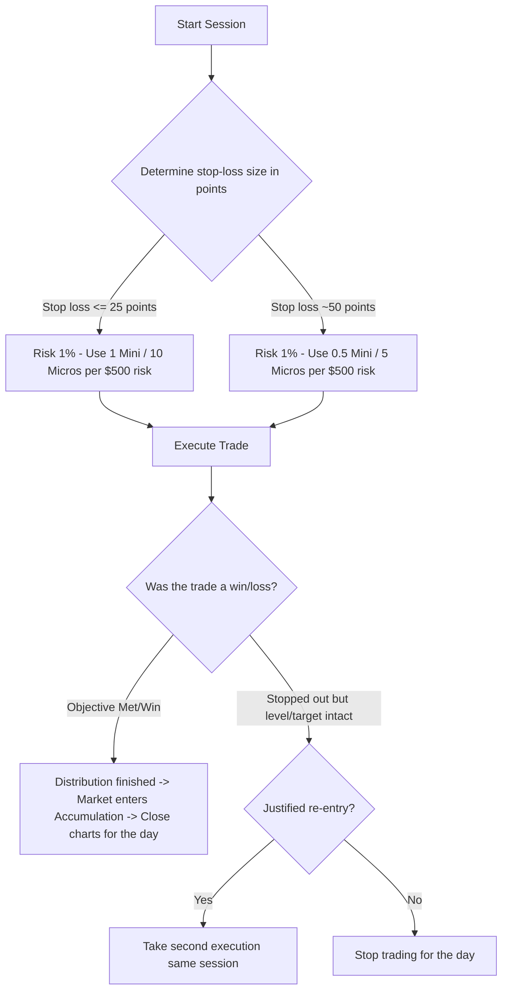

# Risk Management: PB Theory

> [!IMPORTANT]
> ## Resumen Causal
> - **La regla del 1-1-1:** Operar un solo trade al día, arriesgar el 1% y hacerlo en una sola sesión de trading es el pilar fundamental para no ser un trader perdedor o de break-even.
> - **Gestión Dinámica de Posición (Minis vs. Micros):** El tamaño del contrato debe cambiar en función del tamaño del Stop Loss para mantener un riesgo monetario constante (1%). Mayor volatilidad no significa evitar el trade, sino reducir el apalancamiento.
> - **Fundamento Técnico del Overtrading:** Operar múltiples veces tras un target cumplido es técnicamente desfavorable. Después de la distribución, el precio suele acumular (rango/choppiness), reduciendo drásticamente la probabilidad del setup.

---

## Cronológico Breakdown

- **[00:00] La lucha personal en los mercados:** El trading es una constante batalla contra uno mismo ("you versus you"). Es imprescindible establecer limitaciones y reglas estrictas diarias para evitar revanchas (revenge trading) y el sobreapalancamiento.
- **[03:45] El poder del 1-1-1:** Se detalla por qué limitar la operativa a 1 trade al día es el camino más rápido a la rentabilidad. Evita estar atado a la pantalla y asegura que un error no destruya la cuenta.
- **[04:51] Regla del 1% de Riesgo:** Para cuentas fondeadas, arriesgar el 1% es ideal. Con una estrategia de alta probabilidad (70% win rate), la probabilidad estadística de perder 4 trades seguidos y quemar una cuenta es inferior al 1% (excluyendo errores humanos). Si no hay suficiente convicción en el modelo, se puede reducir al 0.5%.
- **[06:55] Fórmulas de Contrato (Minis vs. Micros):** Un contrato Mini equivale a 10 Micros. El tamaño de la posición debe ajustarse al Stop Loss del trade:
  - **Fórmula de 25 puntos de Stop Loss:** 1 Mini = $500 riesgo (en cuenta de 50k); 2 Minis = $1000 riesgo. En micros: 1 Micro = $50, 2 Micros = $100.
  - **Fórmula de 50 puntos de Stop Loss:** 1 Mini = $1000 riesgo; 2 Minis = $2000 riesgo. En micros: 1 Micro = $100, 2 Micros = $200.
- **[15:00] Explicación Técnica de Operar Menos:** Tras completarse un target o [[Draw on Liquidity]], el mercado pasa de la distribución a la acumulación (rango estrecho y sucio). Entrar a un trade en esta etapa es entrar en un contexto de baja probabilidad.
- **[19:30] Justificación de Re-entrada:** Una re-entrada es válida únicamente si el Stop Loss fue barrido (stop rated) pero el nivel clave sigue respetándose y el target/liquidez superior sigue intacto.

---

## Mechanical Rules (IF/THEN)

- **IF** se planea ejecutar un trade **THEN** calcular el Stop Loss en puntos antes de ingresar a la posición para determinar el tamaño correcto del contrato.
- **IF** el Stop Loss es de $N$ puntos **THEN** ajustar el tamaño entre Minis y Micros para que la pérdida máxima no supere el 1% de la cuenta.
- **IF** un setup cumple su objetivo y finaliza la distribución **THEN** cerrar la plataforma inmediatamente para evitar operar en la fase de acumulación subsiguiente.
- **IF** se sufre un stop out pero el sesgo y el nivel clave siguen intactos (sin haber tocado el target final) **THEN** se permite una única re-entrada con el mismo riesgo gestionado.

---

## Decision Tree / Risk Management Flow

---
**Enlaces de Interés:**
- Playlist: [[PB Trading Theory Series]]
- Conceptos Clave: [[Liquidity Sweep]], [[Draw on Liquidity]], [[SMT Divergence]], [[Fair Value Gap]]
