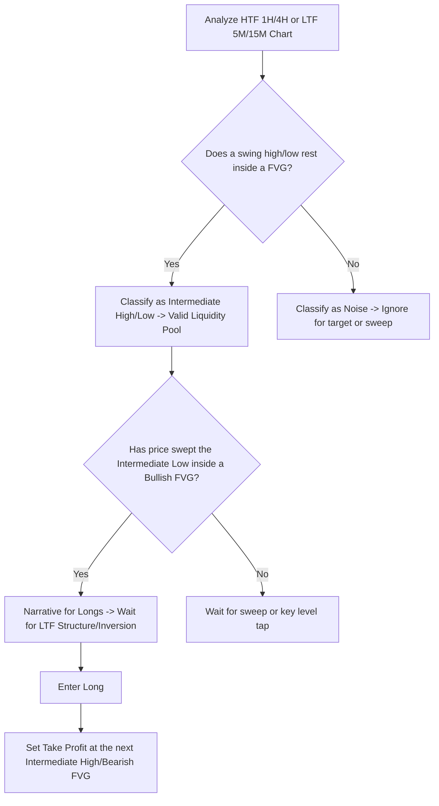

# Market Liquidity: PB Theory

> [!IMPORTANT]
> ## Resumen Causal
> - **Liquidez Intermedia (Intermediate Highs/Lows):** Son los máximos y mínimos que descansan directamente dentro de un [[Fair Value Gap]] (FVG) de temporalidades mayores (1H/4H) o de ejecución (5M/15M). Son las únicas piscinas de liquidez que PB Trading considera válidas.
> - **Liquidez como "Ruido":** Cualquier máximo o mínimo que no esté dentro de un FVG o nivel clave es catalogado como ruido. Ignorarlos mantiene los gráficos limpios y evita el error común de proteger el trade a break-even demasiado temprano.
> - **Confluencia FVG + Sweep:** Un sweep de liquidez no se opera de manera aislada; requiere que el barrido ocurra dentro de un desequilibrio existente (FVG), lo cual proporciona la fuerza necesaria para el movimiento de reversión/distribución.

---

## Cronológico Breakdown

- **[00:21] Redefiniendo la Liquidez:** Tradicionalmente la liquidez son máximos/mínimos (swing highs/lows) que actúan como imanes para el precio. Sin embargo, PB Trading no utiliza etiquetas genéricas como "London Highs" o "Asia Lows" ya que distraen del objetivo principal del precio.
- **[05:01] ¿Qué hace válida a una piscina de liquidez?:** Para ser un objetivo o confluencia válida, el máximo/mínimo debe coincidir con un FVG (ej. FVG de 5M o 15M). El precio no revierte en máximos aleatorios a la izquierda; busca rebalancear e ir a buscar liquidez dentro de niveles clave.
- **[11:00] Gestión Emocional en el Recorrido:** Se explica que muchos traders salen prematuramente o se van a break-even por asustarse con el "ruido". Es mejor aguantar hasta el objetivo real (liquidez intermedia) o salir con ganancias donde la probabilidad de reversión es muy alta.
- **[20:48] Definición de Máximos y Mínimos Intermedios:** Se acuña el término formal. Un *Intermediate Low* o *Intermediate High* es aquel punto de liquidez que descansa dentro de un FVG en cualquier marco de tiempo.
- **[31:40] Ejemplo de target a FVG de 1H:** Al entrar en compras tras un sweep inferior, el profit target ideal es el máximo que lleva el precio al rebalanceo de un FVG de 1H pendiente.
- **[39:50] El peligro de reaccionar al ruido:** Si el precio barre un mínimo menor ("ruido") y el trader se pone break-even de inmediato, el mercado suele retroceder para sacar al trader antes de correr finalmente hacia el verdadero objetivo de liquidez intermedia.

---

## Mechanical Rules (IF/THEN)

- **IF** un máximo o mínimo no descansa dentro de un FVG (1H/4H/15M/5M) **THEN** clasificarlo como "ruido" e ignorarlo como zona de sweep o target de salida.
- **IF** el precio barre un mínimo/máximo intermedio dentro de un FVG de marco temporal superior **THEN** buscar confirmación de reversión en temporalidades de entrada mediante un cambio de estructura o inversión.
- **IF** se ingresa en una posición **THEN** colocar el Take Profit en el siguiente máximo/mínimo intermedio relevante (que coincida con un FVG desequilibrado).
- **IF** el precio se mueve a favor pero no ha alcanzado la liquidez intermedia **THEN** no mover el Stop Loss a break-even debido a barridos menores de "ruido".

---

## Decision Tree / Liquidity Classification & Execution

---
**Enlaces de Interés:**
- Playlist: [[PB Trading Theory Series]]
- Conceptos Clave: [[Liquidity Sweep]], [[Fair Value Gap]], [[Draw on Liquidity]], [[SMT Divergence]]
