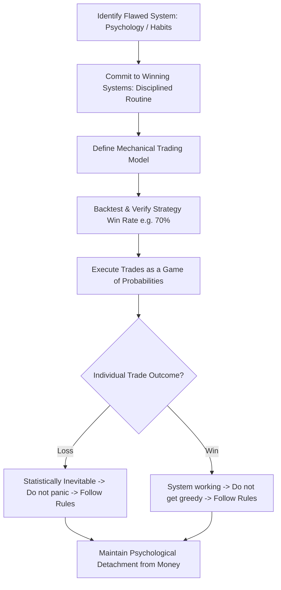

# How To Master Day Trading (EP. 5: Winning Systems)

> [!IMPORTANT]
> ## Resumen Causal
> - **El Trader como el Sistema Defectuoso:** El fracaso en el trading rara vez se debe a una estrategia ineficaz; suele deberse a que el sistema psicológico y de hábitos del trader está roto.
> - **Trading Profesional vs. Juego de Azar (Gambling):** Actos como cerrar trades antes de tiempo por miedo, entrar tarde por FOMO o forzar operaciones para recuperar pérdidas transforman el trading en apuestas. El profesional ejecuta y confía 100% en la estadística.
> - **Obsesión con la Probabilidad:** Para ganar en el largo plazo, el trader debe desvincularse emocionalmente del dinero de cada operación individual y ver las pérdidas como un costo estadístico inevitable dentro de un sistema ganador.

---

## Cronológico Breakdown

- **[00:00] La definición de un "Sistema":** Un sistema no es solo tu modelo de trading. Tus rutinas diarias, tus relaciones personales, tus hábitos de sueño y tu disciplina son sistemas que se reflejan directamente en tu rendimiento frente a los gráficos.
- **[10:15] La trampa psicológica:** Muchos traders culpan a la estrategia cuando tienen pérdidas. El verdadero problema es su incapacidad para aceptar pérdidas pequeñas, lo que los lleva a romper reglas, promediar a la baja (martingala) o sobreoperar.
- **[20:30] La estadística del 70% Win Rate:** Se explica cómo funciona la probabilidad en el trading. Incluso con una estrategia con 70% de efectividad, las pérdidas ocurrirán de forma consecutiva por pura probabilidad. Confiar en el sistema significa no alterar el tamaño de riesgo ni dudar al presionar el gatillo tras una racha perdedora.
- **[32:00] Eliminar el Comportamiento de Apostador:**
  - **Miedo (Cerrar temprano):** Interrumpir el trade antes del target priva al sistema de su esperanza matemática positiva (R:R).
  - **FOMO (Entrada tardía):** Perseguir el precio fuera de la zona de entrada óptima invalida la gestión del Stop Loss.
  - **Venganza (Revenge Trading):** Forzar operaciones para "recuperar" el dinero perdido en el día.
- **[40:00] Construyendo el "Winning System":** Pasos prácticos para alinear la vida personal con el trading: establecer un horario fijo de pantalla, realizar backtesting riguroso para ganar confianza en la estrategia, y automatizar el diario de trading (ej. TradeZella) para analizar datos fríos en lugar de basarse en emociones.

---

## Mechanical Rules (IF/THEN)

- **IF** se experimenta una pérdida **THEN** catalogarla como un costo estadístico normal del negocio y evitar a toda costa tomar un trade no planificado para recuperarla.
- **IF** el precio avanza pero no ha tocado el stop o el target **THEN** sentarse sobre las manos y dejar que el trade corra de manera mecánica según el sistema.
- **IF** la rutina diaria (sueño, estrés personal, falta de preparación) está fuera de control **THEN** abstenerse de operar esa sesión para proteger el capital.
- **IF** se identifica una entrada tardía (FOMO) **THEN** no ejecutar y esperar pacientemente al siguiente setup que cumpla con los parámetros del modelo.

---

## Decision Tree / System Alignment Flow

---
**Enlaces de Interés:**
- Playlist: [[PB Trading Theory Series]]
- Conceptos Clave: [[Market Structure]], [[Higher Timeframe Bias]], [[Draw on Liquidity]]
