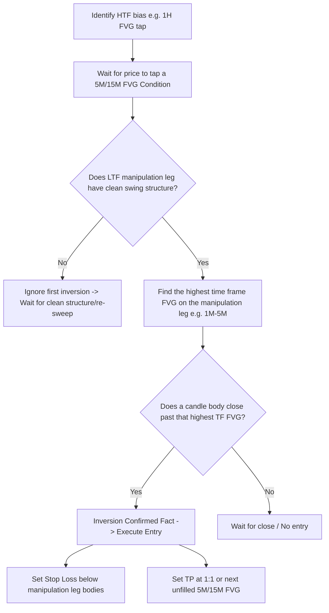

# Inverse Fair Value Gaps: PB Theory

> [!IMPORTANT]
> ## Resumen Causal
> - **De la Opinión al Hecho:** Un [[Fair Value Gap]] (FVG) siendo respetado es solo una suposición u opinión. Cuando un FVG es invalidado por el cierre de cuerpo de vela (inversión o iFVG), esto se convierte en un *hecho* confirmatorio del flujo de órdenes.
> - **La Estructura es Obligatoria:** Ningún iFVG es válido si no existe una estructura limpia previa. Intentar operar la primera inversión en un movimiento vertical ("dookie flakes") sin oscilaciones claras (swing points) resulta en pérdidas el 90% de las veces.
> - **Regla de la Temporalidad Más Alta (HTF Inversion):** Para ejecutar un trade en temporalidades bajas (1M a 5M), se debe identificar el FVG más grande presente en la pierna de manipulación (ej. si hay FVG en 1M, 2M y 4M, la entrada válida es el cierre sobre el iFVG de 4M).

---

## Cronológico Breakdown

- **[00:02] Introducción a iFVG:** Se define el concepto básico de inversión como la invalidación de un FVG previo mediante el cierre del cuerpo de una vela por encima/debajo del rango del gap.
- **[02:40] El valor del Hecho sobre la Suposición:** Mientras que un rebote en un FVG es una asunción, la inversión de un gap contrario es una confirmación dura de que el flujo de órdenes ha cambiado.
- **[06:40] Marco de 3 Pasos para Confirmar Ideas:**
  1. **Bias/Fundación (1H / 4H):** Identifica la narrativa macro. Si respetamos un FVG alcista de 1H e inversamos un FVG bajista de 1H, el sesgo es sólidamente alcista.
  2. **Condiciones (5M / 15M):** Actúan como detector del [[Draw on Liquidity]]. Si una zona de soporte 5M/15M se invierte, la narrativa cambia de dirección de inmediato.
  3. **Entrada (1M a 5M):** Gatillo final de ejecución. No se operan temporalidades superiores a 5M para entradas.
- **[20:30] La importancia de la estructura:** Se enfatiza que no se debe operar de manera mecánica cualquier iFVG. Es obligatorio esperar a que la pierna de manipulación barra liquidez y dibuje un "swing high/low" limpio antes de la inversión.
- **[36:00] Regla del FVG más alto en la pierna de manipulación:** Al refinar entradas en 1M-5M, se analizan todos los marcos de tiempo de forma fractal. Se debe esperar a que el FVG de mayor temporalidad dentro de la pierna de manipulación sea inversado para evitar entrar en gaps mayores todavía activos.

---

## Mechanical Rules (IF/THEN)

- **IF** se busca entrar en compras/ventas mediante iFVG **THEN** esperar a que el cuerpo de la vela cierre completamente fuera del FVG en la temporalidad respectiva.
- **IF** la pierna de manipulación no tiene una estructura limpia con oscilaciones claras **THEN** no operar el iFVG y esperar a un segundo barrido (re-sweep) que genere estructura válida.
- **IF** existen múltiples FVG bajistas/alcistas en la pierna de manipulación en marcos de 1M, 2M, 3M, 4M o 5M **THEN** esperar a que se inverse el FVG de la temporalidad más alta observada (HTF Inversion) para gatillar la entrada.
- **IF** el precio alcanza un FVG de 5M o 15M (Condición) opuesto al trade **THEN** tomar ganancias o proteger a break-even de inmediato por la alta probabilidad de reversión.

---

## Decision Tree / iFVG Execution Framework

---
**Enlaces de Interés:**
- Playlist: [[PB Trading Theory Series]]
- Conceptos Clave: [[IFVG.md|Inverse FVG (iFVG)]], [[Fair Value Gap]], [[Market Structure]], [[Liquidity Sweep]]
