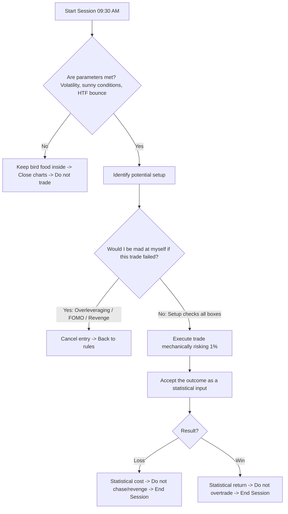

# Everything Is Probability: PB Theory

> [!IMPORTANT]
> ## Resumen Causal
> - **La Analogía del Alimento para Aves:** Dejar alimento de 9:30 a 11:00 AM en un día soleado (70-80°F) atrae aves el 70% de las veces. Si colocas el alimento a las 7:30 AM o bajo la lluvia (rompiendo las condiciones del sistema), la estadística del 70% deja de existir. Lo mismo ocurre en el trading al alterar los parámetros del modelo.
> - **La Analogía del Trabajo de $300k:** Si te pagaran un salario anual fijo por el simple hecho de ejecutar mecánicamente un setup (sin importar si cada trade individual gana o pierde), lo harías sin emociones. Esa mentalidad robótica es la que garantiza la rentabilidad a largo plazo.
> - **La Pregunta del Gatillo:** Antes de entrar en cualquier posición, hazte la pregunta definitiva: *¿Me enfadaría conmigo mismo si este trade falla?*. Si la respuesta es sí (por FOMO, sobreapalancamiento o revancha), cancela el trade. Si es no, ejecútalo sin dudar.

---

## Cronológico Breakdown

- **[00:22] Aceptar las pérdidas como costos estadísticos:** Con una estrategia probada de 70%+ de efectividad, las pérdidas son inevitables. No significa que hiciste algo mal si seguiste tus reglas; simplemente es el 30% restante de la estadística jugando su papel.
- **[01:50] Pérdidas malas vs. pérdidas buenas:**
  - **Pérdida Buena:** Se ejecutó con disciplina, respetando las reglas y el R:R. Contribuye a la estadística ganadora del sistema.
  - **Pérdida Mala:** Ocurre debido al sobreapalancamiento, FOMO, revenge trading u operar fuera de hora. Estas pérdidas deben analizarse y corregirse urgentemente en el diario.
- **[05:00] La analogía de alimentar a las aves:** Se explica cómo el sistema de trading es idéntico a un fenómeno natural condicionado. Si alteras el horario de operativa, la sesión o ignoras la falta de volatilidad (operar con lluvia), estás destruyendo tu ventaja probabilística.
- **[09:15] Enfocarse en los "Inputs" en lugar de los "Outputs":** Los traders rentables dejan de mirar su P&L diario. Se enfocan únicamente en cumplir las reglas de ejecución durante la semana, sabiendo que al cabo de meses la estadística les dará una ganancia masiva de forma natural.
- **[13:30] La aburrida consistencia robótica:** El trading divertido es sinónimo de apuestas (gambling) basadas en la adrenalina. El trading profesional es aburrido y sistemático. La verdadera diversión viene *después* de la sesión al disfrutar de la libertad de tiempo y ubicación.
- **[18:40] El trade como zona de descanso:** Una vez tomada la operación con los parámetros correctos, el trader debe relajarse y no estresarse por las oscilaciones internas de la vela. Todo el ruido intermedio no importa; solo importa haber seguido las reglas.

---

## Mechanical Rules (IF/THEN)

- **IF** se planea entrar a un trade **THEN** plantearse la pregunta: *"¿Me enfadaría conmigo mismo si este trade falla?"* antes de presionar el gatillo.
- **IF** la respuesta a la pregunta anterior es afirmativa (implicando violación de reglas o falta de convicción) **THEN** abstenerse inmediatamente de entrar.
- **IF** se opera fuera del horario establecido (9:30 AM - 11:00 AM) o bajo condiciones de mercado no estudiadas **THEN** asumir que la estadística de acierto del 70% ha sido invalidada y evitar la operativa.
- **IF** se está dentro de una operación que cumple todas las reglas **THEN** no intervenir en la gestión del stop o take profit, asumiendo que el resultado es puramente probabilístico.

---

## Decision Tree / Probability Implementation

---
**Enlaces de Interés:**
- Playlist: [[PB Trading Theory Series]]
- Conceptos Clave: [[Market Structure]], [[Higher Timeframe Bias]], [[London Open.md|London Session]], [[NY Open.md|New York Session]]
