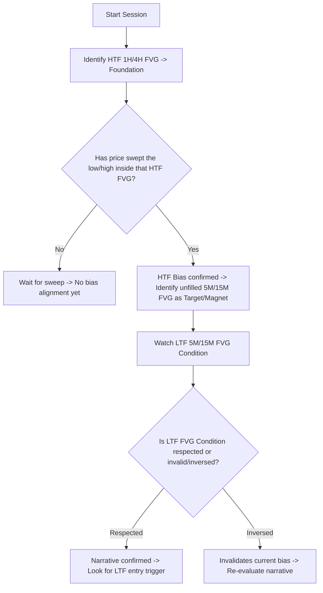

# Fair Value Gaps: PB Theory

> [!IMPORTANT]
> ## Resumen Causal
> - **Doble Función de los FVG (Soporte vs. Imán):** Un [[Fair Value Gap]] (FVG) no solo actúa como un nivel de soporte o resistencia (empujando el precio), sino también como un imán (atrayendo el precio para rebalancear la ineficiencia).
> - **El "Intermediario" Transaccional (5M/15M):** Mientras que los gaps de temporalidades altas (1H/4H) crean la fundación del trade, los de 5M/15M confirman la alineación entre la temporalidad mayor y la menor, funcionando como condiciones del trade.
> - **Regla de Barrido Interno en FVG:** Para incrementar drásticamente la probabilidad de acierto, PB Trading exige que el precio barra el mínimo (bullish) o máximo (bearish) que descansa dentro del FVG de 1H/4H antes de buscar cualquier patrón de reversión.

---

## Cronológico Breakdown

- **[00:30] Anatomía Básica del FVG:** Secuencia de tres velas donde las mechas de la vela 1 y la vela 3 no se tocan, dejando un vacío o ineficiencia en el precio (imbalance). Representa el verdadero soporte y resistencia basado en el flujo de órdenes.
- **[02:30] El FVG como Soporte:** En una estructura alcista sana, el precio sube, retrocede a rellenar parcialmente el FVG de 5M, y continúa su camino alcista, repitiendo este ciclo fractalmente.
- **[04:45] Roles por Temporalidades:**
  - **Fundación y Sesgo (1H y 4H):** Establecen la narrativa macro del día. Si no hay un FVG de 1H/4H soportando la idea, no hay trade.
  - **Condiciones y Draw on Liquidity (5M y 15M):** El puente transaccional que confirma que el flujo de órdenes de temporalidad baja se alinea con la HTF.
  - **Entradas (1M a 5M):** Zona exclusiva de gatillo (principalmente usando iFVGs).
- **[14:00] Ejemplo de transición 4H a 5M:** El precio golpea un FVG bajista de 4H (fundación), luego genera un FVG bajista de 5M que confirma el movimiento a la baja hacia un FVG alcista de 4H pendiente (narrativa).
- **[20:30] La regla estricta de barrido de mínimos:** Si el precio simplemente toca el FVG de 4H, el sesgo sigue siendo neutral/incierto. Solo cuando el precio barre el mínimo oscilante (swing low) que quedó atrapado dentro del FVG de 4H, se activa la búsqueda de compras con alta probabilidad.
- **[25:00] Gaps de 5M/15M como Imán:** Los gaps pendientes (unfilled) en temporalidades de 5M o 15M se marcan como los objetivos obvios de Take Profit (TP), buscando un ratio 1:1 conservador en lugar de targets poco realistas.

---

## Mechanical Rules (IF/THEN)

- **IF** el precio no ha rebotado en un FVG de 1H/4H o no ha barrido un máximo/mínimo interno del mismo **THEN** clasificar el mercado como sin narrativa y abstenerse de operar.
- **IF** se identifica un FVG de 5M o 15M pendiente (unfilled) **THEN** utilizarlo como un imán (Draw on Liquidity) y target principal para el Take Profit del trade.
- **IF** el precio cotiza dentro de un FVG de 5M/15M Condition **THEN** esperar a que este se respete (rebote) o se invalide (inversión) para confirmar la dirección antes de gatillar en 1M-5M.
- **IF** se toma una compra tras el barrido del mínimo interno de un FVG de 1H/4H **THEN** invalidar la idea si el precio rompe y cierra con cuerpo por debajo del mínimo de la vela de barrido.

---

## Decision Tree / FVG Alignment & Narrative

---
**Enlaces de Interés:**
- Playlist: [[PB Trading Theory Series]]
- Conceptos Clave: [[Fair Value Gap]], [[Market Structure]], [[Draw on Liquidity]], [[Liquidity Sweep]], [[IFVG.md|Inverse FVG (iFVG)]]
