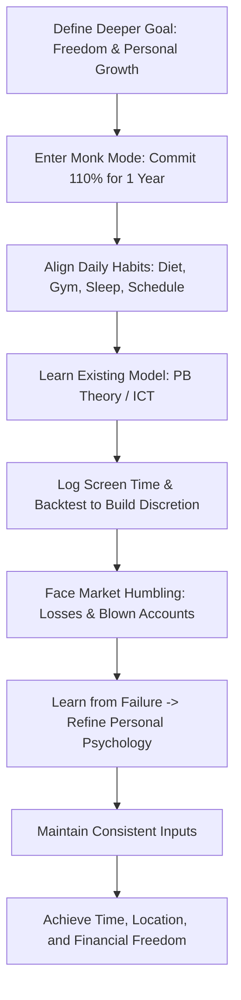

# The Truth About Trading: PB Theory

> [!IMPORTANT]
> ## Resumen Causal
> - **El Espejo de tus Hábitos:** El mercado no solo lee el precio; lee tu carácter. Reflejará de manera implacable tus debilidades personales (falta de rutina, pereza, desorganización) en pérdidas monetarias. Para ser un buen trader, primero debes ser una persona disciplinada.
> - **El Poder del Modo Monje (Monk Mode):** Comprometerse al 110% de energía y enfoque en una sola habilidad durante un año completo (consistencia en inputs) produce resultados exponencialmente superiores a diversificar esfuerzos a medias.
> - **La Discreción se Construye, No se Enseña:** Un mentor (como Blake o Patrick) puede darte las herramientas y la teoría matemática, pero la discreción (la capacidad de leer el mercado en tiempo real bajo condiciones cambiantes) es un músculo propio que solo se desarrolla con horas de pantalla y diario de trading.

---

## Cronológico Breakdown

- **[00:00] Propósito de la Serie PB Theory:** Patrick introduce la serie como una destilación de sus propios descubrimientos y reglas aplicadas en el mercado, buscando crear traders autosuficientes que expandan y personalicen el modelo de trading.
- **[02:30] La belleza del fracaso en el aprendizaje:** Se repasa su historial de intentos de negocio a temprana edad (rug making, clothing brands, drop shipping, crypto). El fracaso y la pérdida constante son los únicos maestros reales del carácter y la resiliencia.
- **[07:30] Metas más allá del dinero:** Definir metas numéricas como "hacer $10k al mes" limita el desarrollo. El objetivo real debe estar anclado en la libertad de tiempo, la autonomía (no recibir órdenes de jefes o familiares) y pasar tiempo de calidad con seres queridos.
- **[10:00] La vida personal afecta al gráfico:** Si no vas al gimnasio, comes mal, te levantas un minuto antes de la campana de apertura y gastas dinero en tonterías, el mercado te destruirá. El éxito requiere una vida estructurada fuera de las pantallas.
- **[16:50] La trampa de la seguridad corporativa:** Patrick cuenta su experiencia trabajando en una corporación tras obtener excelentes notas en la universidad. El ambiente "sin alma" de los cubículos y la falsa seguridad financiera lo empujaron a arriesgarse al 100% en el trading.
- **[22:00] La conversación definitiva con papá:** La pregunta clave que guió su transición al trading a tiempo completo: *"¿Te arrepentirías de dejar este trabajo estable por ir por tu cuenta?"*. La respuesta fue un rotundo no, iniciando su periodo de un año de enfoque extremo (Monk Mode).

---

## Mechanical Rules (IF/THEN)

- **IF** se define un objetivo en el trading **THEN** desvincularlo de cifras de dinero y enfocarlo en la libertad de tiempo y mejora personal.
- **IF** tu vida personal, hábitos de sueño o salud están en desorden **THEN** asumir que el trading reflejará ese desorden y no operar hasta estructurar tu rutina diaria.
- **IF** se desea adquirir maestría en un modelo **THEN** estudiar la teoría inicial de un mentor pero dedicar un año de diario de trading para desarrollar la discreción propia.
- **IF** se experimentan pérdidas al inicio del Monk Mode **THEN** aceptarlo como parte normal del "Hunter Exam" (periodo de prueba) y continuar aplicando inputs disciplinados.

---

## Decision Tree / The Path to Mastery

---
**Enlaces de Interés:**
- Playlist: [[PB Trading Theory Series]]
- Conceptos Clave: [[Market Structure]], [[Fair Value Gap]], [[Draw on Liquidity]], [[Kill Zones]]
