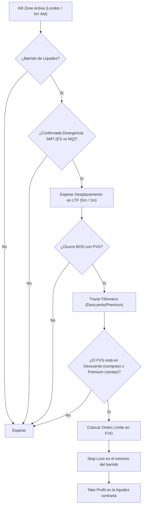

> [!NOTE]
> ### Resumen Causal
> - **La trinidad del trading institucional:** La estrategia se fundamenta en tres pilares: Estructura ([[Market Structure|Market Structure]]), Liquidez (identificada mediante máximos/mínimos y [[Equal Highs|EQL/EQS]]) y Tiempo (operando estrictamente dentro de las [[Kill Zones|ICT Kill Zones]]).
> - **Confluencia avanzada con SMT:** La Divergencia SMT ([[SMT Divergence|SMT Divergence]]) entre activos correlacionados (como S&P 500 y Nasdaq) funciona como la huella institucional definitiva para validar barridos de liquidez reales y anticipar reversiones de alta probabilidad.
> - **El Modelo de Entrada de Blake:** Se define una secuencia mecánica estricta: esperar un barrido de liquidez, validar con SMT, identificar un desplazamiento con ruptura ([[Break of Structure|BOS]]) en temporalidad menor, y entrar en el [[Fair Value Gap|Fair Value Gap (FVG)]] situado en la zona de descuento/premium ([[Discount Zone|Discount]] / [[Premium Zone|Premium]]).

---

## Cronológico Breakdown

### `[00:00]` Introducción e Importancia de la Disciplina
- Blake introduce el curso completo explicando que el trading no consiste en adivinar, sino en seguir un conjunto estricto de reglas estadísticas. El éxito depende de la disciplina, el control emocional y una psicología sólida.

### `[02:15]` Configuración del Gráfico e Indicadores Clave
- Recomendación de usar TradingView. Indicadores sugeridos para simplificar el análisis gráfico:
  - *Equal Highs and Lows* (por Jay-Zster) para marcar automáticamente la liquidez minorista acumulada.
  - *ICT Kill Zones and Pivots* (por TFO) para delimitar las sesiones de Nueva York y Londres, ya que operar a la hora correcta es crucial.

### `[24:44]` Anatomía y Lectura de Velas Japonesas
- Comprensión del cuerpo de la vela (entrega del precio por volumen institucional) y las mechas o *wicks* (que representan rechazo de liquidez, absorción de órdenes y capturas de stops).

### `[40:11]` Estructura de Mercado Básica y Avanzada
- Cómo identificar tendencias alcistas y bajistas mediante altos más altos y bajos más altos. Explicación detallada del quiebre de estructura ([[Break of Structure|BOS]]) que confirma la continuación de la tendencia y el cambio de carácter ([[Change of Character|CHoCH]]) que indica una reversión potencial.

### `[56:26]` Mecánica de la Liquidez
- Las instituciones necesitan la liquidez de los minoristas (sus stop losses) para poder abrir sus grandes posiciones sin generar deslizamientos bruscos. Se identifican la liquidez de compra ([[Buy-Side Liquidity|BSL]]) por encima de los máximos y la liquidez de venta ([[Sell-Side Liquidity|SSL]]) por debajo de los mínimos.

### `[1:11:15]` Ineficiencias y Fair Value Gaps (FVG)
- Definición del [[Fair Value Gap|FVG]] como un vacío de liquidez de tres velas donde la vela central se mueve de forma agresiva sin que las mechas de la primera y tercera vela se toquen. El precio busca mitigar o rebalancear estas zonas tarde o temprano.

### `[1:29:39]` Zonas Premium y de Descuento
- Uso de la cuadrícula de Fibonacci (niveles 0, 0.5 y 1) para dividir el rango operativo. Nunca comprar en Premium (caro, por encima del 50%) ni vender en Descuento (barato, por debajo del 50%). Siempre buscar compras en la [[Discount Zone|Discount Zone]] y ventas en la [[Premium Zone|Premium Zone]].

### `[1:50:32]` Sesiones Operativas y Kill Zones
- El tiempo es tan importante como el precio. Se operan las [[Kill Zones|Kill Zones]] específicas: London Open (2:00 - 5:00 AM EST) y New York Open AM (8:30 - 11:00 AM EST). Fuera de estos horarios el volumen decae y los movimientos son erráticos.

### `[2:12:28]` Conceptos Avanzados de Liquidez
- Identificación de piscinas de liquidez en gráficos diarios y semanales, y cómo el precio busca barrer las sesiones previas (máximos y mínimos de la sesión asiática o del día anterior).

### `[2:41:42]` Divergencia SMT (Smart Money Tool)
- Herramienta institucional por excelencia. Ocurre una [[SMT Divergence|SMT Divergence]] cuando un índice correlacionado (ej. Nasdaq, NQ) barre un máximo/mínimo clave pero el otro índice (ej. S&P 500, ES) no logra hacerlo. Esto demuestra la falta de fuerza del mercado y una inminente reversión.

### `[2:53:38]` Sesgo Diario (Daily Bias) y Condiciones
- Cómo estructurar el sesgo de mercado al inicio de cada día analizando temporalidades diarias (Daily) y de 4 horas (4H) para determinar si el precio busca rellenar ineficiencias o tomar liquidez externa.

### `[3:17:47]` El Modelo de Entrada de Blake
- Integración paso a paso de todos los conceptos: Barrido de liquidez + Divergencia SMT + Desplazamiento y BOS + Retroceso a un FVG en zona de descuento/premium para ejecutar la entrada en temporalidades de 5m/1m.

---

## Mechanical Rules (IF/THEN)

- **IF** el precio barre liquidez clave (BSL/SSL) durante una Kill Zone **AND** se confirma una divergencia SMT entre ES y NQ, **THEN** se marca el máximo/mínimo y se espera un cambio de estructura en temporalidad menor.
- **IF** ocurre un desplazamiento fuerte con un quiebre de estructura ([[Break of Structure|BOS]]) en 5m o 1m, **THEN** se traza el Fibonacci del rango para ubicar las zonas Premium/Descuento.
- **IF** el precio retrocede al [[Fair Value Gap|Fair Value Gap (FVG)]] o [[Order Block (Bullish)|Order Block]] situado en Descuento (para compras) o Premium (para ventas), **THEN** se ejecuta la orden límite de entrada.
- **IF** se ejecuta el trade, **THEN** el Stop Loss se coloca de forma fija por debajo/encima del swing de barrido de liquidez, y el Take Profit se sitúa en la liquidez opuesta (BSL/SSL) más cercana.

---

## Mermaid Flowchart

