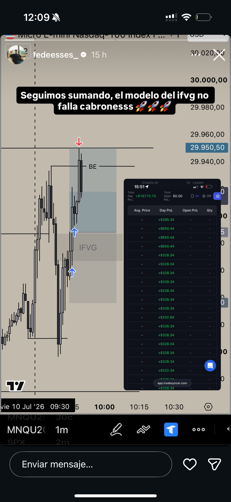
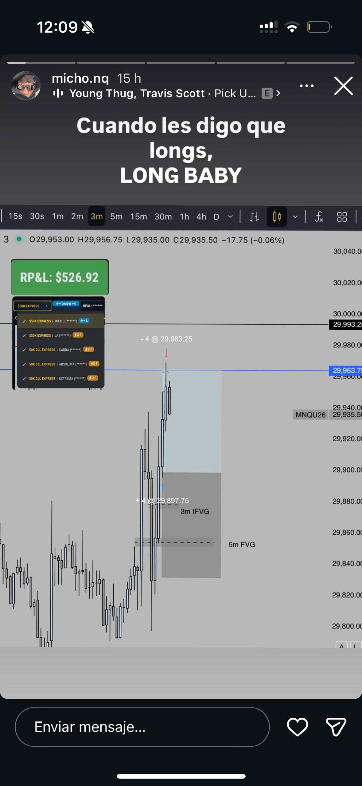
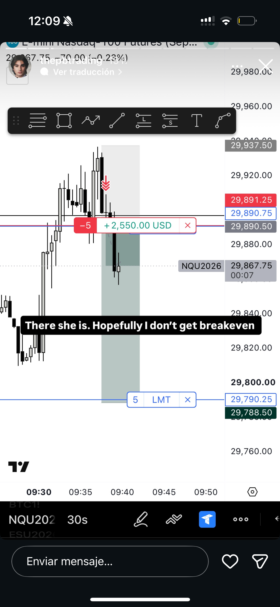

# 🎓 Estudio de Recaps de Mentores — 10 de Julio de 2026

Este archivo documenta el análisis visual interpretativo de los trades tomados por tus mentores el 10 de Julio de 2026, cruzado de manera sincrónica con tu operativa en Guayaquil.

---

## 🖼️ CAPTURAS DE LOS RECAPS

### 1. Fede Essés (`fedeesses_`) — Long en MNQ (1m)

*   **Instrumento:** `MNQU2026` (Nasdaq Micro U26).
*   **Timeframe:** `1m` (Gráfico de 1 minuto).
*   **Ejecución:**
    *   *Gatillo:* Retesteo de iFVG en 1m (formado post-apertura tras sweep de SSL).
    *   *Escala 1:* `~29,880.00` a las **`09:47 NYT`** (`08:47 GYE`).
    *   *Escala 2:* `~29,905.00` a las **`09:56 NYT`** (`08:56 GYE`).
    *   *Salida (Venta):* `29,950.50` a las **`09:58 - 09:59 NYT`** (`08:58 - 08:59 GYE`).
    *   *Resultado:* Día verde de `+$16,770.70 USD` global (TradeSyncer).

---

### 2. Micho (`micho.nq`) — Long en MNQ (3m)

*   **Instrumento:** `MNQU2026` (Nasdaq Micro U26).
*   **Timeframe:** `3m` (Gráfico de 3 minutos).
*   **Ejecución:**
    *   *Gatillo:* Confluencia de 3m iFVG + 5m FVG alcista tras barrida de mínimos de apertura.
    *   *Entrada:* `29,897.75` a las **`09:46 NYT`** (`08:46 GYE`).
    *   *Salida:* `29,963.25` a las **`09:59 NYT`** (`08:59 GYE`).
    *   *Resultado:* `+65.50 puntos` (`+$526.92 USD` netos) con 4 contratos.

---

### 3. PB Blake (`thepbtrading`) — Short en NQ (30s)

*   **Instrumento:** `NQU2026` (Nasdaq Grande U26).
*   **Timeframe:** `30s` (Gráfico de 30 segundos).
*   **Ejecución:**
    *   *Gatillo:* Barrida de BSL en la apertura seguido de desplazamiento bajista en LTF (30s).
    *   *Entrada:* `~29,915.00` a las **`09:37 - 09:38 NYT`** (`08:37 - 08:38 GYE`).
    *   *Target Límite:* `29,790.25` (operación activa en la captura con `+$2,550.00 USD` flotantes con 5 contratos a las `09:51 NYT`).

---

## ⚖️ LECCIONES OPERATIVAS Y COMPARATIVA DE TU TRADE

### 1. ¿Por qué tu Long en MES fue Break-Even mientras sus Longs en MNQ fueron TP?
*   **Timing de Entrada:** Fede y Micho entraron a su Long en la zona de las **`09:46 - 09:47 NYT`**. Tú entraste a las **`09:48 NYT`**. Aunque solo es 1 minuto de diferencia, tu entrada en MES se dio cuando NQ ya estaba muy cerca de su objetivo alcista inicial.
*   **El Factor Correlación:** Como NQ ya estaba maduro y golpeando su DOL superior, MES (tu trade) se quedó sin combustible y empezó a lateralizar, forzándote a salir en Break-Even.

### 2. ¿Por qué tu segundo Long en MES falló de inmediato?
*   Entraste Long en MES a las **`09:59:10 NYT`**. 
*   A esa misma hora (`09:58 - 09:59 NYT`), Fede Essés **estaba cerrando su Long (Take Profit)** en el techo de `29,950.50`.
*   *Lección Causal:* Compraste la punta de la expansión justo en la zona donde las instituciones estaban distribuyendo y saliendo de sus posiciones largas. Esto te expuso a la reversión inmediata que Blake venía operando en corto.

### 3. La Dinámica de SMT y la Fuerza Relativa
*   El **SMT Alcista** de la apertura funcionó a la perfección y dio un recorrido de +6 puntos en MES. Sin embargo, compraste el setup 13 minutos tarde (`09:48 NYT` y `09:59 NYT`).
*   La fuerza de un SMT reside en la **reacción inmediata post-confirmación**. Cazar la expansión tardía anula la ventaja del SMT.
