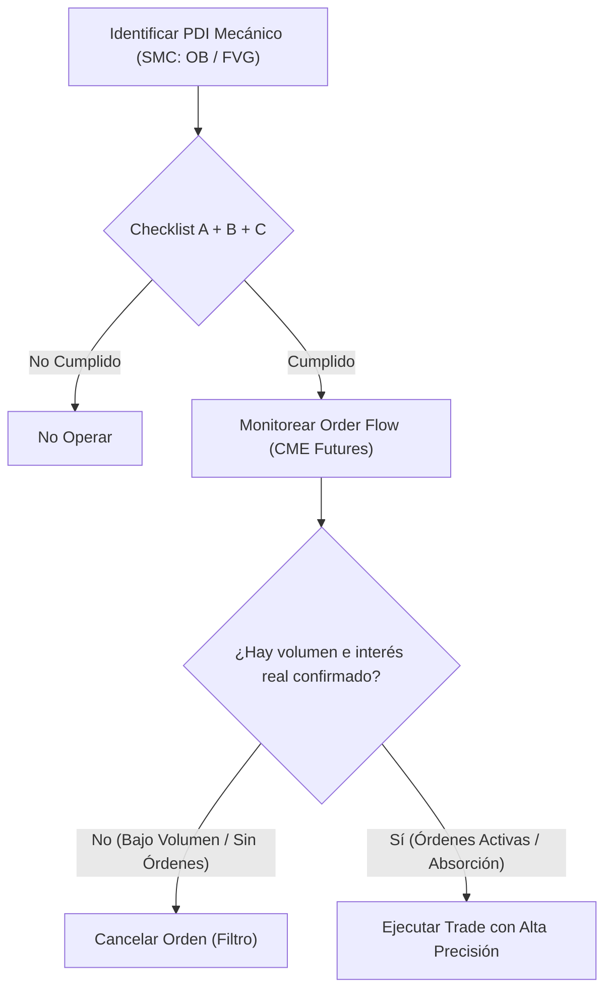

> [!NOTE]
> ### Resumen Causal
> - **El Order Flow como catalizador:** Agregar Order Flow a los conceptos de [[Market Structure|Smart Money Concepts (SMC)]] funciona como "esteroides", ya que permite validar si los [[Fair Value Gap|Fair Value Gaps (FVG)]] y [[Order Block (Bullish)|Order Blocks]] tienen volumen real u órdenes atrapadas.
> - **Trading Mecánico + Discreción:** Se promueve un trading mecánico basado en reglas estadísticas claras, utilizando el Order Flow en el momento de la ejecución como el filtro discrecional definitivo para entrar o descartar un trade.
> - **Futuros vs. CFDs:** El análisis de Order Flow debe realizarse sobre mercados centralizados y regulados como los futuros (CME), ya que la liquidez de los CFDs es descentralizada e interna del broker (haciéndote competir directamente contra él).

---

## Cronológico Breakdown

### `[00:00]` Introducción y la sinergia entre SMC y Order Flow
- Muchos traders minoristas ignoran el Order Flow, pero en el ámbito institucional y profesional (fondos de inversión, trading floors reales) es la herramienta fundamental.
- Combinar [[Market Structure|SMC]] con Order Flow permite ver la "película completa". Los conceptos de SMC explican bien la mecánica general del precio bajo la lógica de [[Mecánica de Subasta y Liquidez|oferta y demanda]], pero carecen de la información de volumen en tiempo real.
- **Validación de conceptos:**
  - **[[Fair Value Gap|Fair Value Gap (FVG)]]:** Es un [[Imbalance]] de poco volumen y tiempo. Con el Order Flow se puede verificar si realmente no hubo transacciones en esa zona o si el gráfico engaña.
  - **[[Order Block (Bullish)|Order Block (OB)]]:** Tradicionalmente definido por velas previas a un movimiento fuerte, pero solo el Order Flow puede confirmar si realmente existen órdenes atrapadas institucionales en ese bloque.

### `[04:12]` Trading Discrecional vs. Trading Mecánico
- **Trading Discrecional:** Basado puramente en análisis técnico predictivo. Requiere años de experiencia y es difícil de estandarizar.
- **Trading Mecánico:** Basado en estadísticas rigurosas y reglas fijas (ej. "Si ocurre A + B + C, entonces ejecuto").
- **El rol del Order Flow:** Se debe usar una base mecánica para identificar los setups y usar la discreción del Order Flow en el último paso (la ejecución) para validar el interés real de compra/venta y filtrar operaciones de baja probabilidad.

### `[09:30]` Estructura de Mercados: Futuros (CME) vs. CFDs
- **CFDs (Contratos por Diferencia):**
  - Liquidez centralizada en el broker. Operas contra la contraparte del broker, no en el mercado real.
  - Clasificación de traders en el broker: **Trader A** (hacen copy trading de tus operaciones en el mercado real) y **Trader B** (operas contra la mesa de dinero del broker; ellos asumen que vas a perder).
  - Tienen spreads variables y comisiones altas ocultas.
- **Futuros (CME - Chicago Mercantile Exchange):**
  - Mercado centralizado y regulado. Tus órdenes impactan directamente el libro de órdenes real.
  - No hay spread y las comisiones son muy bajas.
  - El volumen de futuros es el volumen real que se debe analizar para el Order Flow.

---

## Mechanical Rules (IF/THEN)

- **IF** el precio llega a un PDI mecánico (como un [[Order Block (Bullish)|Order Block]] o [[Fair Value Gap|Fair Value Gap]]) cumpliendo con el checklist estadístico (A + B + C) **AND** el Order Flow muestra volumen e interés de compra/venta real en la cinta/libro, **THEN** se ejecuta el trade.
- **IF** el setup mecánico es válido pero el Order Flow no muestra participación institucional ni volumen relevante, **THEN** se cancela la orden (filtro de protección).
- **IF** se desea operar con máxima precisión en Day Trading o Scalping, **THEN** se debe analizar el volumen centralizado de futuros del CME en lugar del volumen simulado de los brokers de CFDs.

---

## Mermaid Flowchart

