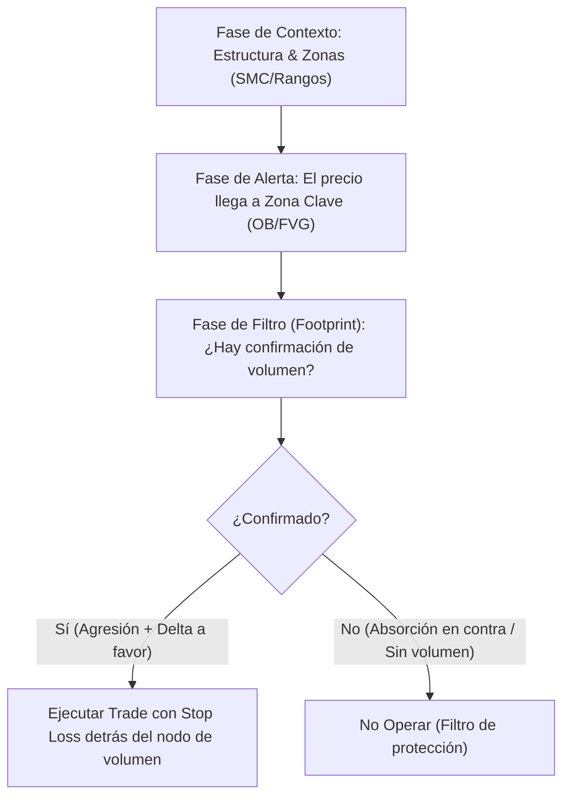

> [!NOTE]
> ### Resumen Causal
> - **Order Flow como complemento, no como estrategia única:** El Order Flow no funciona de manera aislada; es una herramienta de confirmación que potencia y actúa como "esteroide" de estrategias existentes como [[Market Structure|SMC]] o rangos.
> - **El Footprint como campo de batalla:** Los Footprint Charts revelan la subasta real interna del precio (agresión, absorción y delta), permitiendo ver quién gana la batalla dentro de cada vela para tomar decisiones más certeras.
> - **Especificidad por activo:** Los patrones de volumen y Order Flow no son universales; lo que funciona en Bitcoin no funciona necesariamente en los índices bursátiles (como el S&P 500) y viceversa.

---

## Cronológico Breakdown

### `[00:00]` Introducción y el error común del principiante
- El error principal al aprender Order Flow es estudiar conceptos aislados sin saber cómo integrarlos en una estrategia.
- Se debe pasar de observar únicamente la acción de precio a combinar **Precio + Volumen** para obtener una vista panorámica y tridimensional del mercado.

### `[01:15]` Paso 1: Entender las bases (Auction Market Theory)
- Estudiar la teoría fundamental de la [[Mecánica de Subasta y Liquidez|subasta de mercado]] (Auction Market Theory).
- Comprender por qué se mueve el precio a través de la interacción de la oferta y la demanda, y la transición constante entre el balance y el imbalance.

### `[02:48]` Paso 2: Aprender a leer dentro de las velas (Footprint Charts)
- El Footprint Chart desglosa los números de volumen transaccionado en cada nivel de precio dentro de una vela.
- Conceptos clave a dominar:
  - **Agresión:** Compradores o vendedores tomando liquidez a mercado de forma rápida.
  - **Absorción:** Órdenes límite bloqueando y deteniendo el avance del precio.
  - **Divergencias:** Desconexiones entre el movimiento del precio y el volumen/delta generado.

### `[04:17]` Paso 3: Dominar la plataforma (Configuración de ATAS)
- Se recomienda **ATAS** como la plataforma más completa e histórica para el análisis de Order Flow.
- Se debe aprender a limpiar el workspace para evitar la sobrecarga de datos. Elementos esenciales: perfil de volumen, delta acumulado, big trades e [[Imbalance|imbalances]].

### `[07:19]` Paso 4: Identificar patrones de entrada y especificidad de activos
- Identificación de traders atrapados, delta incremental o decreciente, y confirmación en zonas de interés (ej. verificar si un [[Order Block (Bullish)|Order Block]] realmente tiene órdenes institucionales atrapadas).
- **Regla de oro:** Cada activo tiene sus propias mañas. Los patrones de volumen de Bitcoin difieren de los de índices bursátiles (S&P 500 / Nasdaq).

### `[09:28]` Paso 5: Integración del Order Flow en la Estrategia
- El Order Flow se utiliza para afinar la ejecución, definir stop loss basados en zonas de volumen fuerte y gestionar el trailing stop.
- Ejemplos de integración: SMC + Order Flow, Estrategia de Rangos, Scalping en índices, y trading de Oro.

---

## Mechanical Rules (IF/THEN)

- **IF** se define un plan de trading integrado, **THEN** la estructura técnica general (contexto) se analiza mediante la acción del precio (ej. [[Market Structure|SMC]]), y la ejecución/confirmación final se realiza exclusivamente con Order Flow.
- **IF** se opera un activo específico (ej. Bitcoin o SPX), **THEN** se deben testear y mapear patrones de volumen y delta exclusivos para ese mercado antes de operar en real.
- **IF** el footprint muestra una fuerte absorción en contra del movimiento (ej. Delta muy positivo pero el precio no sube en un nivel de resistencia), **THEN** se asume la presencia de un participante pasivo institucional y se evita tomar longs (posible reversión o stop hunt).

---

## Mermaid Flowchart

