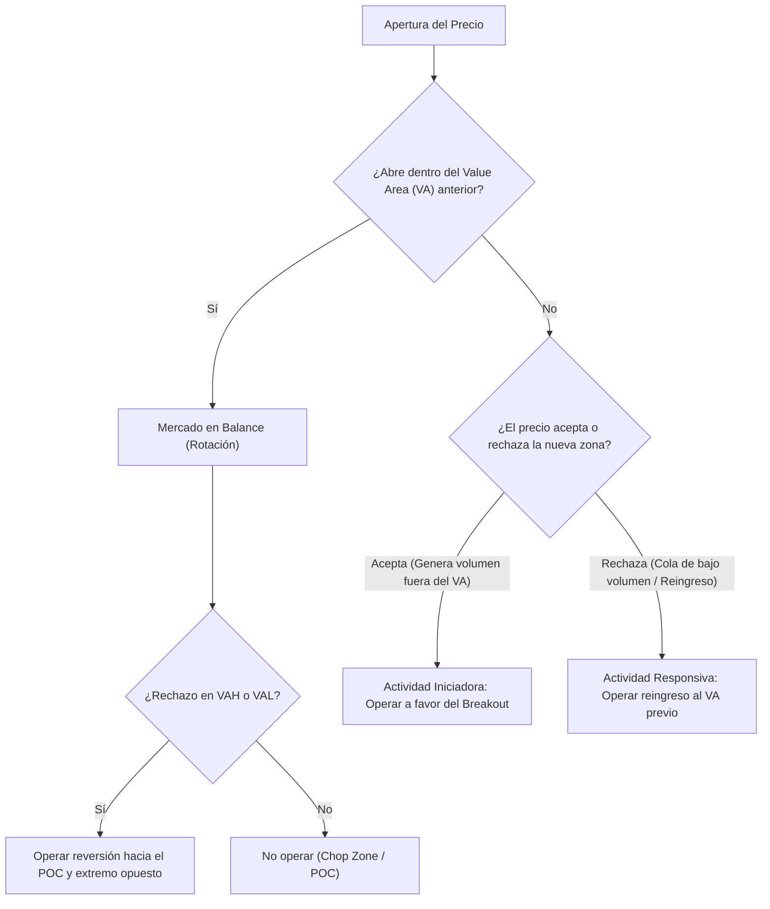

> [!NOTE]
> ### Resumen Causal
> - **El propósito del mercado (AMT):** Bajo la [[Mecánica de Subasta y Liquidez|Teoría de Subasta (Auction Market Theory)]], el mercado tiene el propósito de facilitar el intercambio y buscar el valor justo (fair value). El mercado pasa el 80% de su tiempo en balance (rangos) y solo el 20% en imbalance (tendencia).
> - **Volume Profile y POC:** El perfil de volumen organiza las transacciones a nivel horizontal, mostrando la zona de valor (Value Area - 68%) limitada por el VAH (Value Area High) y VAL (Value Area Low), con el POC (Point of Control) como el precio más transaccionado y aceptado.
> - **Confirmación de SFP con Open Interest:** Los [[Liquidity Sweep|Swing Failure Patterns (SFP / tomas de liquidez)]] se validan monitoreando la caída del Open Interest (interés abierto), lo cual confirma que el mercado está liquidando/cerrando posiciones y no es un movimiento aleatorio.

---

## Cronológico Breakdown

### `[00:00]` Introducción y mentalidad
- Bienvenida y contextualización del Bootcamp de Order Flow.
- Se hace énfasis en que la metodología no busca reemplazar conceptos previos, sino unirlos con datos de volumen reales para eliminar la adivinación y operar con base científica.

### `[08:10]` Swing Trading, Order Blocks y tomas de liquidez (SFP)
- **Naked Point of Control (NPOC) mensual:** Representa niveles de POC mensuales no testeados. Son puntos de reacción macro de alta efectividad (ej. bottom de Bitcoin comprado en NPOC y rebote en corto desde los $69,200).
- **[[Order Block (Bullish)|Order Blocks]] con volumen:** Un bloque de órdenes se analiza verificando el volumen transaccionado dentro de él para determinar la presencia real de participantes institucionales.
- **[[Liquidity Sweep|Tomas de Liquidez (SFP)]] con Open Interest (OI):**
  - Al barrer un máximo/mínimo, si el Open Interest cae, confirma el cierre forzado de posiciones (liquidaciones/stop loss).
  - Esto valida una reversión inminente. Si el OI sube o se mantiene igual, no es un barrido limpio.

### `[15:53]` El Volumen Horizontal vs. Vertical
- El volumen vertical clásico (TradingView) muestra el volumen total por vela (suma de compras y ventas). Es útil para medir picos de participación en acumulaciones/distribuciones.
- El **[[Volume Imbalance|Volume Profile (Perfil de Volumen)]]** muestra el volumen horizontalmente. Esto nos permite mapear el 68% del volumen total que compone el Área de Valor (Value Area), definiendo los extremos y el POC.

### `[19:08]` Teoría de Subasta (Auction Market Theory - AMT)
- El mercado funciona como una subasta continua. El precio es la publicidad (anuncia la oportunidad), el tiempo regula esa oportunidad y el volumen mide el éxito o fracaso de la subasta.
- El mercado busca la máxima eficiencia facilitando transacciones bidireccionales y buscando constantemente el balance o precio justo.
- **TPO/Market Profile** (distribución por tiempo) vs. **Volume Profile** (distribución por volumen).

### `[29:46]` Estados del Mercado: Balance vs. Imbalance
- **Balance (Rango / Distribución / Acumulación):** El 80% del tiempo. Compradores y vendedores están de acuerdo en el valor. El precio rota entre el VAH y VAL.
- **Imbalance (Tendencia / Expansión):** El 20% del tiempo. Compradores o vendedores son más agresivos (actividad iniciadora), empujando el precio a buscar una nueva zona de balance.

---

## Mechanical Rules (IF/THEN)

- **IF** el precio abre dentro del Área de Valor (VA) del perfil anterior y es rechazado en el VAH o VAL, **THEN** se busca un trade de reversión a la media (Mean Reversion) con objetivo en el POC o el extremo opuesto.
- **IF** el precio toma liquidez de un máximo/mínimo clave (SFP) **AND** el Open Interest cae drásticamente en el footprint/cinta, **THEN** se confirma la absorción/liquidación de posiciones y se ejecuta una entrada en dirección contraria al sweep.
- **IF** el precio rompe el VAH/VAL previo **AND** comienza a negociar con fuerte volumen por fuera del rango (Aceptación), **THEN** se considera actividad iniciadora y se opera a favor del breakout buscando el siguiente POC o nivel estructural relevante.

---

## Mermaid Flowchart

