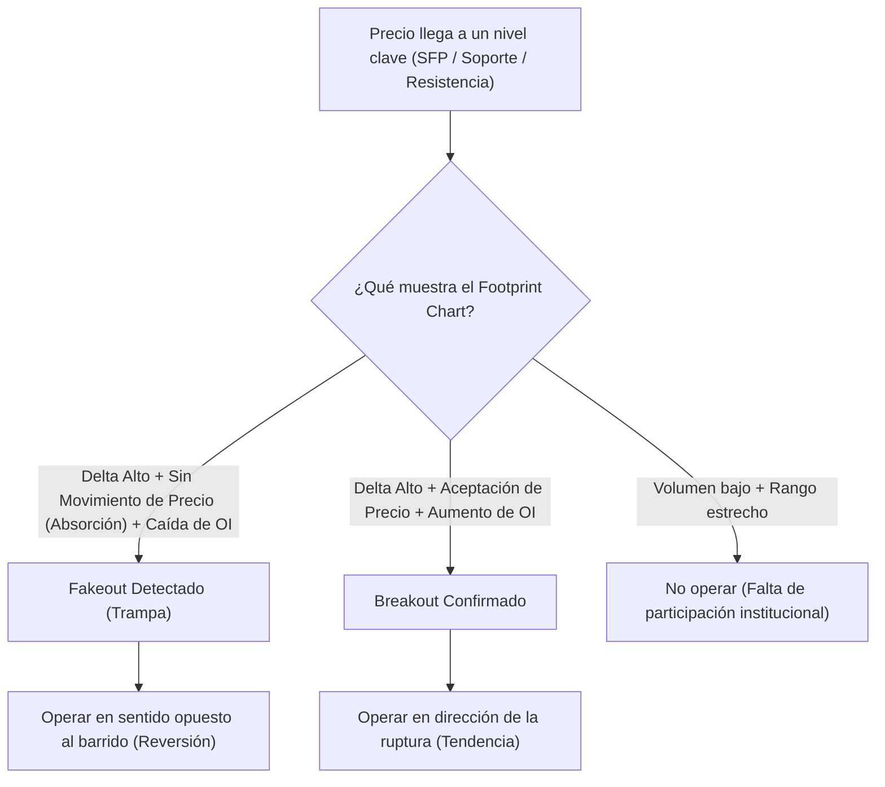

> [!NOTE]
> ### Resumen Causal
> - **Definición del Footprint Chart:** Es un gráfico bidimensional (precio y volumen) que actúa como un "rayo X" de las velas tradicionales, permitiendo ver el volumen transaccionado al bid (venta de mercado) y al ask (compra de mercado) en cada nivel de precio.
> - **Componentes Clave (Volumen, Delta, Open Interest):** El análisis de la agresividad mediante el Delta (diferencia entre compras y ventas de mercado) y el Open Interest permite distinguir entre la participación institucional genuina y el cierre/liquidación de posiciones minoristas.
> - **Breakouts vs. Fakeouts (Absorción):** Un breakout se valida cuando hay desequilibrio de compra/venta y aumento de Open Interest. Un fakeout (o trampa) se identifica mediante patrones de absorción (alto volumen y Delta, pero el precio no se mueve) seguidos de una reversión.

---

## Cronológico Breakdown

### `[00:00]` Introducción a los Footprint Charts
- ¿Qué son y por qué son necesarios? Explicación de que las velas tradicionales ocultan información interna y el Footprint es un "rayo X" del mercado.
- La utilidad de ver el volumen detallado por cada tick de precio en lugar de agregados temporales.

### `[05:30]` Explicación matemática del Bid y el Ask en el Footprint
- Cómo se cruzan las órdenes a mercado con las órdenes límite de forma diagonal (cross-matching).
- Las compras a mercado (agresivas) se cruzan al Ask, mientras que las ventas a mercado (agresivas) se cruzan al Bid.

### `[12:15]` Métricas clave: Volumen, Delta y Open Interest
- Volumen total: Muestra la actividad general en cada nivel de precio.
- Delta: La diferencia neta entre compras y ventas agresivas. Si el Delta es muy positivo, dominan las compras a mercado.
- Open Interest (Interés Abierto): Indica si están entrando nuevos contratos al mercado (aumento) o si se están cerrando/liquidando posiciones (caída).

### `[20:45]` Imbalances (Desequilibrios) en el Footprint
- Identificación de imbalances de compra (compras agresivas superan ventas límite en la diagonal por un ratio superior al 300%-400%).
- Identificación de imbalances de venta (ventas agresivas superan compras límite en la diagonal).
- Estos desequilibrios indican una fuerte presión iniciadora.

### `[32:10]` Patrones de absorción y bloqueo (Absorción de liquidez)
- Identificación de grandes órdenes límite absorbiendo las órdenes a mercado agresivas.
- Zonas de POC (Point of Control) de la vela y cómo el desplazamiento de este punto indica aceptación o rechazo de precios.

### `[42:30]` Cómo diferenciar Breakouts vs. Fakeouts
- Análisis de la estructura de mercado junto con datos de Order Flow.
- Un breakout legítimo requiere continuación del volumen, Delta a favor de la ruptura y aumento del Open Interest.
- Un fakeout se caracteriza por un alto volumen y Delta en la ruptura, pero con caída del Open Interest (liquidación de posiciones cortas/largas que actúan como combustible) y rápida reversión.

### `[53:40]` Ejemplos prácticos y conclusión
- Integración del Footprint en temporalidades bajas (1m/5m) con conceptos de Higher Timeframe (HTF) como [[Order Block (Bullish)|Order Blocks]] y zonas de liquidez macro.
- Recomendaciones de práctica en cuenta demo para entrenar el ojo en la velocidad de la cinta.

---

## Mechanical Rules (IF/THEN)

- **IF** el precio rompe un nivel clave (por ejemplo, VAH o VAL previo) **AND** el Footprint muestra imbalances de compra consecutivos con incremento de Open Interest, **THEN** se opera a favor de la tendencia (Breakout validado).
- **IF** el precio toma liquidez de un máximo clave (SFP) **AND** el Delta es extremadamente positivo en el Footprint pero el precio cierra por debajo del nivel barrido (absorción de compras) **AND** el Open Interest cae, **THEN** se ejecuta una entrada en corto con stop loss por encima de la mecha (Fakeout / Reversión).
- **IF** el precio retrocede a un [[Order Block (Bullish)|Order Block (Bullish)]] macro **AND** en la parte baja del bloque se forma una zona de volumen concentrado (POC de la vela) con Delta vendedor disminuyendo o girando a comprador en el Footprint, **THEN** se abre posición en largo buscando continuación alcista.

---

## Mermaid Flowchart

