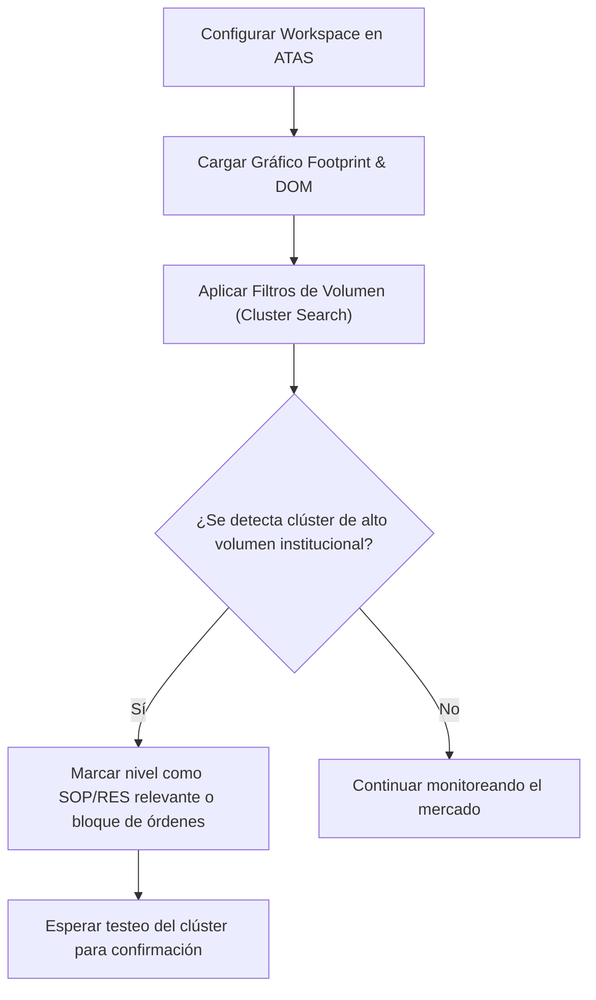

> [!NOTE]
> ### Resumen Causal
> - **Configuración del Entorno de ATAS:** La correcta parametrización de ATAS (Advanced Time And Sales) es crítica para el análisis de volumen horizontal y vertical, organizando el espacio de trabajo con paneles de Footprint, DOM y perfiles diarios.
> - **Plantillas y Filtros de Volumen:** Configurar filtros de volumen mínimo en el footprint (filtrar transacciones minoristas) resalta instantáneamente los bloques de órdenes y la actividad institucional (bloques de absorción y ejecuciones institucionales).
> - **El DOM y las Órdenes Límite:** El DOM (Depth of Market) proporciona la visualización en tiempo real de la liquidez latente (órdenes límite de compra y venta). Identificar áreas con densa liquidez latente permite proyectar imanes de precio y zonas de rebote.

---

## Cronológico Breakdown

### `[00:00]` Introducción a la plataforma ATAS
- Beneficios de usar ATAS sobre otras plataformas tradicionales de análisis gráfico (como TradingView) debido a su procesamiento directo de datos de ticks de futuros.
- Vista general de la interfaz de usuario.

### `[06:15]` Conexión de feeds de datos
- Cómo configurar las fuentes de datos (CQG, Rithmic o brokers compatibles) para recibir datos de ticks en tiempo real.
- Importancia de contar con datos consolidados y de nivel 2 (Level 2 data) para el correcto funcionamiento del DOM.

### `[15:20]` Configuración de gráficos Footprint en ATAS
- Selección del modo de visualización: Bid/Ask Profile, Delta Profile y Volume Profile por vela.
- Ajuste del marco temporal a ticks o rangos en lugar de minutos tradicionales.

### `[24:10]` Configuración de Filtros de Volumen (Cluster Search)
- Cómo aplicar filtros para resaltar operaciones grandes (bloques institucionales).
- Explicación de que filtrar el "ruido" menor revela el rastro de la liquidez real.

### `[35:45]` Configuración e interpretación del DOM (Depth of Market)
- Uso de la visualización del DOM para identificar spoofing (órdenes falsas que se retiran antes de ejecutarse), iceberg orders y barreras de liquidez límite.
- Configuración de la columna de volumen acumulado en el DOM.

### `[45:30]` Guardado de plantillas (Templates) y automatizaciones
- Configuración del módulo de Chart Trader para la gestión de riesgo.
- Órdenes automáticas (Bracket Orders) y gestión de stop loss/take profit dinámicos.

---

## Mechanical Rules (IF/THEN)

- **IF** el DOM muestra un muro de órdenes límite significativamente mayor a la media diaria (liquidez institucional acumulada) **AND** el precio se acerca a esa zona, **THEN** se utiliza como zona de interés de alta probabilidad (Draw on Liquidity) y soporte/resistencia objetivo.
- **IF** se detecta un patrón de "Cluster Search" filtrado (operación institucional > 500 contratos) en un extremo de la vela actual **AND** la vela cierra rechazando ese nivel (absorción institucional), **THEN** se busca una entrada en el testeo subsecuente de ese clúster.
- **IF** el Delta Acumulado de la sesión muestra una fuerte divergencia alcista (Delta subiendo pero el precio haciendo mínimos más bajos), **THEN** se busca un patrón de reversión alcista (fuerte absorción de ventas) para posicionar compras.

---

## Mermaid Flowchart

