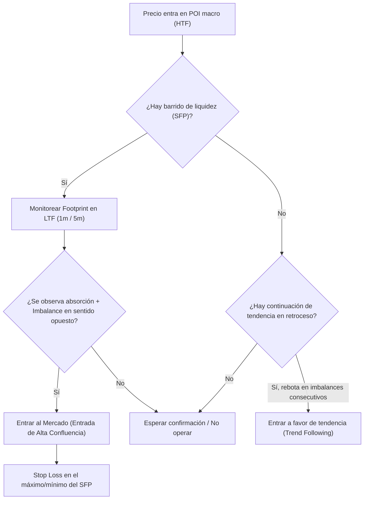

> [!NOTE]
> ### Resumen Causal
> - **Fusión de SMC y Order Flow:** La estrategia óptima combina el análisis macro de Smart Money Concepts (SMC) (como [[Higher Timeframe Bias]], [[Order Block (Bullish)|Order Blocks]], y [[Draw on Liquidity]]) con la ejecución micro basada en Order Flow en la plataforma ATAS.
> - **Gestión del Delta Acumulado:** El Delta Acumulado revela la dirección del dinero agresivo de la sesión. Permite detectar divergencias clave para anticipar giros del mercado antes de que se reflejen en la acción del precio.
> - **El Setup de Ejecución en Microestructura:** Entradas de bajo riesgo se definen mediante la confluencia de tomas de liquidez ([[Liquidity Sweep]]) en temporalidades mayores, confirmadas por la aparición de desequilibrios (imbalances) en el Footprint y retrocesos de testeo al POC de la vela ejecutora.

---

## Cronológico Breakdown

### `[00:00]` Introducción a la operativa en vivo
- La lógica de confluencia SMC + Order Flow. Por qué SMC marca el "dónde" y Order Flow el "cuándo".

### `[08:45]` Análisis macro de mercado en temporalidades de HTF
- Identificación del sesgo diario ([[Higher Timeframe Bias]]) y zonas donde reside la liquidez ([[Buy-Side Liquidity]] y [[Sell-Side Liquidity]]).
- Uso de temporalidades de 1 hora y 15 minutos para marcar los puntos de interés (POI).

### `[18:30]` La transición a temporalidades micro en ATAS
- Cómo esperar a que el precio entre en las zonas de interés marcadas (POI) antes de mirar el flujo de órdenes en gráficos de 1 minuto, 5 ticks o rangos.

### `[27:15]` Patrón de Entrada #1: SFP con confirmación de Order Flow
- Cómo se ve una toma de liquidez ([[Liquidity Sweep]] / SFP) en el Footprint con absorción del Delta y caída del interés abierto.

### `[38:20]` Patrón de Entrada #2: Continuación de Tendencia en imbalances
- Cómo entrar en retrocesos a imbalances (imbalances de compra/venta consecutivos) que actúan como zonas de soporte/resistencia dinámicos.

### `[48:10]` Gestión de la operación en tiempo real
- Uso de la velocidad de cinta (Tape Reading) y el DOM para gestionar la salida del trade.
- Ajuste del stop loss a breakeven según se observen absorciones del precio en contra.

### `[56:55]` Gestión de riesgo y cierre de la sesión
- Consejos para evitar la sobreoperativa (overtrading) utilizando estadísticas de rendimiento diario.

---

## Mechanical Rules (IF/THEN)

- **IF** el precio alcanza un POI macro (como un [[Order Block (Bearish)|Bearish Order Block]] de 15m) **AND** el precio hace un barrido de liquidez ([[Liquidity Sweep]] / SFP) **AND** el Footprint en 1m muestra un Delta comprador exhausto con posterior imbalance de venta fuerte, **THEN** se entra en corto al mercado con stop loss en el máximo del SFP.
- **IF** el precio está en tendencia alcista confirmada en HTF **AND** retrocede a un POC de vela anterior en el Footprint **AND** se observa absorción de ventas (Delta vendedor alto pero sin velas bajistas de continuación), **THEN** se coloca una orden de compra límite en el POC con stop en el mínimo local.
- **IF** el precio avanza a favor del trade **AND** en el DOM se observa una gran barrera de liquidez en contra del movimiento (muro límite) con fuerte Delta defensivo que bloquea el precio, **THEN** se cierra el 50% de la posición y se mueve el stop loss a breakeven (protección de capital).

---

## Mermaid Flowchart

