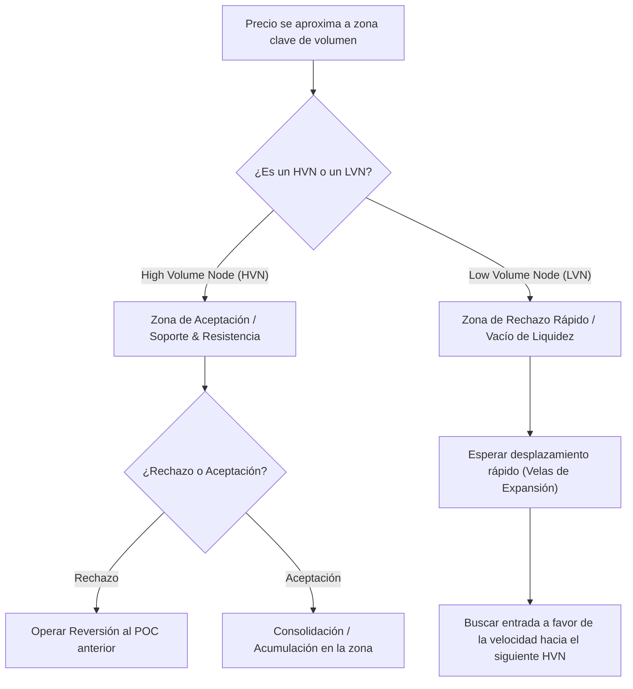

> [!NOTE]
> ### Resumen Causal
> - **Volumen Horizontal vs. Vertical:** A diferencia del volumen vertical que solo mide la participación en el tiempo, el Volume Profile organiza las transacciones a nivel horizontal, mostrando exactamente a qué precios hay mayor interés y aceptación institucional.
> - **Área de Valor (Value Area) y POC:** El Área de Valor (VA) encierra el 68% (o 70% según la configuración) del volumen transaccionado en la sesión. El POC (Point of Control) es el nivel de precio con mayor concentración de transacciones, actuando como un potente imán y nivel de soporte/resistencia dinámico.
> - **Nodos de Alto y Bajo Volumen (HVN y LVN):** Los HVN (High Volume Nodes) representan zonas de aceptación de valor donde el precio tiende a consolidar, mientras que los LVN (Low Volume Nodes) indican zonas de rechazo rápido donde el mercado cruza con velocidad por falta de interés en negociar allí.

---

## Cronológico Breakdown

### `[00:00]` Introducción y Conceptos Básicos de Perfil de Volumen
- Explicación del volumen horizontal. Mientras el volumen clásico nos dice *cuándo* se operó fuerte, el Volume Profile nos dice *dónde* (a qué niveles exactos de precio).
- Importancia de combinar la acción del precio clásica con la herramienta de perfil para obtener un contexto tridimensional.

### `[03:15]` La Anatomía del Perfil de Volumen
- **Point of Control (POC):** El nivel de precio más negociado de la sesión. Representa el valor justo temporal aceptado por compradores y vendedores.
- **Value Area High (VAH):** Extremo superior del Área de Valor. Representa el límite superior del rango aceptado.
- **Value Area Low (VAL):** Extremo inferior del Área de Valor. Límite inferior del rango de aceptación.
- **Developing POC (dPOC):** El movimiento intradía del POC a medida que se acumula nuevo volumen.

### `[08:45]` Nodos de Alto y Bajo Volumen: HVN vs. LVN
- **High Volume Nodes (HVN):** Áreas prominentes en el perfil que demuestran una fuerte aceptación y acumulación de contratos. Funcionan como imanes de precio y zonas de soporte/resistencia donde ocurren consolidaciones.
- **Low Volume Nodes (LVN):** Valles o huecos en el perfil de volumen. Indican una transición rápida del mercado o rechazo. El precio tiende a atravesar los LVN de forma explosiva mediante [[Displacement Candle|velas de desplazamiento]].

### `[15:20]` Sesgo y Contexto (HTF Bias) utilizando Perfiles
- Cómo utilizar los perfiles semanales y mensuales previos para establecer la dirección general ([[Higher Timeframe Bias|Sesgo de Temporalidad Mayor]]).
- Identificación de POCs mensuales desprotegidos o no testeados (NPOC) como objetivos claros de la liquidez ([[Draw on Liquidity]]).

### `[22:10]` Estrategias Operativas con el Perfil de Volumen
- Operativa en Rango (Mean Reversion): Si el precio abre dentro del Área de Valor y rechaza un extremo (VAH/VAL), la estrategia mecánica busca la rotación al POC y luego al extremo opuesto.
- Operativa en Tendencia (Breakout): Si el precio rompe el VA con volumen de agresión y es aceptado negociando fuera del VA anterior, se busca operar la expansión hacia el siguiente HVN relevante.

---

## Mechanical Rules (IF/THEN)

- **IF** el precio cotiza dentro del Área de Valor (VA) previa **AND** muestra un rechazo limpio del VAH o VAL con confirmación en el delta, **THEN** se ejecuta una entrada en reversión a la media con objetivo en el POC y el extremo opuesto (VAL/VAH).
- **IF** el precio rompe el VAH/VAL previo **AND** genera una fuerte aceptación (volumen horizontal en incremento por fuera del área), **THEN** se anula la reversión a la media y se toma una entrada a favor del breakout buscando el siguiente HVN macro.
- **IF** el precio ingresa en un LVN (Low Volume Node) macro, **THEN** se evita operar reversiones dentro de ese rango y se espera un movimiento de velocidad direccional que cruce toda la zona vacía de volumen.

---

## Mermaid Flowchart

