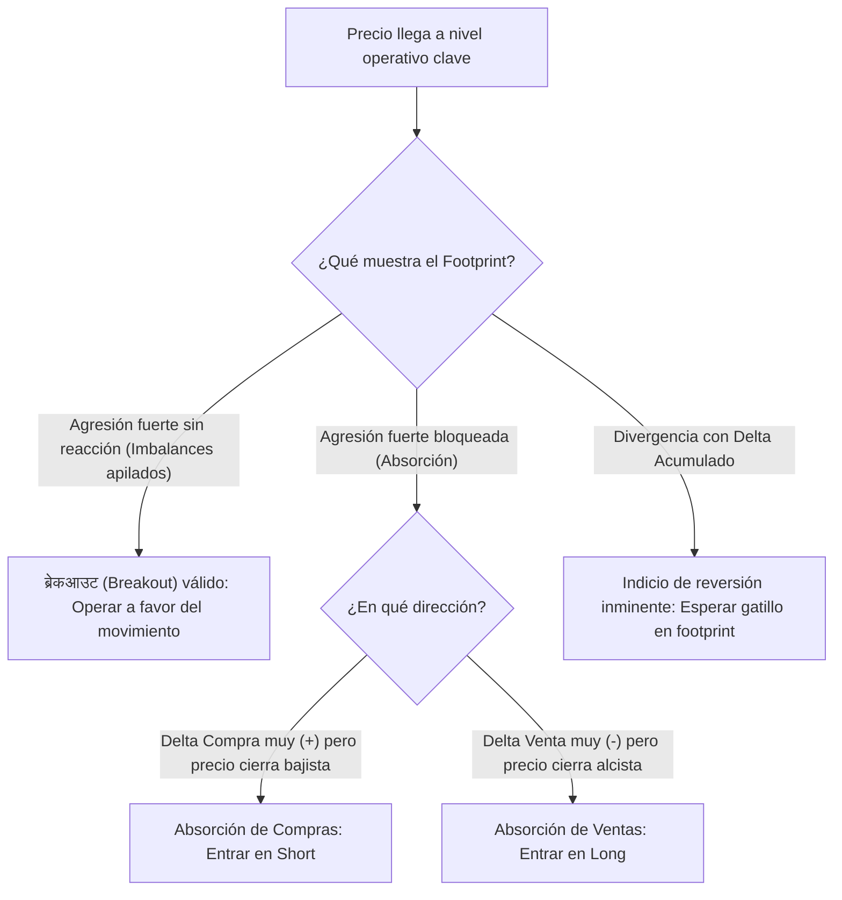

> [!NOTE]
> ### Resumen Causal
> - **Lectura Interna de la Vela (Footprint):** A diferencia de las velas japonesas estándar, los gráficos de Footprint abren la vela para revelar las órdenes de compra (Ask) y venta (Bid) ejecutadas a mercado, exponiendo la agresión real.
> - **Imbalances Diagonales:** Los imbalances ocurren cuando hay una asimetría notable (por ejemplo, ratio > 300%) al comparar en diagonal la agresión de los compradores (Ask) frente a los vendedores (Bid), marcando el control institucional.
> - **Delta Acumulado y Divergencias:** El Delta Acumulado mide la presión de compra o venta neta del mercado durante la sesión. Las divergencias entre el delta acumulado y la acción del precio alertan sobre la absorción pasiva por parte de instituciones.

---

## Cronológico Breakdown

### `[00:00]` Introducción a los Gráficos de Footprint (Bid/Ask)
- Explicación de los datos de la cinta (Time and Sales) organizados dentro de la vela.
- La bid (oferta) se lee a la izquierda y el ask (demanda) se lee a la derecha de cada nivel de precio.
- Comprensión de la comparación diagonal: se compara el Bid en el nivel X con el Ask en el nivel X + 1 tick (los compradores interactúan con el ask y los vendedores con el bid).

### `[04:30]` Delta, Delta de Vela y Delta Acumulado
- **Delta:** La diferencia neta entre compras a mercado y ventas a mercado (Ask Vol - Bid Vol).
- **Delta Acumulado (Cumulative Delta):** Suma progresiva de los deltas de cada vela durante la sesión. Muestra la fuerza dominante a mercado.
- Identificación de las divergencias: Si el precio marca un nuevo máximo pero el Delta Acumulado está plano o decreciente, indica que la agresión compradora está siendo absorbida por órdenes límite de venta (órdenes institucionales pasivas).

### `[09:15]` Imbalances (Desequilibrios) de Compra y Venta
- Definición de imbalance diagonal: cuando las compras superan a las ventas (o viceversa) por un factor predefinido (usualmente 3x o 4x, es decir, 300% o 400%).
- Imbalances de Compra (Buying Imbalance) pintados usualmente en azul/verde; Imbalances de Venta (Selling Imbalance) en rojo.
- Los clústeres de imbalances múltiples en velas de fuerte volumen indican [[Displacement Candle|desplazamiento]] institucional.

### `[16:40]` Mecánica de la Absorción vs. Agresión
- Agresión: Participantes que entran a mercado para ejecutar inmediatamente, empujando el precio.
- Absorción: Participantes institucionales que usan órdenes límite (pasivas) para absorber toda la agresión a mercado. Se evidencia en footprint cuando hay un delta muy alto a favor de un movimiento, pero la vela cierra en sentido contrario o deja un Wick largo.

### `[24:10]` Configuración Práctica en Plataformas (ATAS/Sierra Chart)
- Cómo limpiar la gráfica para centrarse únicamente en:
  - Volumen Total por precio.
  - Imbalances diagonales (Ratio 300%).
  - POC del Footprint (el nivel con más contratos de la vela individual).
  - Filtro de Big Trades (bloques de órdenes grandes ejecutados en un solo instante).

---

## Mechanical Rules (IF/THEN)

- **IF** el precio hace un máximo local [[Liquidity Sweep|barriendo liquidez]] **AND** el Footprint muestra clústeres de agresión de compra (imbalances verdes) pero la vela cierra bajista con Delta negativo en el extremo superior, **THEN** se confirma Absorción de Compras y se entra en Short.
- **IF** se detecta una divergencia alcista (precio haciendo mínimos iguales o inferiores pero el Delta Acumulado marca mínimos ascendentes), **THEN** se asume absorción de ventas por parte de compradores pasivos y se busca confirmación para entrar en Long.
- **IF** una vela de desplazamiento genera tres o más imbalances de compra apilados en diagonal, **THEN** esa zona se define como un nivel de soporte institucional (Zona de Imbalances) y se busca operar compras en su retest con stop loss debajo de la base de la vela.

---

## Mermaid Flowchart

