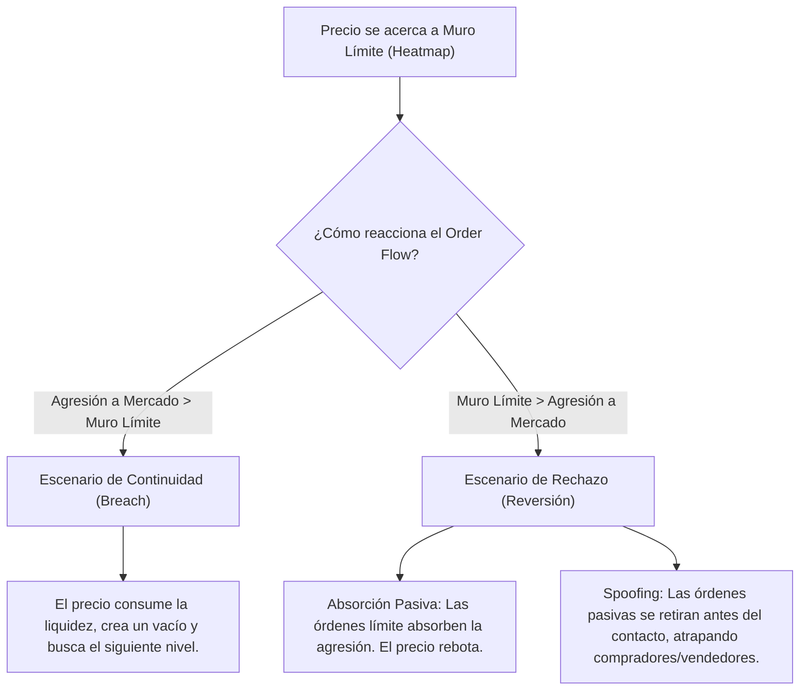

# 🎓 GUÍA DE ENTRENAMIENTO: FOOTPRINT, DELTA ACUMULADO Y TEORÍA DE LA SUBASTA (SUPREME TRADING)

Este documento sirve como recurso de entrenamiento avanzado de Inteligencia Artificial y manual técnico operativo. Estructura de forma taxonómica y lógica los conceptos del video de Supreme Trading, combinando la mecánica del flujo de órdenes con la acción del precio SMC y la Teoría de la Subasta.

---

## 🌐 1. ONTOLOGÍA DEL MERCADO Y DEFINICIONES FUNDAMENTALES

Para modelar matemáticamente el comportamiento del precio, la IA debe comprender la infraestructura de órdenes que rige la subasta financiera:

### A. Liquidez Real vs. Liquidez Tradicional
*   **Liquidez Tradicional (SMC/Retail):** Concepto de "piscinas de liquidez" (BSL/SSL) basadas exclusivamente en máximos y mínimos visuales (donde se asume la existencia de órdenes de stop loss).
*   **Liquidez Real (Order Book):** La concentración real de órdenes de compra y venta pendientes de ejecución en el libro de órdenes (DOM). Se divide en dos categorías operativas:
    *   **Órdenes Límite (Pasivas/Maker):** Órdenes de compra o venta a un precio específico que descansan en el DOM. Proveen liquidez al mercado. Pueden ser canceladas o modificadas dinámicamente antes de ser tocadas (**Spoofing**).
    *   **Órdenes a Mercado (Agresivas/Taker):** Órdenes que demandan ejecución inmediata a los mejores precios disponibles (Ask para compras, Bid para ventas). Consumen la liquidez límite disponible y son las únicas que mueven el precio.

### B. Teoría de la Subasta (Auction Market Theory - AMT)
El mercado es un mecanismo de descubrimiento de precios que busca facilitar el comercio entre compradores y vendedores. Se rige por un ciclo perpetuo de dos estados:
1.  **Fase de Balance (Rango/Distribución/Acumulación):** El precio cotiza dentro de un Área de Valor donde compradores y vendedores acuerdan que el precio es justo. El volumen se distribuye en forma de campana de Gauss (Point of Control - POC en el centro).
2.  **Fase de Imbalance (Expansión/Desplazamiento):** Una de las fuerzas (compradores o vendedores agresivos) supera la liquidez del extremo opuesto, rompiendo el balance para buscar una nueva zona de valor de mayor o menor precio.

---

## 🛠️ 2. INPUTS DE DATOS E INTEGRACIÓN DE HERRAMIENTAS (ATAS)

El procesamiento algorítmico requiere combinar dos fuentes de información visualizada a través de software especializado como **ATAS**:

### A. Heatmap / Bookmap (Profundidad de Mercado Visual)
*   **Función:** Proyecta históricamente la densidad y el tamaño de las órdenes límite pasivas descansando en el DOM a lo largo del tiempo.
*   **Filtrado Algorítmico de Ruido:** Se debe calibrar la exposición del mapa para ignorar bloques de órdenes pequeños (ruido retail) y resaltar únicamente las paredes institucionales densas (grandes muros de limit orders).

### B. Gráfico de Footprint (Flujo de Órdenes Cruzado)
*   **Función:** Revela el cruce exacto de ejecuciones a mercado contra órdenes límite.
*   **Lectura Bid/Ask:** La columna izquierda muestra el volumen ejecutado en el Bid (ventas a mercado consumiendo compras límite). La columna derecha muestra el volumen ejecutado en el Ask (compras a mercado consumiendo ventas límite).
*   **Comparación Diagonal:** La agresión se mide en diagonal. Se compara el Bid en el nivel de precio $P$ contra el Ask en el nivel $P + 1$ tick.
*   **Imbalance Diagonal:** Ocurre cuando el volumen de un lado supera al otro por un ratio superior al 300% (parámetro estándar de 3x). Indica agresión institucional concentrada.

---

## 👥 3. PERFILES DE PARTICIPANTES Y CONDUCTA SENSORIAL

| Perfil de Participante | Tamaño de Posición | Restricciones Operativas | Conducta de Ejecución |
| :--- | :--- | :--- | :--- |
| **Dinero Institucional (Smart Money)** | Masivo (Hedge Funds, Creadores de Mercado) | No pueden entrar a mercado directamente porque barren el spread y causan deslizamiento hostil. | **Acumulan y Distribuyen de forma pasiva** en zonas de Balance (alta liquidez). Usan órdenes límite e invierten en el DOM. |
| **Trader Minorista (Retail / Algoritmos de Fricción)** | Pequeño (Retail Traders, Algos de escala) | Pueden entrar y salir del mercado instantáneamente sin causar deslizamiento en el precio. | **Operan en Imbalances (Zonas Ilíquidas)**. Pueden aprovechar vacíos de volumen para ejecuciones rápidas y momentum. |

---

## 🌀 4. DINÁMICA DE PRECIOS Y ATRACCIÓN MAGNÉTICA

Los bloques densos de órdenes límite en el Heatmap actúan como imanes para el precio, pero presentan dos desenlaces excluyentes:



---

## 🎯 5. PROTOCOLO ALGORÍTMICO DE EJECUCIÓN (CONDICIONES IF-THEN)

Para que el modelo califique una **Toma de Liquidez** como válida y de alta probabilidad para operar una reversión, se deben cumplir obligatoriamente las siguientes cuatro condiciones en secuencia temporal cruzando Precio, Heatmap y Order Flow:

### 📥 Condición 1: Llegada a la Zona ESTRUCTURAL
*   **Lógica:** El precio de MES o MNQ debe acercarse a un nivel de liquidez clave (máximo/mínimo estructural BSL/SSL) o a un bloque denso del Heatmap (muro límite institucional pasivo).

### ⚡ Condición 2: Incremento Exponencial de Volumen (Confirmación por Order Flow)
*   **Lógica:** En el instante de la ruptura, el Order Flow debe registrar un salto masivo en el volumen negociado en comparación con las velas previas (ejemplo literal del video: el volumen por nivel de precio salta abruptamente de **2 millones a 14 millones de contratos** ejecutados).

### 🔍 Condición 3: Validación de Activación de Stops (Stops Trigger)
*   **Lógica:** Si rompemos un máximo, la mayor parte de ese volumen masivo (los 14 millones) debe estar concentrada **justo por encima del máximo**. Esto confirma de forma científica que se ejecutaron las órdenes de Stop Loss de los vendedores (que actúan como compras forzadas a mercado). Si no hay un incremento de volumen concentrado ahí, el patrón se declara inválido por falta de liquidez real.

### 🛡️ Condición 4: Absorción Eficiente (Trapped Traders)
*   **Lógica:** **IF** el precio rompe el máximo con fuerte volumen comprador (14M en el Ask) **AND** el precio envuelve rápidamente esas posiciones y cierra por debajo del nivel de ruptura en la vela actual, **THEN** se confirma **Absorción**. Los compradores agresivos quedaron atrapados (Trapped Traders) y sus posiciones perdedoras servirán de combustible para la reversión inmediata. Se ejecuta la orden de **Short**.

---

## 📈 6. ESTRUCTURAS AVANZADAS: NAKED POINTS OF CONTROL (nPOC)

### A. Anatomía y Causa Causal
Un **Naked Point of Control (nPOC)** es el nivel de precio con mayor concentración de volumen de una sesión previa que no ha sido re-testeado por el precio.
*   **Origen Causal:** Los traders e instituciones que abrieron posiciones de alta exposición en ese POC (por ejemplo, vendiendo) y vieron el precio alejarse rápidamente, defenderán ese nivel con órdenes límite contrarias cuando el precio regrese, o intentarán cerrar sus posiciones en Break-Even (BE) para evitar pérdidas, lo que genera fricción y rebotes garantizados.

### B. El Algoritmo de Limpieza de nPOCs (nPOC Sweep Grid)
Los nPOCs actúan como imanes magnéticos de liquidez secuencial. El algoritmo institucional opera bajo la siguiente regla lógica:

```text
IF existen múltiples nPOCs cercanos agrupados (ej: nPOC-1, nPOC-2, nPOC-3) 
AND existe un gran vacío de volumen hasta el siguiente nPOC lejano (nPOC-4):
THEN:
  1. El precio liquidará y "limpiará" secuencialmente nPOC-1 y nPOC-2 sin dar reversión.
  2. Queda estrictamente prohibido buscar contratendencias en nPOC-1 o nPOC-2 (los atravesará).
  3. El gatillo de reversión de alta probabilidad se coloca exclusivamente en nPOC-3 (el último nPOC del grupo, justo antes del gran vacío de volumen).
```

---

## 💡 7. EL "HACK" OPERATIVO PARA ALGORITMOS RETAIL

Al no poseer las restricciones de tamaño de las instituciones, los traders individuales y sus algoritmos de soporte deben explotar las zonas ilíquidas:

1.  **Operar en Vacíos de Volumen:** Buscar entradas rápidas en zonas de ineficiencia de volumen (rango de precios donde no hubo transacciones institucionales previas). Al no haber interés institucional pasivo que sostenga el precio, el mercado tenderá a rechazar y rellenar estas zonas de manera sumamente veloz.
2.  **Operar Extremos de Áreas de Valor (Value Area Extremes):**
    *   **Lógica:** El Value Area High (VAH) y el Value Area Low (VAL) representan los límites de desviación del rango. Son zonas ilíquidas (de bajo volumen) donde los institucionales no desean operar.
    *   **Estrategia:** Ejecutar reversiones en VAH/VAL (buscando compras en VAL y ventas en VAH) proyectando el precio hacia el POC central (donde reside el volumen masivo de los creadores de mercado).

---

## ⏰ 8. DESGLOSE CRONOLÓGICO DEL VIDEO (SUPREME ORDER FLOW)

*   **`[00:00]` Estructura Bid/Ask en Footprint:** Cómo se agrupa la cinta dentro de la vela. La Bid a la izquierda (ventas a mercado), Ask a la derecha (compras a mercado). Regla de comparación diagonal.
*   **`[04:30]` Mecánica del Delta y Delta Acumulado (CVD):** Explicación del Delta como balance neto instantáneo y el CVD como sumatoria de la sesión. Patrón de divergencia alcista/bajista (precio sube pero CVD cae ➔ absorción institucional de compras límite).
*   **`[09:15]` Identificación de Imbalances:** Configuración de imbalances diagonales al 300% para identificar el desplazamiento agresivo del dinero institucional.
*   **`[16:40]` Agresión vs. Absorción Pasiva:** Explicación de cómo las instituciones usan órdenes pasivas en el DOM para frenar movimientos agresivos del retail, visibles en footprint como clústeres de alto volumen que cierran en sentido opuesto.
*   **`[24:10]` Configuración de ATAS para IA:** Limpieza del gráfico para monitorear únicamente Volumen, Imbalances diagonales de 3x, y POCs de velas de 1m/5m, filtrando el ruido de transacciones pequeñas.
*   **`[28:30]` Naked POCs y Teoría de la Subasta:** Cómo usar los nPOCs y las áreas de valor (VAH/VAL) para establecer objetivos de Take Profit estructurales e imanes de liquidez para el día.
