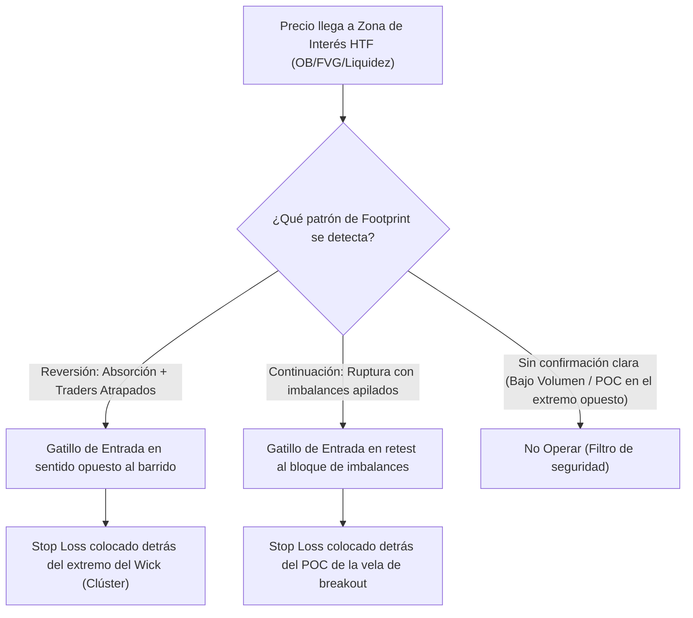

> [!NOTE]
> ### Resumen Causal
> - **Confirmación en Zonas HTF:** Los patrones de Order Flow no deben buscarse en medio de la nada. Se ejecutan únicamente cuando el precio llega a una zona de alto valor o interés macro (ej. [[Order Block (Bullish)|Order Blocks]], [[Fair Value Gap|FVGs]] o tomas de liquidez HTF).
> - **Fuerza y Agresión Direccional:** Las entradas de continuación se validan localizando imbalances diagonales a favor de la tendencia y POCs de velas que se desplazan hacia el objetivo.
> - **Traders Atrapados (Locked Traders):** El patrón más potente de reversión se da cuando los compradores o vendedores tardíos son atrapados en los extremos de un rango operativo y se ven obligados a liquidar sus posiciones, acelerando el movimiento en contra.

---

## Cronológico Breakdown

### `[00:00]` Regla de Oro: Contexto > Confirmación
- Explicación de por qué el footprint por sí solo puede dar señales falsas en zonas de consolidación ("chop zones").
- Primero se define el sesgo con la acción del precio macro ([[Higher Timeframe Bias]]) y las áreas de liquidez, y luego se hace zoom con el Footprint para el gatillo de entrada.

### `[05:20]` Patrón 1: Absorción en Extremos (SFP Confirmado)
- Identificación de un [[Liquidity Sweep|SFP (Swing Failure Pattern)]] en un máximo/mínimo clave.
- Confirmación de volumen:
  - Fuerte agresión a mercado intentando romper el nivel.
  - Aparición de órdenes límite bloqueando el movimiento (Absorción).
  - La vela cierra por debajo del nivel barrido con delta opuesto en la punta de la vela (Wick), atrapando a los breakouts falsos.

### `[11:15]` Patrón 2: Traders Atrapados (Locked Traders)
- Clústeres de volumen masivo atrapados en el extremo de la vela (ej. compras agresivas en el máximo absoluto de una vela bajista).
- El mercado retrocede de inmediato. Esas posiciones compradoras a mercado entran en pérdidas instantáneas.
- Sus stop-loss (que son órdenes de venta a mercado) actuarán como gasolina para acelerar la caída cuando el precio rompa el mínimo de esa vela de confirmación.

### `[18:40]` Patrón 3: Agresión Iniciadora y POC de Vela
- Patrón de continuación de tendencia.
- Una vela rompe un nivel estructural (Breakout) mostrando imbalances apilados de compra (long) o venta (short).
- El POC de la vela se ubica en el tercio inferior (en caso de compra) o en el medio, demostrando que los compradores iniciadores defienden y empujan el precio activamente.

### `[25:30]` Colocación de Stop Loss y Gestión del Trade
- El stop loss óptimo no se pone arbitrariamente; se ubica justo detrás de la zona de alta concentración de volumen (clúster de imbalances o POC de la vela de reversión/agresión).
- Si el precio vulnera ese nodo de alto volumen, la narrativa de absorción/iniciación institucional se anula por completo.

---

## Mechanical Rules (IF/THEN)

- **IF** el precio hace un [[Liquidity Sweep|SFP (toma de liquidez)]] macro **AND** el Footprint muestra clústeres de volumen atrapados (Locked Traders) en el extremo del Wick con Delta negativo en el cierre, **THEN** se abre posición en contra del sweep con Stop Loss protegido detrás del máximo/mínimo barrido.
- **IF** el precio rompe un soporte/resistencia clave **AND** se apilan 3 o más imbalances diagonales a favor del breakout, **THEN** se ejecuta una orden en retest al nivel de los imbalances con Stop Loss detrás de la vela de ruptura.
- **IF** se opera una reversión a la media desde VAH/VAL **AND** el precio cruza el POC de la vela en contra de la posición, **THEN** se reduce la exposición o se cierra el trade manualmente (invalidez inmediata de la absorción).

---

## Mermaid Flowchart

